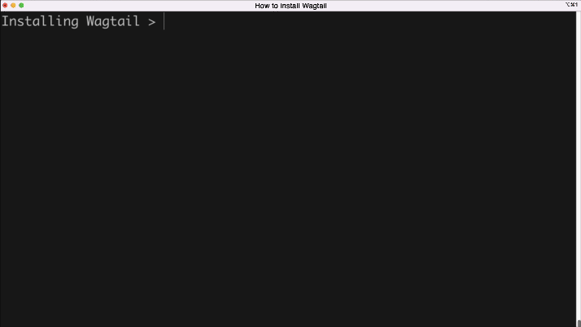
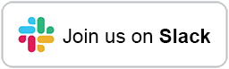

<h1 align="center">
    
    
</h1>
<p align="center">
    <br>
    <a href="https://github.com/wagtail/wagtail/actions">
        
    </a>
    <a href="https://opensource.org/licenses/BSD-3-Clause">
        
    </a>
    <a href="https://pypi.python.org/pypi/wagtail/">
        
    </a>
    <a href="https://lgtm.com/projects/g/wagtail/wagtail/alerts/">
        
    </a>
    <a href="https://lgtm.com/projects/g/wagtail/wagtail/context:python">
        
    </a>
    <a href="https://lgtm.com/projects/g/wagtail/wagtail/context:javascript">
        
    </a>
    <a href="https://pypi.python.org/pypi/wagtail/">
        
    </a>
</p>

Wagtail is an open source content management system built on Django, with a strong community and commercial support. It's focused on user experience, and offers precise control for designers and developers.


### 🔥 Features

-   A fast, attractive interface for authors
-   Complete control over front-end design and structure
-   Scales to millions of pages and thousands of editors
-   Fast out of the box, cache-friendly when you need it
-   Content API for 'headless' sites with de-coupled front-end
-   Runs on a Raspberry Pi or a multi-datacenter cloud platform
-   StreamField encourages flexible content without compromising structure
-   Powerful, integrated search, using Elasticsearch or PostgreSQL
-   Excellent support for images and embedded content
-   Multi-site and multi-language ready
-   Embraces and extends Django

Find out more at [wagtail.org](https://wagtail.org/).

### 👉 Getting started

Wagtail works with [Python 3](https://www.python.org/downloads/), on any platform.

To get started with using Wagtail, run the following in a virtual environment:



```bash
pip install wagtail
wagtail start mysite
cd mysite
pip install -r requirements.txt
python manage.py migrate
python manage.py createsuperuser
python manage.py runserver
```

For detailed installation and setup docs, see [the getting started tutorial](https://docs.wagtail.org/en/stable/getting_started/tutorial.html).

### 👨‍👩‍👧‍👦 Who’s using it?

Wagtail is used by [NASA](https://www.nasa.gov/), [Google](https://www.google.com/), [Oxfam](https://www.oxfam.org/en), the [NHS](https://www.nhs.uk/), [Mozilla](https://www.mozilla.org/en-US/), [MIT](https://www.mit.edu/), the [Red Cross](https://www.icrc.org/en), [Salesforce](https://www.salesforce.com/), [NBC](https://www.nbc.com/), [BMW](https://www.bmw.com/en/index.html), and the US and UK governments. Add your own Wagtail site to [madewithwagtail.org](https://madewithwagtail.org).

### 📖 Documentation

[docs.wagtail.org](https://docs.wagtail.org/) is the full reference for Wagtail, and includes guides for developers, designers and editors, alongside release notes and our roadmap.

For those who are **new to Wagtail**, the [Zen of Wagtail](https://docs.wagtail.org/en/stable/getting_started/the_zen_of_wagtail.html) will help you understand what Wagtail is, and what Wagtail is _not_.

**For developers** who are ready to jump in to their first Wagtail website the [Getting Started Tutorial](https://docs.wagtail.org/en/stable/getting_started/tutorial.html) will guide you through creating and editing your first page.

**Do you have an existing Django project?** The [Wagtail Integration documentation](https://docs.wagtail.org/en/stable/getting_started/integrating_into_django.html) is the best place to start.

### 📌 Compatibility

_(If you are reading this on GitHub, the details here may not be indicative of the current released version - please see [Compatible Django / Python versions](https://docs.wagtail.org/en/stable/releases/upgrading.html#compatible-django-python-versions) in the Wagtail documentation.)_

Wagtail supports:

-   Django 3.2.x and 4.0.x
-   Python 3.7, 3.8, 3.9 and 3.10
-   PostgreSQL, MySQL and SQLite (with JSON1) as database backends

[Previous versions of Wagtail](https://docs.wagtail.org/en/stable/releases/upgrading.html#compatible-django-python-versions) additionally supported Python 2.7 and earlier Django versions.

---

### 📢 Community Support

There is an active community of Wagtail users and developers responding to questions on [Stack Overflow](https://stackoverflow.com/questions/tagged/wagtail). When posting questions, please read Stack Overflow's advice on [how to ask questions](https://stackoverflow.com/help/how-to-ask) and remember to tag your question "wagtail".

For topics and discussions that do not fit Stack Overflow's question and answer format we have a [Slack workspace](https://github.com/wagtail/wagtail/wiki/Slack). Please respect the time and effort of volunteers by not asking the same question in multiple places.

[](https://github.com/wagtail/wagtail/wiki/Slack)

Our [Github discussion boards](https://github.com/wagtail/wagtail/discussions) are open for sharing ideas and plans for the Wagtail project.

We maintain a curated list of third party packages, articles and other resources at [Awesome Wagtail](https://github.com/springload/awesome-wagtail).

### 🧑‍💼 Commercial Support

Wagtail is sponsored by [Torchbox](https://torchbox.com/). If you need help implementing or hosting Wagtail, please contact us: hello@torchbox.com. See also [madewithwagtail.org/developers/](https://madewithwagtail.org/developers/) for expert Wagtail developers around the world.

### 🔐 Security

We take the security of Wagtail, and related packages we maintain, seriously. If you have found a security issue with any of our projects please email us at [security@wagtail.org](mailto:security@wagtail.org) so we can work together to find and patch the issue. We appreciate responsible disclosure with any security related issues, so please contact us first before creating a Github issue.

If you want to send an encrypted email (optional), the public key ID for security@wagtail.org is 0xbed227b4daf93ff9, and this public key is available from most commonly-used keyservers.

### 🕒 Release schedule

Feature releases of Wagtail are released every three months. Selected releases are designated as Long Term Support (LTS) releases, and will receive maintenance updates for an extended period to address any security and data-loss related issues. For dates of past and upcoming releases and support periods, see [Release Schedule](https://github.com/wagtail/wagtail/wiki/Release-schedule).

#### 🕛 Nightly releases

To try out the latest features before a release, we also create builds from `main` every night. You can find instructions on how to install the latest nightly release at https://releases.wagtail.org/nightly/index.html

### 🙋🏽 Contributing

If you're a Python or Django developer, fork the repo and get stuck in! We have several developer focused channels on the [Slack workspace](https://github.com/wagtail/wagtail/wiki/Slack).

You might like to start by reviewing the [contributing guidelines](https://docs.wagtail.org/en/latest/contributing/index.html) and checking issues with the [good first issue](https://github.com/wagtail/wagtail/labels/good%20first%20issue) label.

We also welcome translations for Wagtail's interface. Translation work should be submitted through [Transifex](https://www.transifex.com/projects/p/wagtail/).

### 🔓 License

[BSD](https://github.com/wagtail/wagtail/blob/main/LICENSE) - Free to use and modify for any purpose, including both open and closed-source code.

### 👏 Thanks

We thank the following organisations for their services used in Wagtail's development:

[](https://www.browserstack.com/)<br>
[BrowserStack](https://www.browserstack.com/) provides the project with free access to their live web-based browser testing tool, and automated Selenium cloud testing.

[](https://www.squash.io/)<br>
[Squash](https://www.squash.io/) provides the project with free test environments for reviewing pull requests.

[](https://assistivlabs.com/)<br>
[Assistiv Labs](https://assistivlabs.com/) provides the project with unlimited access to their remote testing with assistive technologies.
