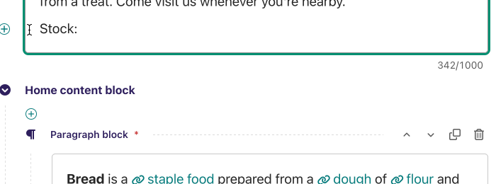

Customising the editing interface
=================================

.. _customising_the_tabbed_interface:

Customising the tabbed interface
~~~~~~~~~~~~~~~~~~~~~~~~~~~~~~~~

As standard, Wagtail organises panels for pages into three tabs: 'Content', 'Promote' and 'Settings'. For snippets Wagtail puts all panels into one page. Depending on the requirements of your site, you may wish to customise this for specific page types or snippets - for example, adding an additional tab for sidebar content. This can be done by specifying an ``edit_handler`` attribute on the page or snippet model. For example:

.. code-block:: python

    from wagtail.admin.edit_handlers import TabbedInterface, ObjectList

    class BlogPage(Page):
        # field definitions omitted

        content_panels = [
            FieldPanel('title', classname="full title"),
            FieldPanel('date'),
            FieldPanel('body', classname="full"),
        ]
        sidebar_content_panels = [
            SnippetChooserPanel('advert'),
            InlinePanel('related_links', label="Related links"),
        ]

        edit_handler = TabbedInterface([
            ObjectList(content_panels, heading='Content'),
            ObjectList(sidebar_content_panels, heading='Sidebar content'),
            ObjectList(Page.promote_panels, heading='Promote'),
            ObjectList(Page.settings_panels, heading='Settings', classname="settings"),
        ])


.. _rich-text:

Rich Text (HTML)
~~~~~~~~~~~~~~~~

Wagtail provides a general-purpose WYSIWYG editor for creating rich text content (HTML) and embedding media such as images, video, and documents. To include this in your models, use the :class:`~wagtail.core.fields.RichTextField` function when defining a model field:

.. code-block:: python

    from wagtail.core.fields import RichTextField
    from wagtail.admin.edit_handlers import FieldPanel


    class BookPage(Page):
        book_text = RichTextField()

        content_panels = Page.content_panels + [
            FieldPanel('body', classname="full"),
        ]

:class:`~wagtail.core.fields.RichTextField` inherits from Django's basic ``TextField`` field, so you can pass any field parameters into :class:`~wagtail.core.fields.RichTextField` as if using a normal Django field. This field does not need a special panel and can be defined with ``FieldPanel``.

However, template output from :class:`~wagtail.core.fields.RichTextField` is special and need to be filtered to preserve embedded content. See :ref:`rich-text-filter`.


.. _rich_text_features:

Limiting features in a rich text field
--------------------------------------

By default, the rich text editor provides users with a wide variety of options for text formatting and inserting embedded content such as images. However, we may wish to restrict a rich text field to a more limited set of features - for example:

 * The field might be intended for a short text snippet, such as a summary to be pulled out on index pages, where embedded images or videos would be inappropriate;
 * When page content is defined using :ref:`StreamField <streamfield>`, elements such as headings, images and videos are usually given their own block types, alongside a rich text block type used for ordinary paragraph text; in this case, allowing headings and images to also exist within the rich text content is redundant (and liable to result in inconsistent designs).

This can be achieved by passing a ``features`` keyword argument to ``RichTextField``, with a list of identifiers for the features you wish to allow:

.. code-block:: python

    body = RichTextField(features=['h2', 'h3', 'bold', 'italic', 'link'])

The feature identifiers provided on a default Wagtail installation are as follows:

 * ``h1``, ``h2``, ``h3``, ``h4``, ``h5``, ``h6`` - heading elements
 * ``bold``, ``italic`` - bold / italic text
 * ``ol``, ``ul`` - ordered / unordered lists
 * ``hr`` - horizontal rules
 * ``link`` - page, external and email links
 * ``document-link`` - links to documents
 * ``image`` - embedded images
 * ``embed`` - embedded media (see :ref:`embedded_content`)


Adding new features to this list is generally a two step process:

 * Create a plugin that extends the editor with a new toolbar button or other control(s) to manage the rich text formatting of the feature.
 * Create conversion or whitelist rules to define how content from the editor should be filtered or transformed before storage, and front-end HTML output.

Both of these steps are performed through the ``register_rich_text_features`` hook (see :ref:`admin_hooks`). The hook function is triggered on startup, and receives a *feature registry* object as its argument; this object keeps track of the behaviours associated with each feature identifier.

To have a feature active by default (i.e. on ``RichTextFields`` that do not define an explicit ``features`` list), add it to the ``default_features`` list on the ``features`` object:

.. code-block:: python

    @hooks.register('register_rich_text_features')
    def register_blockquote_feature(features):
        features.default_features.append('strikethrough')

The process for creating new features is described in the following sections.


.. _extending_wysiwyg:

Extending the WYSIWYG Editor (``Draftail``)
+++++++++++++++++++++++++++++++++++++++++++

Wagtail’s rich text editor is built with `Draftail <https://github.com/springload/draftail>`_, and its functionality can be extended through plugins.

Plugins come in three types:

* Inline styles – To format a portion of a line, eg. ``bold``, ``italic``, ``monospace``.
* Blocks – To indicate the structure of the content, eg. ``blockquote``, ``ol``.
* Entities – To enter additional data/metadata, eg. ``link`` (with a URL), ``image`` (with a file).

All of these plugins are created with a similar baseline, which we can demonstrate with one of the simplest examples – a custom feature for an inline style of ``strikethrough``.

.. code-block:: python

    import wagtail.admin.rich_text.editors.draftail.features as draftail_features
    from wagtail.admin.rich_text.converters.html_to_contentstate import InlineStyleElementHandler
    from wagtail.core import hooks

    # 1. Use the register_rich_text_features hook.
    @hooks.register('register_rich_text_features')
    def register_strikethrough_feature(features):
        """
        Registering the `strikethrough` feature, which uses the `STRIKETHROUGH` Draft.js inline style type,
        and is stored as HTML with an `<s>` tag.
        """
        feature_name = 'strikethrough'
        type_ = 'STRIKETHROUGH'
        tag = 's'

        # 2. Configure how Draftail handles the feature in its toolbar.
        control = {
            'type': type_,
            'label': 'S',
            'description': 'Strikethrough',
            # This isn’t even required – Draftail has predefined styles for STRIKETHROUGH.
            # 'style': {'textDecoration': 'line-through'},
        }

        # 3. Call register_editor_plugin to register the configuration for Draftail.
        features.register_editor_plugin(
            'draftail', feature_name, draftail_features.InlineStyleFeature(control)
        )

        # 4.configure the content transform from the DB to the editor and back.
        db_conversion = {
            'from_database_format': {tag: InlineStyleElementHandler(type_)},
            'to_database_format': {'style_map': {type_: tag}},
        }

        # 5. Call register_converter_rule to register the content transformation conversion.
        features.register_converter_rule('contentstate', feature_name, db_conversion)

These five steps will always be the same for all Draftail plugins. The important parts are to:

* Consistently use the feature’s Draft.js type or Wagtail feature names where appropriate.
* Give enough information to Draftail so it knows how to make a button for the feature, and how to render it (more on this later).
* Configure the conversion to use the right HTML element (as they are stored in the DB).

For detailed configuration options, head over to the `Draftail documentation <https://github.com/springload/draftail#formatting-options>`_ to see all of the details. Here are some parts worth highlighting about controls:

* The ``type`` is the only mandatory piece of information.
* To display the control in the toolbar, combine ``icon``, ``label`` and ``description``.
* The controls’ ``icon`` can be a string to use an icon font with CSS classes, say ``'icon': 'fas fa-user',``. It can also be an array of strings, to use SVG paths, or SVG symbol references eg. ``'icon': ['M100 100 H 900 V 900 H 100 Z'],``. The paths need to be set for a 1024x1024 viewbox.

Creating new inline styles
""""""""""""""""""""""""""

In addition to the initial example, inline styles take a ``style`` property to define what CSS rules will be applied to text in the editor. Be sure to read the `Draftail documentation <https://github.com/springload/draftail#formatting-options>`_ on inline styles.

Finally, the DB to/from conversion uses an ``InlineStyleElementHandler`` to map from a given tag (``<s>`` in the example above) to a Draftail type, and the inverse mapping is done with `Draft.js exporter configuration <https://github.com/springload/draftjs_exporter>`_ of the ``style_map``.

Creating new blocks
"""""""""""""""""""

Blocks are nearly as simple as inline styles:

.. code-block:: python

    from wagtail.admin.rich_text.converters.html_to_contentstate import BlockElementHandler

    @hooks.register('register_rich_text_features')
    def register_blockquote_feature(features):
        """
        Registering the `blockquote` feature, which uses the `blockquote` Draft.js block type,
        and is stored as HTML with a `<blockquote>` tag.
        """
        feature_name = 'blockquote'
        type_ = 'blockquote'
        tag = 'blockquote'

        control = {
            'type': type_,
            'label': '❝',
            'description': 'Blockquote',
            # We need to tell Draftail what element to use when displaying those blocks in the editor.
            'element': 'blockquote',
            # This isn't required as the blockquote tag could be styled directly.
            # 'className': 'editor__blockquote',
        }

        features.register_editor_plugin(
            'draftail', feature_name, draftail_features.BlockFeature(control)
        )

        features.register_converter_rule('contentstate', feature_name, {
            'from_database_format': {tag: BlockElementHandler(type_)},
            'to_database_format': {'block_map': {type_: tag}},
        })

Here are the main differences:

* We need to configure an ``element`` to tell Draftail how to render those blocks in the editor.
* We could use a ``className`` (say if ``element`` was ``div``) to style the blockquotes in the editor.
* We register the plugin with ``BlockFeature``.
* We set up the conversion with ``BlockElementHandler`` and ``block_map``.

That’s it! The extra complexity is that you may need to write some CSS if using a ``className`` so your blocks look good in the editor.

Creating new entities
"""""""""""""""""""""

.. warning::
    This is an advanced feature. Please carefully consider whether you really need this.

Entities aren’t simply formatting buttons in the toolbar. They usually need to be much more versatile, communicating to APIs or requesting further user input. As such,

* You will most likely need to write a **hefty dose of JavaScript**, some of it with React.
* The API is very **low-level**. You will most likely need some **Draft.js knowledge**.
* Custom UIs in rich text can be brittle. Be ready to spend time **testing in multiple browsers**.

The good news is that having such a low-level API will enable third-party Wagtail plugins to innovate on rich text features, proposing new kinds of experiences.
But in the meantime, consider implementing your UI through :doc:`StreamField <../../topics/streamfield>` instead, which has a battle-tested API meant for Django developers.

----

Here are the main requirements to create a new entity feature:

* Like for inline styles and blocks, register an editor plugin.
* The editor plugin must define a ``source``: a React component responsible for creating new entity instances in the editor, using the Draft.js API.
* The editor plugin also needs a ``decorator`` (for inline entities) or ``block`` (for block entities): a React component responsible for displaying entity instances within the editor.
* Like for inline styles and blocks, set up the to/from DB conversion.
* The conversion usually is more involved, since entities contain data that needs to be serialised to HTML.

To write the React components, Wagtail exposes its own React and Draft.js dependencies as global variables. Read more about this in :ref:`extending_clientside_components`. To go further, please look at the `Draftail documentation <https://github.com/springload/draftail#formatting-options>`_ as well as the `Draft.js exporter documentation <https://github.com/springload/draftjs_exporter>`_.

Here is a detailed example to showcase how those tools are used in the context of Wagtail.
For the sake of our example, we can imagine a news team working at a financial newspaper.
They want to write articles about the stock market, refer to specific stocks anywhere inside of their content (eg. $TSLA tokens in a sentence), and then have their article automatically enriched with the stock’s information (a link, a value, up or down, a sparkline).

The editor toolbar could contain a "stock chooser" that displays a list of available stocks, then inserts the user’s selection as a textual token. For our example, we will just pick a stock at random:



Those tokens are then saved in the rich text on publish. When the news article is displayed on the site, we then insert live market data coming from an API next to each token:

.. image:: ../../_static/images/draftail_entity_stock_rendering.png


Extending the WYSIWYG Editor (``hallo.js``)
+++++++++++++++++++++++++++++++++++++++++++

.. warning::
  **As of Wagtail 2.0, the hallo.js editor is deprecated.** We have no intentions to remove it from Wagtail as of yet, but it will no longer receive bug fixes. Please be aware of the `known hallo.js issues <https://github.com/wagtail/wagtail/issues?q=is%3Aissue+is%3Aclosed+hallo+label%3A%22component%3ARich+text%22+label%3Atype%3ABug+label%3A%22status%3AWont+Fix%22>`_ should you want to keep using it.

  To use hallo.js on Wagtail 2.x, add the following to your settings:

  .. code-block:: python

    WAGTAILADMIN_RICH_TEXT_EDITORS = {
        'default': {
            'WIDGET': 'wagtail.admin.rich_text.HalloRichTextArea'
        }
    }

The legacy hallo.js editor’s functionality can be extended through plugins. For information on developing custom ``hallo.js`` plugins, see the project's page: https://github.com/bergie/hallo

Once the plugin has been created, it should be registered through the feature registry's ``register_editor_plugin(editor, feature_name, plugin)`` method. For a ``hallo.js`` plugin, the ``editor`` parameter should always be ``'hallo'``.

A plugin ``halloblockquote``, implemented in ``myapp/js/hallo-blockquote.js``, that adds support for the ``<blockquote>`` tag, would be registered under the feature name ``block-quote`` as follows:

.. code-block:: python

    from wagtail.admin.rich_text import HalloPlugin
    from wagtail.core import hooks

    @hooks.register('register_rich_text_features')
    def register_embed_feature(features):
        features.register_editor_plugin(
            'hallo', 'block-quote',
            HalloPlugin(
                name='halloblockquote',
                js=['myapp/js/hallo-blockquote.js'],
            )
        )

The constructor for ``HalloPlugin`` accepts the following keyword arguments:

 * ``name`` - the plugin name as defined in the Javascript code. ``hallo.js`` plugin names are prefixed with the ``"IKS."`` namespace, but the name passed here should be without the prefix.
 * ``options`` - a dictionary (or other JSON-serialisable object) of options to be passed to the Javascript plugin code on initialisation
 * ``js`` - a list of Javascript files to be imported for this plugin, defined in the same way as a `Django form media <https://docs.djangoproject.com/en/1.11/topics/forms/media/>`_ definition
 * ``css`` - a dictionary of CSS files to be imported for this plugin, defined in the same way as a `Django form media <https://docs.djangoproject.com/en/1.11/topics/forms/media/>`_ definition
 * ``order`` - an index number (default 100) specifying the order in which plugins should be listed, which in turn determines the order buttons will appear in the toolbar

When writing the front-end code for the plugin, Wagtail’s Hallo implementation offers two extension points:

* In JavaScript, use the ``[data-hallo-editor]`` attribute selector to target the editor, eg. ``var $editor = $('[data-hallo-editor]');``.
* In CSS, use the ``.halloeditor`` class selector.


.. _whitelisting_rich_text_elements:

Whitelisting rich text elements (``hallo.js``)
++++++++++++++++++++++++++++++++++++++++++++++

After extending the editor to support a new HTML element, you'll need to add it to the whitelist of permitted elements - Wagtail's standard behaviour is to strip out unrecognised elements, to prevent editors from inserting styles and scripts (either deliberately, or inadvertently through copy-and-paste) that the developer didn't account for.

Elements can be added to the whitelist through the feature registry's ``register_converter_rule(converter, feature_name, ruleset)`` method. When the ``hallo.js`` editor is in use, the ``converter`` parameter should always be ``'editorhtml'``.

The following code will add the ``<blockquote>`` element to the whitelist whenever the ``block-quote`` feature is active:

.. code-block:: python

    from wagtail.admin.rich_text.converters.editor_html import WhitelistRule
    from wagtail.core.whitelist import allow_without_attributes

    @hooks.register('register_rich_text_features')
    def register_blockquote_feature(features):
        features.register_converter_rule('editorhtml', 'block-quote', [
            WhitelistRule('blockquote', allow_without_attributes),
        ])

``WhitelistRule`` is passed the element name, and a callable which will perform some kind of manipulation of the element whenever it is encountered. This callable receives the element as a `BeautifulSoup <http://www.crummy.com/software/BeautifulSoup/bs4/doc/>`_ Tag object.

The ``wagtail.core.whitelist`` module provides a few helper functions to assist in defining these handlers: ``allow_without_attributes``, a handler which preserves the element but strips out all of its attributes, and ``attribute_rule`` which accepts a dict specifying how to handle each attribute, and returns a handler function. This dict will map attribute names to either True (indicating that the attribute should be kept), False (indicating that it should be dropped), or a callable (which takes the initial attribute value and returns either a final value for the attribute, or None to drop the attribute).


.. _rich_text_image_formats:

Image Formats in the Rich Text Editor
-------------------------------------

On loading, Wagtail will search for any app with the file ``image_formats.py`` and execute the contents. This provides a way to customise the formatting options shown to the editor when inserting images in the :class:`~wagtail.core.fields.RichTextField` editor.

As an example, add a "thumbnail" format:

.. code-block:: python

    # image_formats.py
    from wagtail.images.formats import Format, register_image_format

    register_image_format(Format('thumbnail', 'Thumbnail', 'richtext-image thumbnail', 'max-120x120'))


To begin, import the ``Format`` class, ``register_image_format`` function, and optionally ``unregister_image_format`` function. To register a new ``Format``, call the ``register_image_format`` with the ``Format`` object as the argument. The ``Format`` class takes the following constructor arguments:

``name``
  The unique key used to identify the format. To unregister this format, call ``unregister_image_format`` with this string as the only argument.

``label``
  The label used in the chooser form when inserting the image into the :class:`~wagtail.core.fields.RichTextField`.

``classnames``
  The string to assign to the ``class`` attribute of the generated ```` tag.

  .. note::
    Any class names you provide must have CSS rules matching them written separately, as part of the front end CSS code. Specifying a ``classnames`` value of ``left`` will only ensure that class is output in the generated markup, it won't cause the image to align itself left.

``filter_spec``
  The string specification to create the image rendition. For more, see the :ref:`image_tag`.


To unregister, call ``unregister_image_format`` with the string of the ``name`` of the ``Format`` as the only argument.

.. _custom_edit_handler_forms:

Customising generated forms
~~~~~~~~~~~~~~~~~~~~~~~~~~~

.. class:: wagtail.admin.forms.WagtailAdminModelForm
.. class:: wagtail.admin.forms.WagtailAdminPageForm

Wagtail automatically generates forms using the panels configured on the model.
By default, this form subclasses :class:`~wagtail.admin.forms.WagtailAdminModelForm`,
or :class:`~wagtail.admin.forms.WagtailAdminPageForm` for pages.
A custom base form class can be configured by setting the :attr:`base_form_class` attribute on any model.
Custom forms for snippets must subclass :class:`~wagtail.admin.forms.WagtailAdminModelForm`,
and custom forms for pages must subclass :class:`~wagtail.admin.forms.WagtailAdminPageForm`.

This can be used to add non-model fields to the form, to automatically generate field content,
or to add custom validation logic for your models:

.. code-block:: python

    from django import forms
    import geocoder  # not in Wagtail, for example only - http://geocoder.readthedocs.io/
    from wagtail.admin.edit_handlers import FieldPanel
    from wagtail.admin.forms import WagtailAdminPageForm
    from wagtail.core.models import Page


    class EventPageForm(WagtailAdminPageForm):
        address = forms.CharField()

        def clean(self):
            cleaned_data = super().clean()

            # Make sure that the event starts before it ends
            start_date = cleaned_data['start_date']
            end_date = cleaned_data['end_date']
            if start_date and end_date and start_date > end_date:
                self.add_error('end_date', 'The end date must be after the start date')

            return cleaned_data

        def save(self, commit=True):
            page = super().save(commit=False)

            # Update the duration field from the submitted dates
            page.duration = (page.end_date - page.start_date).days

            # Fetch the location by geocoding the address
            page.location = geocoder.arcgis(self.cleaned_data['address'])

            if commit:
                page.save()
            return page


    class EventPage(Page):
        start_date = models.DateField()
        end_date = models.DateField()
        duration = models.IntegerField()
        location = models.CharField(max_length=255)

        content_panels = [
            FieldPanel('title'),
            FieldPanel('start_date'),
            FieldPanel('end_date'),
            FieldPanel('address'),
        ]
        base_form_class = EventPageForm

Wagtail will generate a new subclass of this form for the model,
adding any fields defined in ``panels`` or ``content_panels``.
Any fields already defined on the model will not be overridden by these automatically added fields,
so the form field for a model field can be overridden by adding it to the custom form.
