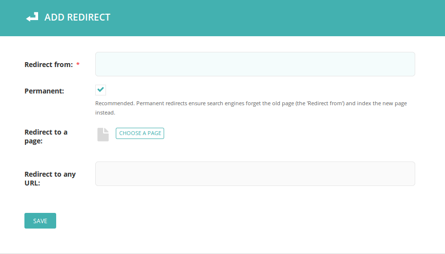

For Django developers
=====================

.. contents:: Contents
    :local:

.. note::
    This documentation is currently being written.

Overview
~~~~~~~~

Wagtail requires a little careful setup to define the types of content that you want to present through your website. The basic unit of content in Wagtail is the ``Page``, and all of your page-level content will inherit basic webpage-related properties from it. But for the most part, you will be defining content yourself, through the construction of Django models using Wagtail's ``Page`` as a base.

Wagtail organizes content created from your models in a tree, which can have any structure and combination of model objects in it. Wagtail doesn't prescribe ways to organize and interrelate your content, but here we've sketched out some strategies for organizing your models.

The presentation of your content, the actual webpages, includes the normal use of the Django template system. We'll cover additional functionality that Wagtail provides at the template level later on.

But first, we'll take a look at the ``Page`` class and model definitions.


The Page Class
~~~~~~~~~~~~~~

``Page`` uses Django's model interface, so you can include any field type and field options that Django allows. Wagtail provides some fields and editing handlers that simplify data entry in the Wagtail admin interface, so you may want to keep those in mind when deciding what properties to add to your models in addition to those already provided by ``Page``.


Built-in Properties of the Page Class
-------------------------------------

Wagtail provides some properties in the ``Page`` class which are common to most webpages. Since you'll be subclassing ``Page``, you don't have to worry about implementing them.

Public Properties
`````````````````

    ``title`` (string, required)
        Human-readable title for the content

    ``slug`` (string, required)
        Machine-readable URL component for this piece of content. The name of the page as it will appear in URLs e.g ``http://domain.com/blog/[my-slug]/``

    ``seo_title`` (string)
        Alternate SEO-crafted title which overrides the normal title for use in the ``<head>`` of a page

    ``search_description`` (string)
        A SEO-crafted description of the content, used in both internal search indexing and for the meta description read by search engines

The ``Page`` class actually has alot more to it, but these are probably the only built-in properties you'll need to worry about when creating templates for your models.


Anatomy of a Wagtail Model
~~~~~~~~~~~~~~~~~~~~~~~~~~

So what does a Wagtail model definition look like? Here's a model representing a typical blog post:

.. code-block:: python

    from django.db import models

    from wagtail.wagtailcore.models import Page
    from wagtail.wagtailcore.fields import RichTextField
    from wagtail.wagtailadmin.edit_handlers import FieldPanel
    from wagtail.wagtailimages.edit_handlers import ImageChooserPanel
    from wagtail.wagtailimages.models import Image

    class BlogPage(Page):
        body = RichTextField()
        date = models.DateField("Post date")
        feed_image = models.ForeignKey(
            'wagtailimages.Image',
            null=True,
            blank=True,
            on_delete=models.SET_NULL,
            related_name='+'
        )

    BlogPage.content_panels = [
        FieldPanel('title', classname="full title"),
        FieldPanel('date'),
        FieldPanel('body', classname="full"),
    ]

    BlogPage.promote_panels = [
        FieldPanel('slug'),
        FieldPanel('seo_title'),
        FieldPanel('show_in_menus'),
        FieldPanel('search_description'),
        ImageChooserPanel('feed_image'),
    ]

To keep track of your ``Page``-derived models, it might be helpful to include "Page" as the last part of your class name. ``BlogPage`` defines three properties: ``body``, ``date``, and ``feed_image``. These are a mix of basic Django models (``DateField``), Wagtail fields (``RichTextField``), and a pointer to a Wagtail model (``Image``).

Next, the ``content_panels`` and ``promote_panels`` lists define the capabilities and layout of the Wagtail admin page edit interface. The lists are filled with "panels" and "choosers", which will provide a fine-grain interface for inputting the model's content. The ``ImageChooserPanel``, for instance, lets one browse the image library, upload new images, and input image metadata. The ``RichTextField`` is the basic field for creating web-ready website rich text, including text formatting and embedded media like images and video. The Wagtail admin offers other choices for fields, Panels, and Choosers, with the option of creating your own to precisely fit your content without workarounds or other compromises.

Your models may be even more complex, with methods overriding the built-in functionality of the ``Page`` to achieve webdev magic. Or, you can keep your models simple and let Wagtail's built-in functionality do the work.

Now that we have a basic idea of how our content is defined, lets look at relationships between pieces of content.


Introduction to Trees
~~~~~~~~~~~~~~~~~~~~~

If you're unfamiliar with trees as an abstract data type, you might want to `review the concepts involved. <http://en.wikipedia.org/wiki/Tree_(data_structure)>`_

As a web developer, though, you probably already have a good understanding of trees as filesystem directories or paths. Wagtail pages can create the same structure, as each page in the tree has its own URL path, like so::

    /
        people/
            nien-nunb/
            laura-roslin/
        events/
            captain-picard-day/
            winter-wrap-up/

The Wagtail admin interface uses the tree to organize content for editing, letting you navigate up and down levels in the tree through its Explorer menu. This method of organization is a good place to start in thinking about your own Wagtail models.


Nodes and Leaves
----------------

It might be handy to think of the ``Page``-derived models you want to create as being one of two node types: parents and leaves. Wagtail isn't prescriptive in this approach, but it's a good place to start if you're not experienced in structuring your own content types.


Nodes
`````
Parent nodes on the Wagtail tree probably want to organize and display a browse-able index of their descendants. A blog, for instance, needs a way to show a list of individual posts.

A Parent node could provide its own function returning its descendant objects.

.. code-block:: python

    class EventPageIndex(Page):
        # ...
        def events(self):
            # Get list of live event pages that are descendants of this page
            events = EventPage.objects.live().descendant_of(self)

            # Filter events list to get ones that are either
            # running now or start in the future
            events = events.filter(date_from__gte=date.today())

            # Order by date
            events = events.order_by('date_from')

            return events

This example makes sure to limit the returned objects to pieces of content which make sense, specifically ones which have been published through Wagtail's admin interface (``live()``) and are children of this node (``descendant_of(self)``). By setting a ``subpage_types`` class property in your model, you can specify which models are allowed to be set as children, but Wagtail will allow any ``Page``-derived model by default. Regardless, it's smart for a parent model to provide an index filtered to make sense.


Leaves
``````
Leaves are the pieces of content itself, a page which is consumable, and might just consist of a bunch of properties. A blog page leaf might have some body text and an image. A person page leaf might have a photo, a name, and an address.

It might be helpful for a leaf to provide a way to back up along the tree to a parent, such as in the case of breadcrumbs navigation. The tree might also be deep enough that a leaf's parent won't be included in general site navigation.

The model for the leaf could provide a function that traverses the tree in the opposite direction and returns an appropriate ancestor:

.. code-block:: python

    class EventPage(Page):
        # ...
        def event_index(self):
            # Find closest ancestor which is an event index
            return self.get_ancestors().type(EventIndexPage).last()

If defined, ``subpage_types`` will also limit the parent models allowed to contain a leaf. If not, Wagtail will allow any combination of parents and leafs to be associated in the Wagtail tree. Like with index pages, it's a good idea to make sure that the index is actually of the expected model to contain the leaf.


Other Relationships
```````````````````
Your ``Page``-derived models might have other interrelationships which extend the basic Wagtail tree or depart from it entirely. You could provide functions to navigate between siblings, such as a "Next Post" link on a blog page (``post->post->post``). It might make sense for subtrees to interrelate, such as in a discussion forum (``forum->post->replies``) Skipping across the hierarchy might make sense, too, as all objects of a certain model class might interrelate regardless of their ancestors (``events = EventPage.objects.all``). It's largely up to the models to define their interrelations, the possibilities are really endless.


Anatomy of a Wagtail Request
~~~~~~~~~~~~~~~~~~~~~~~~~~~~

For going beyond the basics of model definition and interrelation, it might help to know how Wagtail handles requests and constructs responses. In short, it goes something like:

    #.  Django gets a request and routes through Wagtail's URL dispatcher definitions
    #.  Starting from the root content piece, Wagtail traverses the page tree, letting the model for each piece of content along the path decide how to ``route()`` the next step in the path.
    #.  A model class decides that routing is done and it's now time to ``serve()`` content.
    #.  ``serve()`` constructs a context using ``get_context()``
    #.  ``serve()`` finds a template to pass it to using ``get_template()``
    #.  A response object is returned by ``serve()`` and Django responds to the requester.

You can apply custom behavior to this process by overriding ``Page`` class methods such as ``route()`` and ``serve()`` in your own models. For examples, see :ref:`model_recipes`.


Page Properties and Methods Reference
~~~~~~~~~~~~~~~~~~~~~~~~~~~~~~~~~~~~~

In addition to the model fields provided, ``Page`` has many properties and methods that you may wish to reference, use, or override in creating your own models. Those listed here are relatively straightforward to use, but consult the Wagtail source code for a full view of what's possible.

Properties:

* specific
* url
* full_url
* relative_url
* has_unpublished_changes
* status_string
* subpage_types
* indexed_fields
* preview_modes

Methods:

* route
* serve
* get_context
* get_template
* is_navigable
* get_ancestors
* get_descendants
* get_siblings
* search
* serve_preview


Page Queryset Methods
~~~~~~~~~~~~~~~~~~~~~

The ``Page`` class uses a custom Django model manager which provides these methods for structuring queries on ``Page`` objects.

get_query_set()
    return PageQuerySet(self.model).order_by('path')

live(self):
    return self.get_query_set().live()

not_live(self):
    return self.get_query_set().not_live()

page(self, other):
    return self.get_query_set().page(other)

not_page(self, other):
    return self.get_query_set().not_page(other)

descendant_of(self, other, inclusive=False):
    return self.get_query_set().descendant_of(other, inclusive)

not_descendant_of(self, other, inclusive=False):
    return self.get_query_set().not_descendant_of(other, inclusive)

child_of(self, other):
    return self.get_query_set().child_of(other)

not_child_of(self, other):
    return self.get_query_set().not_child_of(other)

ancestor_of(self, other, inclusive=False):
    return self.get_query_set().ancestor_of(other, inclusive)

not_ancestor_of(self, other, inclusive=False):
    return self.get_query_set().not_ancestor_of(other, inclusive)

parent_of(self, other):
    return self.get_query_set().parent_of(other)

not_parent_of(self, other):
    return self.get_query_set().not_parent_of(other)

sibling_of(self, other, inclusive=False):
    return self.get_query_set().sibling_of(other, inclusive)

not_sibling_of(self, other, inclusive=False):
    return self.get_query_set().not_sibling_of(other, inclusive)

type(self, model):
    return self.get_query_set().type(model)

not_type(self, model):
    return self.get_query_set().not_type(model)


.. _wagtail_site_admin:

Site
~~~~

Django's built-in admin interface provides the way to map a "site" (hostname or domain) to any node in the wagtail tree, using that node as the site's root.

Access this by going to ``/django-admin/`` and then "Home › Wagtailcore › Sites." To try out a development site, add a single site with the hostname ``localhost`` at port ``8000`` and map it to one of the pieces of content you have created.

Wagtail's developers plan to move the site settings into the Wagtail admin interface.


.. _redirects:

Redirects
~~~~~~~~~

Wagtail provides a simple interface for creating arbitrary redirects to and from any URL.


