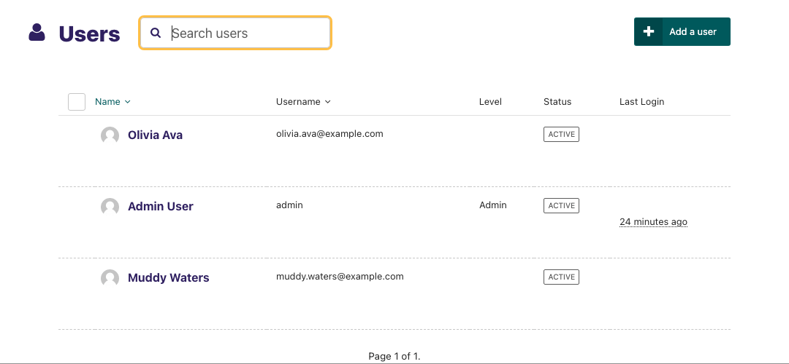
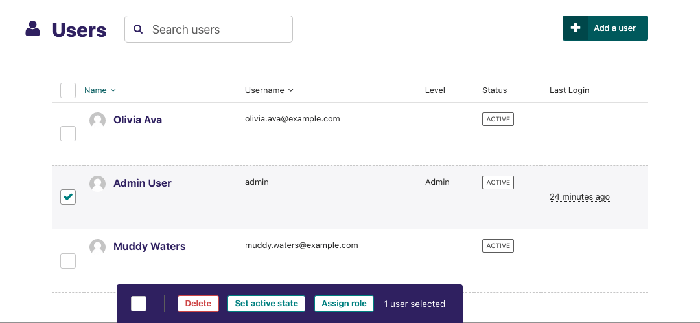

# Managing users and roles

As an administrator, a common task will be adding, modifying or removing user profiles.

This is done via the 'Users' interface, which can be found in the Settings menu, accessible via the left-hand menu bar.

In this interface you can see all of your users, their usernames, their 'level' of access (otherwise known as their 'role'), and their status, either active or inactive.

You can sort this listing either via Name or Username.



-   Select multiple users by checking the checkbox on the left of each row, then use the bulk actions bar at the bottom to perform an action on all selected users.



Clicking on a user's name will open their profile details. From here you can then edit that users details.

```{note}
It is possible to change user's passwords in this interface, but it is worth encouraging your users to use the 'Forgotten password' link on the login screen instead. This should save you some time!
```

Click the 'Roles' tab to edit the level of access your users have. By default there are three roles:

| Role          | Create/view drafts | Publish content | Access Settings |
| ------------- | ------------------ | --------------- | --------------- |
| Editor        | Yes                | No              | No              |
| Moderator     | Yes                | Yes             | No              |
| Administrator | Yes                | Yes             | Yes             |
