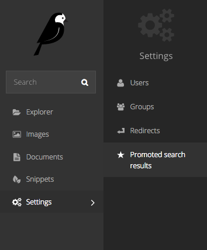
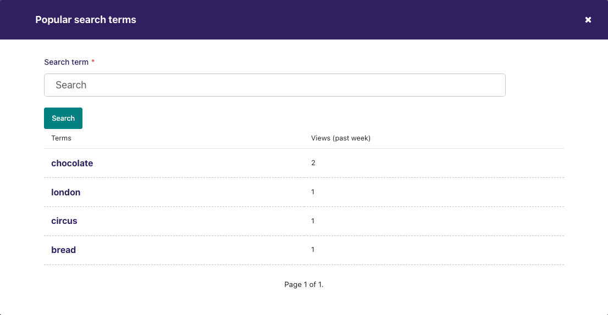
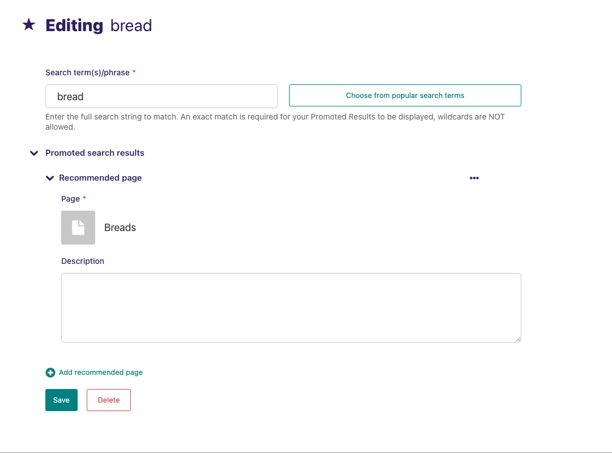

# Promoted search results

```{note}
Promoted search results are an optional Wagtail feature. For details of how to enable them on a Wagtail installation, see {mod}`~wagtail.contrib.search_promotions`
```

Wagtail allows you to promote certain search results dependent on the keyword or phrase entered by the user when searching. This can be particularly useful when users commonly refer to parts of your organisation via an acronym that isn't in official use, or if you want to direct users to a page when they enter a certain term related to the page but not included in the text of the page itself.

As a concrete example, one of our clients wanted to direct people who searched for 'finances' to their 'Annual budget review' page. The word 'finances' is not mentioned in either the title or the body of the target page, so they created a promoted search result for the word 'finances' that pushed the budget page to the very top of the results.

```{note}
The promoted result will only work if the user types _exactly_ the phrase that you have set it up for. If you have variations of a phrase that you want to take into account, then you must create additional promoted results.
```

To set up the promoted search results, click on the 'Promoted search results' menu item in the 'Settings' menu.



Add a new promoted result from the button in the top right of the resulting screen, or edit an existing promoted result by clicking on it.


When adding a new promoted result, Wagtail provides you with a 'Choose from popular search terms' option. This will show you the most popular terms entered by users into your internal search. You can match this list against your existing promoted results to ensure that users are able to find what they are looking for.



You then add a the result itself by clicking 'Add recommended page'. You can add multiple results, but be careful about adding too many, as you may end up hiding all of your organic results with promoted results, which may not be helpful for users who aren't really sure what they are looking for.


