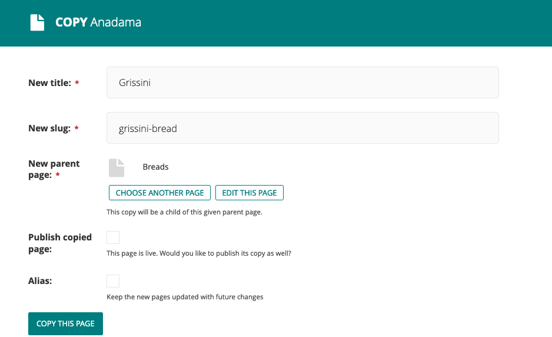
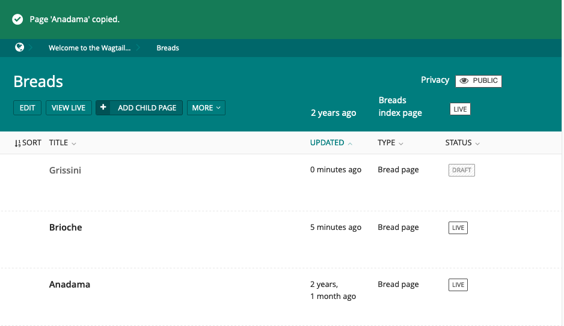
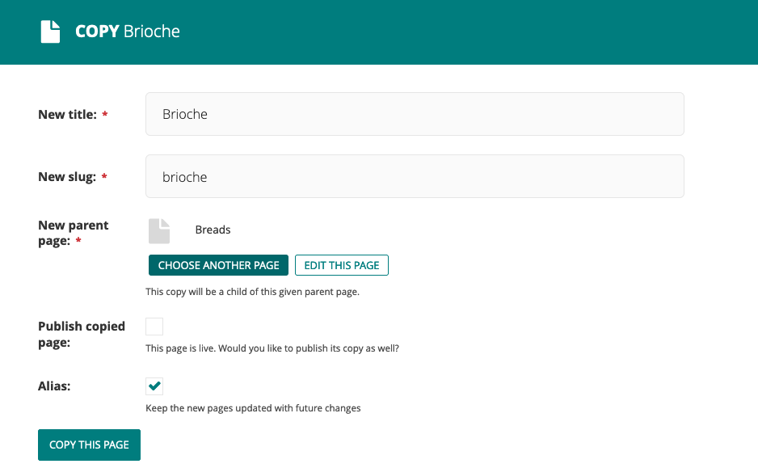
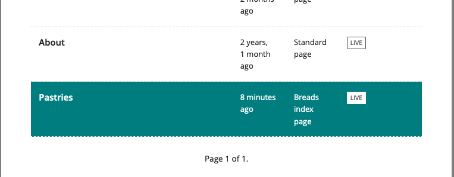
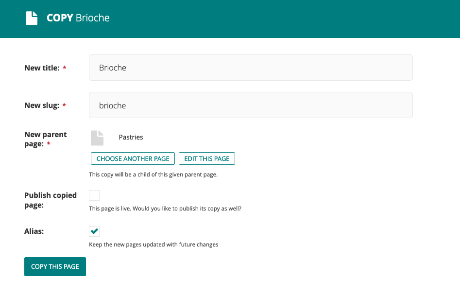
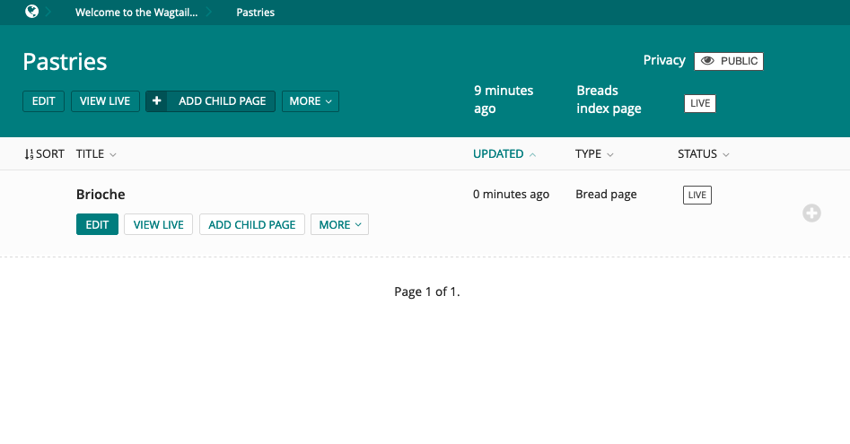

(copying_page_label)=

# Copying and creating aliases to existing pages

## Copying Pages

Sometimes you might not need to create a new page from scratch. For example, you could have several pages that are very similar in terms of structure, but differ in content. In that case, you can copy an existing page and only change the required parts.

Here is how to copy an existing page:

-   When you hover over a page in an {doc}`Explorer page <finding_your_way_around/the_explorer_page>`, click on _More_ and then _Copy_.

-   You are then taken to a form where you can enter the copy's title, slug and choose the parent page (if you want to change it). You then get the option to publish the copied page right away and an option to mark the copy as an alias of the original page (see  for more information about aliasing pages).

-   Once you completed this form, press _Copy this page_. The page will then be copied and appear in the Explorer page.

(aliasing_page_label)=

## Aliasing pages

When copying a page, you also have the option to mark it as an alias. The content of an aliased page will stay in sync with the original. This is particularly useful when a page is required to be available in multiple places.
For example, let's say you have a page about Brioche in the Breads section. You then want to also make this page available in the Pastries section. One way to do this is to create a copy of the Brioche page and change the parent page to the Pastries page. However you now need to remember to update this copy each time the original is modified. If a copy is marked as an alias Wagtail will do this for you each time a modification to the original page is published.

Here is how to create an alias to an existing page:

-   The first step is the same as it is for . When you hover over a page in the {doc}`Explorer page <finding_your_way_around/the_explorer_page>`, click on _More_ and then _Copy_.
-   When you get to the copy page form, you can then choose another page as the parent page. Click the _Choose another page_ button.

-   Select and click on the desired parent page.

-   Make sure the _Alias_ checkbox is ticked.
-   You can then complete the page aliasing by clicking on the _Copy this page_ button.

-   The aliased page will then appear under the new parent in the Explorer.

-   When you try to edit the aliased page, you are notified that it is an alias of another page. You will then be offered two options: edit the original page (with changes appearing in both places) or convert the alias page into an ordinary page (i.e. a conventional copy, not updated when the original changes).

