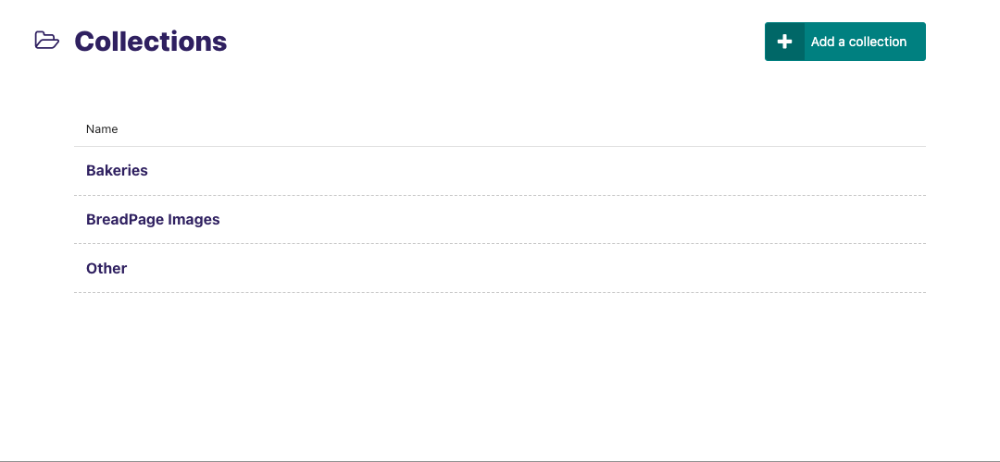
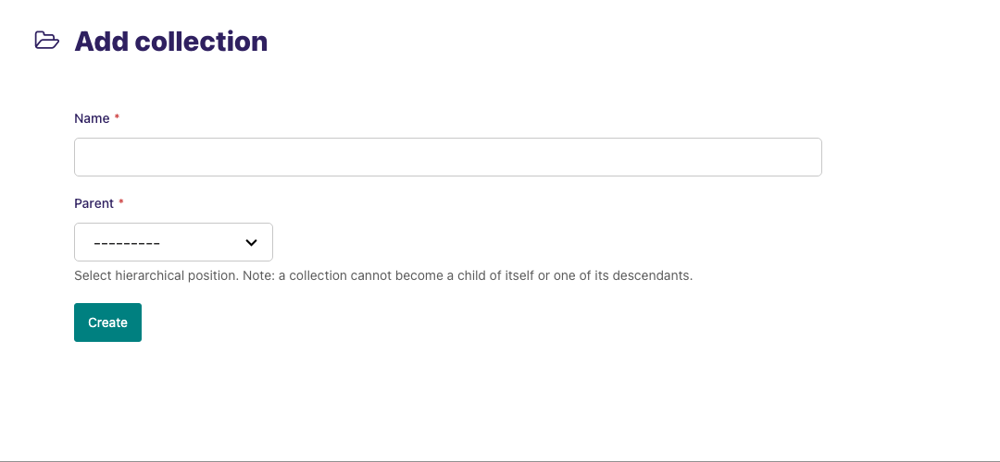
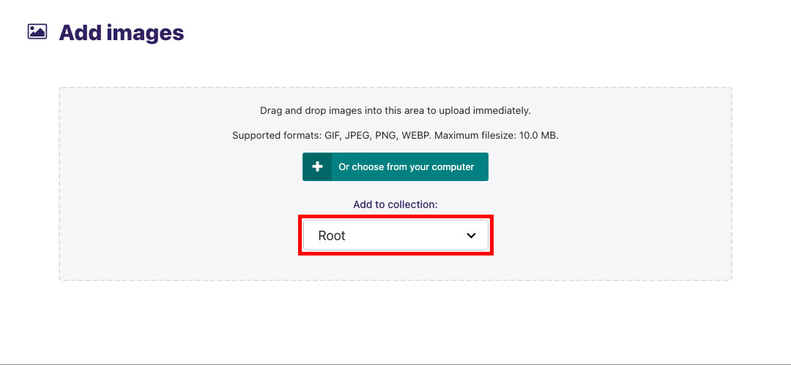
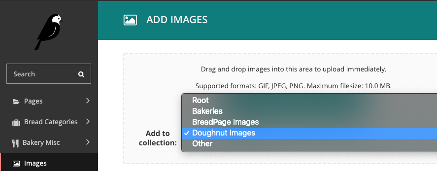
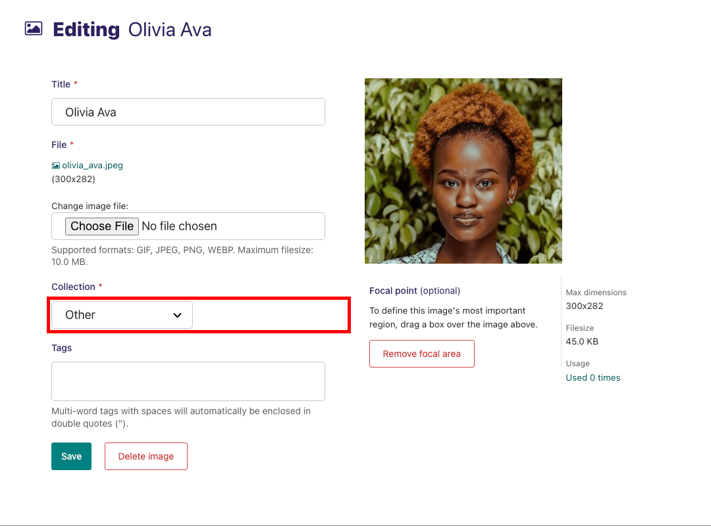
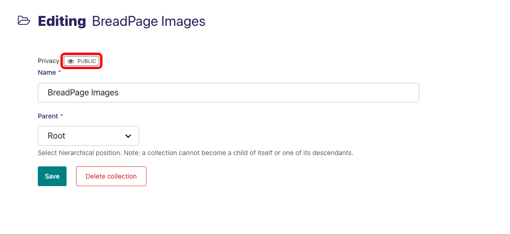
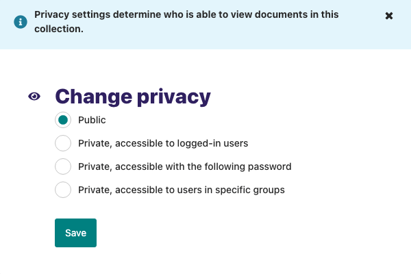

# Collections

Access to specific sets of images and documents can be controlled by setting up ‘collections’. By default all images and documents belong to the ‘root’ collection, but users with appropriate permissions can create new collections through the **Settings -> Collections** area of the admin interface.



## Add a collection

-   Clicking the **add a collection** button will allow you to create a collection. Name your collection and click **save** .



## Add images / documents to a collection

-   Navigate to the **Images** or **Documents** section and select a collection from the dropdown menu.





-   You can also edit an image or document directly by clicking on it to assign it to a collection.



(collection_privacy_settings)=

## Privacy settings

-   To set permissions determining who is able to view documents within a collection, navigate to **Settings > Collections** and select a collection. Then click the privacy button above the collection name.



-   Within the privacy settings overlay, select the level of privacy for the collection.



Permissions set on a collection apply to that collection and all collections below it in the hierarchy. Therefore, if you make the 'root' collection private, all documents in the site will be private. Permissions set on other collections apply to that collection only.

```{Note}
Although privacy settings are added to a collection, they are only enforced for documents within the collection. Privacy settings do not apply to images.
```
