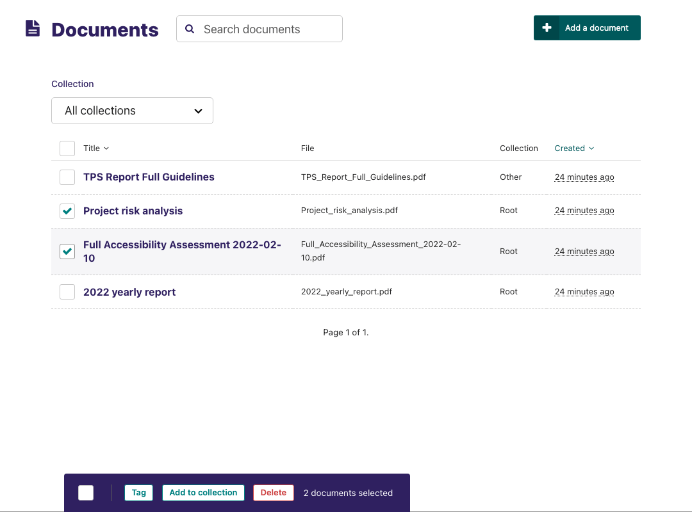

# Documents

Documents such as PDFs can be managed from the Documents interface, available in the left-hand menu. This interface allows you to add documents to and remove documents from the CMS.


-   Add documents by clicking the _Add document_ button in the top-right.
-   Search for documents in the CMS by entering your search term in the search bar. The results will be automatically updated as you type.
-   You can also filter the results by _Collection_ by selecting one from the collections dropdown above the documents list.



-   Select multiple documents by checking the checkbox on the left of each row, then use the bulk actions bar at the bottom to perform an action on all selected documents.
-   Edit the details of a document by clicking the document title.


-   When editing a document you can replace the file associated with that document record. This means you can update documents without having to update the pages on which they are placed. Changing the file will change it on all pages that use the document.
-   Change the document's collection using the collection dropdown.
-   Add or remove tags using the Tags field.
-   Save or delete documents using the buttons at the bottom of the interface.

```{Warning}
Deleted documents cannot be recovered.
```
