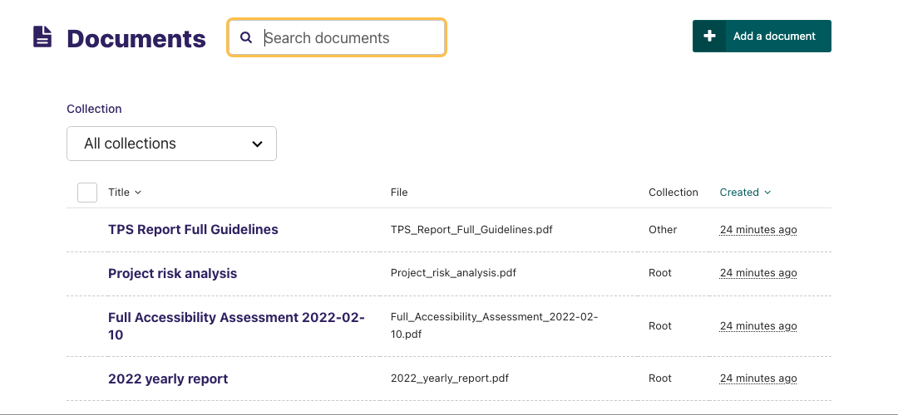
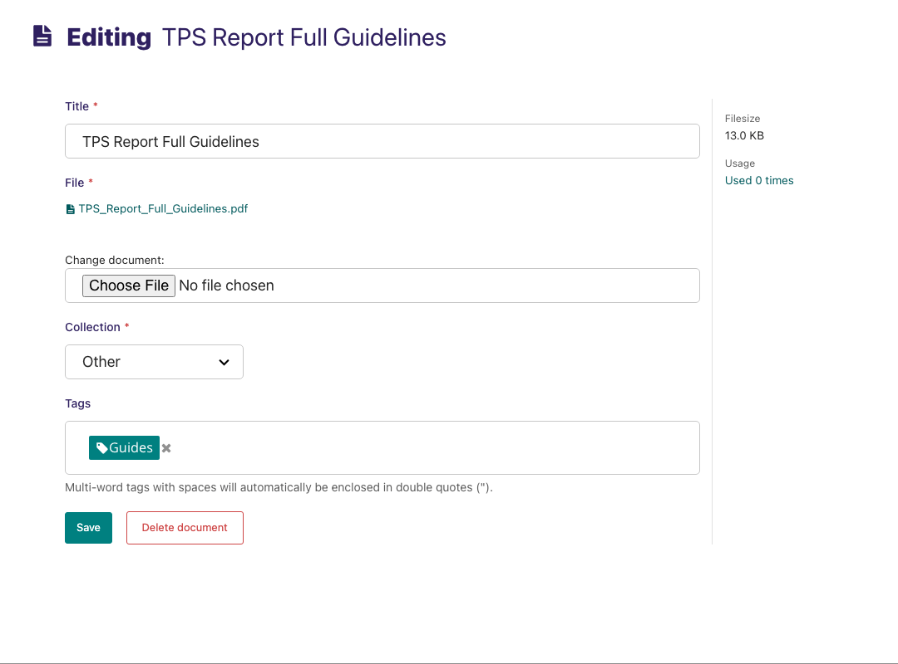

Documents
~~~~~~~~~

Documents such as PDFs can be managed from the Documents interface, available in the left-hand menu. This interface allows you to add documents to and remove documents from the CMS.

* Add documents by clicking the *Add document* button in the top-right.
* Search for documents in the CMS by entering your search term in the search bar. The results will be automatically updated as you type.
* You can also filter the results by *Popular tags*. Click on a tag to update the search results listing.
* Edit the details of a document by clicking the document title.

* When editing a document you can replace the file associated with that document record. This means you can update documents without having to update the pages on which they are placed. Changing the file will change it on all pages that use the document.
* Add or remove tags using the Tags field.
* Save or delete documents using the buttons at the bottom of the interface.

.. Warning::
    Deleted documents cannot be recovered.
