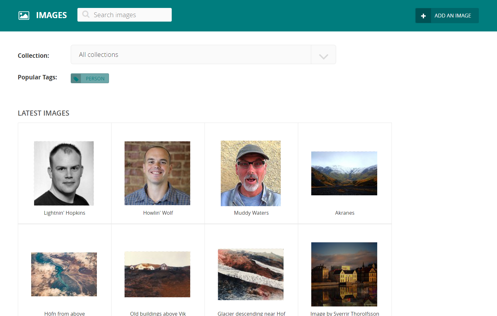
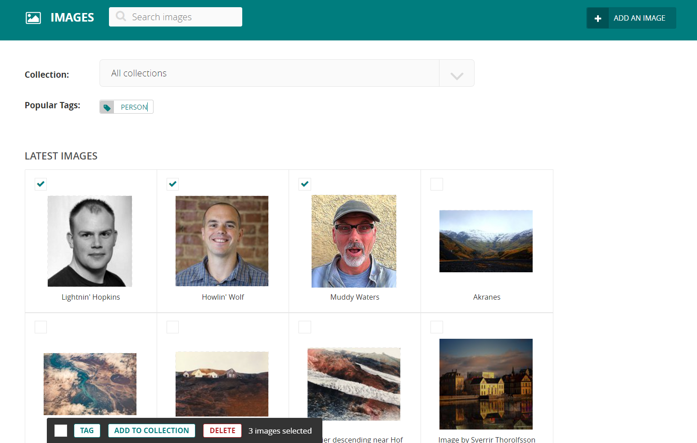
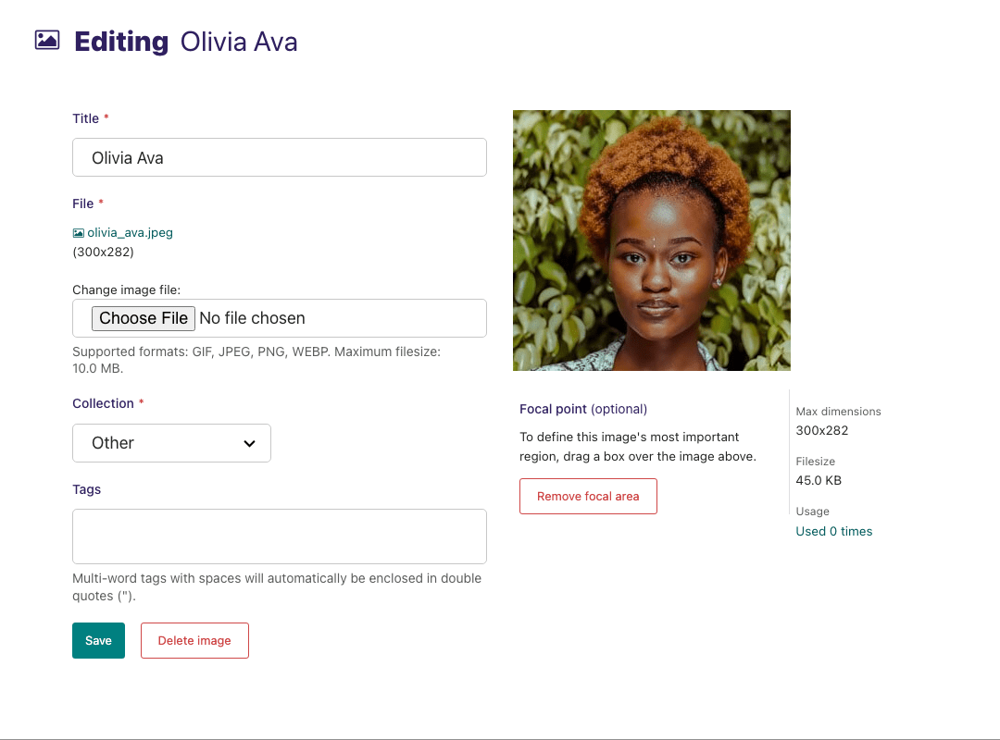

# Images

If you want to edit, add or remove images from the CMS outside of the individual pages you can do so from the Images interface. This is accessed from the left-hand menu.



-   Select multiple images by checking the checkbox on the top left of each image block, then use the bulk actions bar at the bottom to perform an action on all selected images.



-   Clicking an image will allow you to edit the data associated with it. This includes the title, the focal point of the image and much more.



## Changing the image

-   When editing an image you can replace the file associated with that image record. This means you can update images without having to update the pages on which they are placed.

```{Warning}
Changing the file will change it on all pages that use the image.
```

## Focal area

-   This interface allows you to select a focal area which can effect how your image displays to visitors on the front-end.
-   If your images are cropped in some way to make them fit to a specific shape, then the focal area will define the centre point from which the image is cropped.
-   To set the focal area, drag a marquee around the most important element of the image.
-   To remove the focal area, hit the button below the image.
-   If the feature is set up in your website, then on the front-end you will see the crop of this image focusing on your selection.
