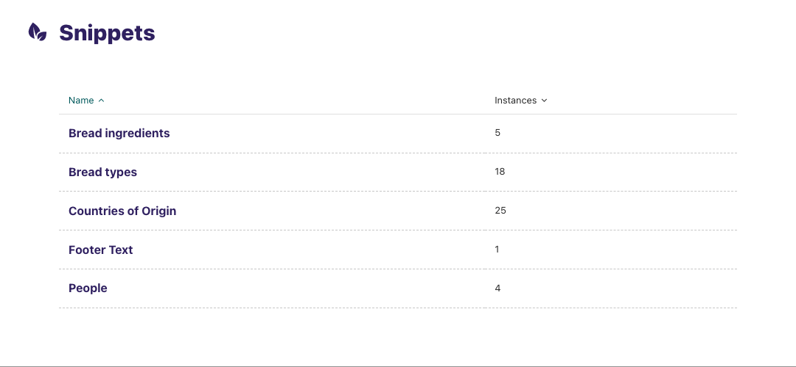
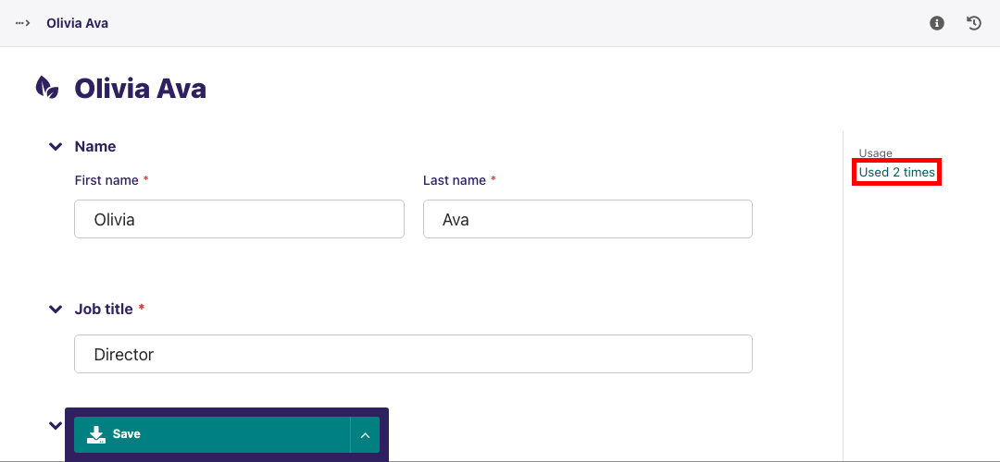

Snippets
~~~~~~~~

Snippets allow you to create elements on a website once and reuse them in multiple places. Then, if you want to change something on the snippet, you only need to change it once, and it will change across all the occurances of the snippet.

How snippets are used can vary widely between websites. Here are a few examples of things Torchbox have used snippets for on our clients' websites:

* For staff contact details, so that they can be added to many pages but managed in one place
* For Adverts, either to be applied sitewide or on individual pages
* To manage links in a global area of the site, for example in the footer
* For Calls to Action, such as Newsletter signup blocks, that may be consistent across many different pages

The Snippets menu
-----------------

* You can access the Snippets menu by clicking on the 'Snippets' link in the left-hand menu bar.
* To add or edit a snippet, click on the snippet type you are interested in (often help text will be included to help you in selecting the right type)
* Click on an individual snippet to edit, or click 'Add ...' in the top right to add a new snippet

.. Warning::
    Editing a snippet will change it on all of the pages on which it has been used. In the top-right of the Snippet edit screen you will see a label saying how many times the snippet has been used. Clicking this label will display a listing of all of these pages.

Adding snippets whilst editing a page
-------------------------------------

If you are editing a page, and you find yourself in need of a new snippet, do not fear! You can create a new one without leaving the page you are editing:

* Whilst editing the page, open the snippets interface in a new tab, either by Ctrl+click (cmd+click on Mac) or by right clicking it and selecting 'Open in new tab' from the resulting menu.
* Add the snippet in this new tab as you normally would.
* Return to your existing tab and reopen the Snippet chooser window.
* You should now see your new snippet, even though you didn't leave the edit page.

.. Note::
    Even though this is possible, it is worth saving your page as a draft as often as possible, to avoid your changes being lost by navigating away from the edit page accidentally.
