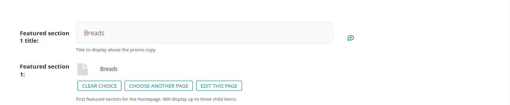
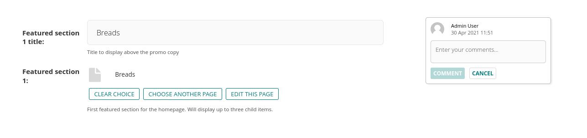
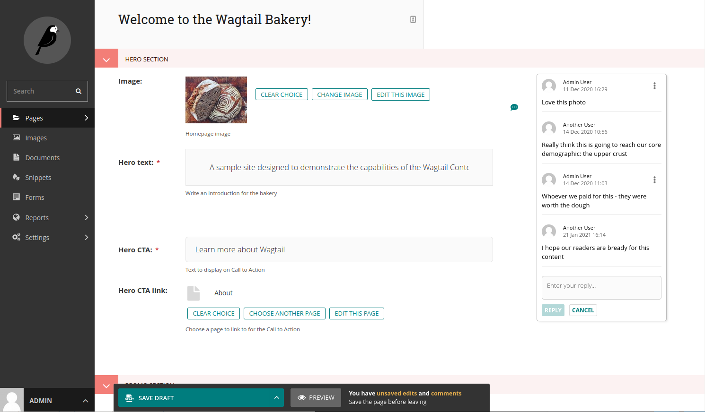
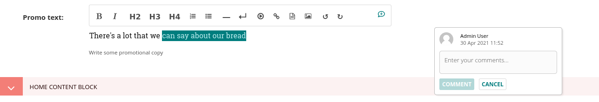
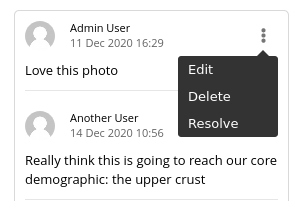
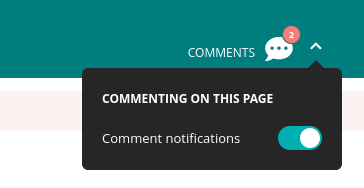

# Editing existing pages

Here is how you can access the edit screen of an existing page:

-   Clicking the title of the page in an {doc}`Explorer page <finding_your_way_around/the_explorer_page>` or in {doc}`search results <finding_your_way_around/using_search>`.
-   Clicking the _Edit_ link below the title in either of the situations above.
-   Clicking the _Edit_ icon for a page in the explorer menu.


-   When editing an existing page the title of the page being edited is displayed at the top of the page.
-   You can perform various actions (such as copy, move or delete a page) by opening the secondary menu at the right of the top breadcrumb.
-   The header has a link to the page history.
-   In the Info side panel, you can find the page type and other important page information.
-   If published, a link to the live version of the page is shown on the top right.
-   You can toggle commenting mode by clicking the icon in the top right, which also shows the number of comments.
-   You can change the title of the page by clicking into the title field.
-   When you're typing into a field, help text is often displayed on the right-hand side of the screen.

## Workflow

If the page is currently in a workflow, you'll see an additional indicator in the Info side panel, showing the current workflow task. Clicking the "View details" button will
show more information about the page's progress through the workflow, as well as any comments left by reviewers.


If you can perform moderation actions (for example, approval or requesting changes) on the current task, you'll see additional options in the
action menu at the bottom of the page.

(commenting)=

## Commenting

Use the comment icon at the top right to enable commenting mode. If there are comments on the page, the number
of comments is shown alongside the icon.

When in commenting mode, hovering over a commentable field or block will reveal a comment button.



If there is no pre-existing comment on the field, you can use this to create a new comment.



If there is an existing comment, clicking either the field button or the comment will bring the comment thread into focus, allowing you to
add new replies.



Within a rich text field, you can highlight text and click the comment button to add an inline comment.



All of these actions can also be performed using the comment shortcut, `Ctrl + Alt + M` / `⌘ + Alt + M`.

Clicking the three dots in the top right of an existing comment will open its menu. This allows you to
resolve a comment, as well as to edit or delete any of your own comments.



Any comments or changes to comments will only be saved when the page is saved.

```{note}
Currently, fields inside `InlinePanels` and `ListBlocks` are uncommentable.
```

The arrow to the right of the comments icon shows the comment notifications
panel, where you can enable or disable email notifications for other users' comments on the page.



```{note}
You will always receive email notifications for threads you are part of, unless you opt out of all comment notifications in your
account settings.
All participants in a thread will receive email notifications for new replies, even if they no longer have permission to edit the page.
```
