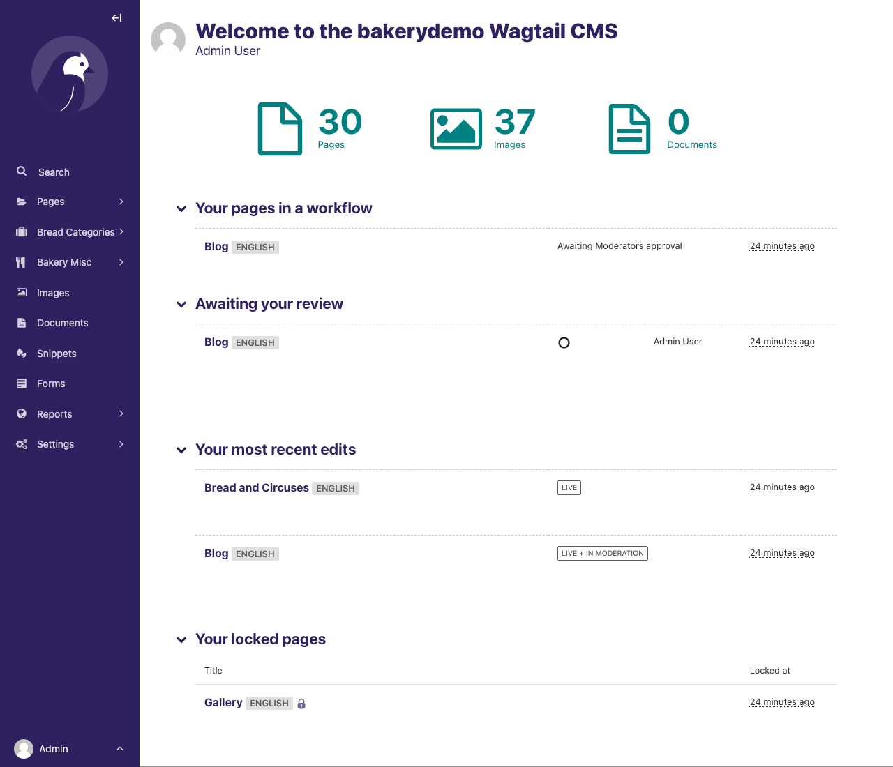

# The Dashboard

The Dashboard provides information on:

-   The number of pages, images, and documents currently held in the Wagtail CMS
-   Any pages currently awaiting moderation (if you have these privileges)
-   Any pages that you've locked (if your administrator has enabled {ref}`author-specific locking<WAGTAILADMIN_GLOBAL_PAGE_EDIT_LOCK>`)
-   Your most recently edited pages

You can return to the Dashboard at any time by clicking the Wagtail logo in the top-left of the screen.

-   Clicking the logo returns you to your Dashboard.

-   The stats at the top of the page describe the total amount of content on the CMS (just for fun!).

-   The _Your pages in a workflow_ panel shows you any pages in moderation that you own or submitted for moderation yourself, along with which
    moderation tasks they are awaiting, and how long they've been on that task.

-   The _Awaiting your review_ panel will only be displayed if you are able to perform moderation actions.

    -   Clicking the name of a page will take you to the ‘Edit page’ interface for this page.
    -   Clicking approve or request changes will either progress the page to the next task in the moderation workflow (or publish if it's the final stage) or mark the page as needing changes and return it to normal editing. An email will be sent to the creator of the page giving the result of the overall workflow when it completes.
    -   The status indicator circles show the progress through the workflow: a tick for a completed task, or an empty circle for an incomplete one. Tooltips provide more details on the status of each.
    -   The time this page has been waiting for review on this task is also shown to the right.

-   The _Your locked pages_ panel shows the pages you've locked so that only you can edit them.

    -   The date you locked the page is displayed to the right.
    -   Clicking the name of a page will take you to the ‘Edit page’ interface for this page.

-   The _Your most recent edits_ table displays the five pages that you most recently edited.

    -   The date that you edited the page is displayed. Hover your mouse over the date for a more exact time/date.

    -   The current status of the page is displayed. A page will have one of a number of statuses:

        -   Live: Published and accessible to website visitors
        -   Draft: Not live on the website
        -   In Moderation: In the middle of a moderation workflow
        -   Scheduled: Not live, but has a publication date set
        -   Expired: Not live - this page was unpublished as it had an expiry date set which has now passed
        -   Live + Draft: A version of the page is live, but a newer version is in draft mode.
        -   Live + (another status): A version of the page is live, but a newer version has another status.
