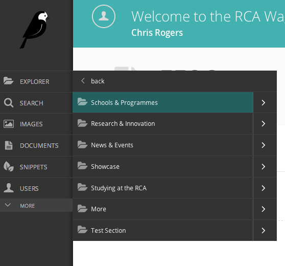

The Explorer menu
~~~~~~~~~~~~~~~~~

* Click the Explorer button in the sidebar to open the site explorer. This allows you to navigate through the tree-structure of the site.
* Clicking the name of a page will take you to the Explorer page for that section (see below). NOTE: The site explorer only displays pages which themselves have child pages. To see and edit the child pages you should click the name of the parent page in the site explorer.
* Clicking the green arrow displays the sub-sections (see below).
* Clicking the back button takes you back to the parent section.
* Again, clicking the section title takes you to the Explorer page.
* Clicking further arrows takes you deeper into the tree.