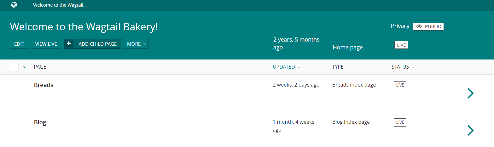
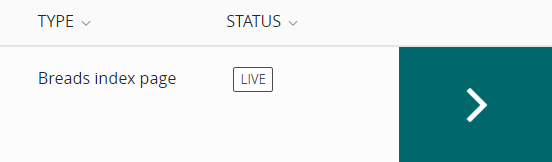
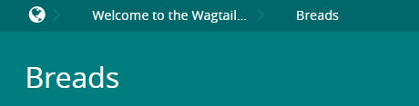
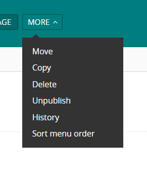
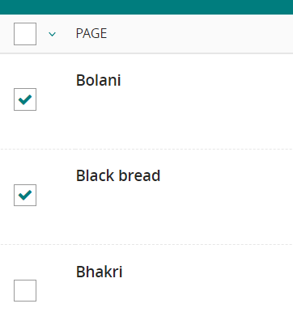
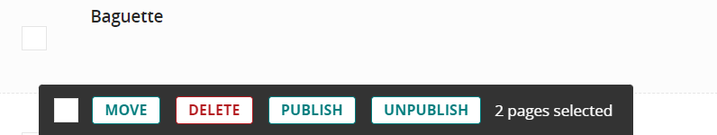
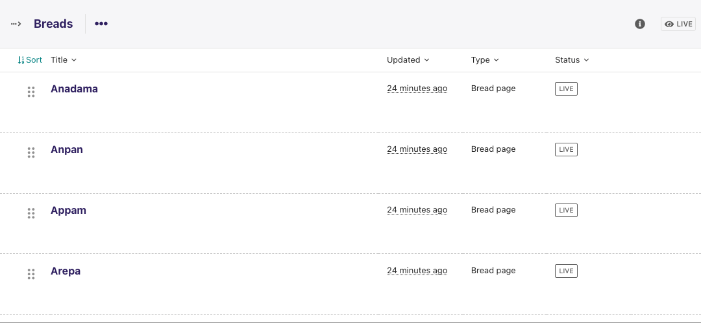

# The Explorer page

The Explorer page allows you to view a page's children and perform actions on them. From here you can publish/unpublish pages, move pages to other sections, drill down further into the content tree, or reorder pages under the parent for the purposes of display in menus.

-   The name of the section you are looking at is displayed below the breadcrumb (the row of page names beginning with the home icon). Each section is also itself a page (in this case the homepage). Clicking the title of the section takes you to the Edit screen for the section page.
-   As the heading suggests, below are the child pages of the section. Clicking the titles of each child page will take you to its Edit screen.

-   Clicking the arrows will display a further level of child pages.

-   As you drill down through the site the breadcrumb (the row of pages beginning with the home icon) will display the path you have taken. Clicking on the page titles in the breadcrumb will take you to the Explorer screen for that page.

-   To add further child pages press the Add child page button below the parent page title. You can view the parent page on the live site by pressing the View live button. The Edit button will take you to the page edit screen.

-   Clicking on More dropdown will show a list of actions for the parent page, like Move, Copy, Delete, Unpublish, History. There will also be a Sort menu order button that will take you to the ordering page (see below)

-   There is a checkbox on the left of each page row, hovering over the row will make it visible. There is also a checkbox at the top left of the header, used to select or deselect all other checkboxes.

-   Selecting at least one checkbox will popup an action bar at the bottom, which will list all the available bulk actions for pages.
-   Clicking on any action will take you to a separate view with all the selected pages, for confirmation
-   Similar buttons are available for each child page. These are made visible on hover.

## Reordering pages

-   Clicking the “Sort menu order” button in the More dropdown will take you to a page with the reordering handles. This allows you to reorder the way that content displays in the main menu of your website.
-   Reorder by dragging the pages by the handles on the far left (the icon made up of 6 dots).
-   Your new order will be automatically saved each time you drag and drop an item.
