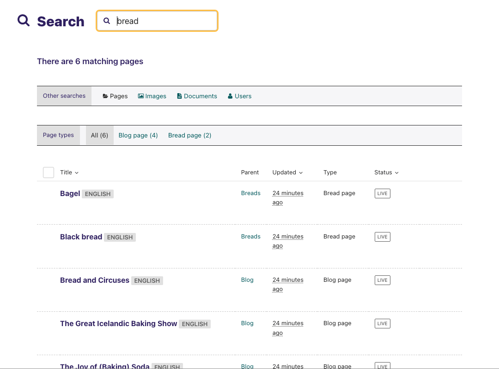

Using search
~~~~~~~~~~~~

* A very easy way to find the page that you want is to use the main search feature, accessible from the left-hand menu.
* Simply type in part or all of the name of the page you are looking for, and the results below will automatically update as you type.
* Clicking the page title in the results will take you to the Edit page for that result. You can differentiate between similar named pages using the Parent column, which tells you what the parent page of that page is.