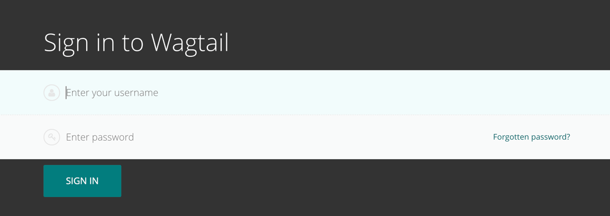

# Getting started

## The Wagtail demo site

The examples in this document are based on [Torchbox.com](https://torchbox.com). However, the instructions are general enough as to be applicable to any Wagtail site.

For the purposes of this documentation we will be using the URL, **www.example.com**, to represent the root (homepage) of your website.

## Logging in

-   The first port of call for an editor is the login page for the administrator interface.
-   Access this by adding **/admin** onto the end of your root URL (e.g. `www.example.com/admin`).
-   Enter your username and password and click **Sign in**.

