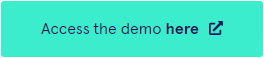
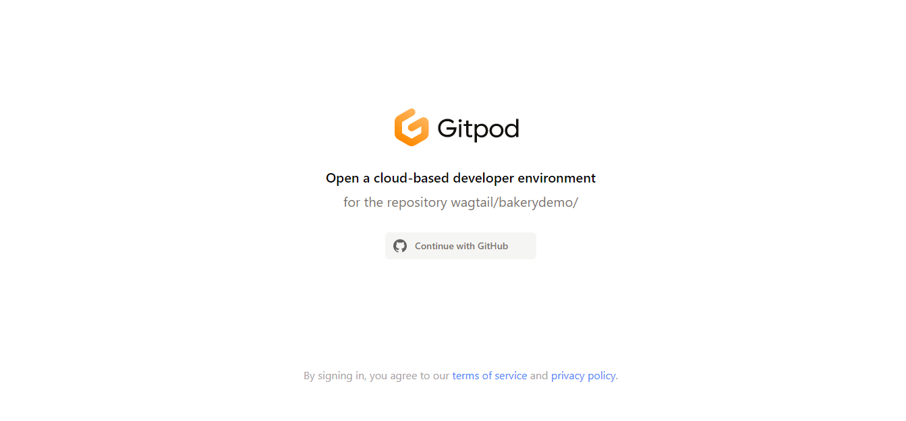
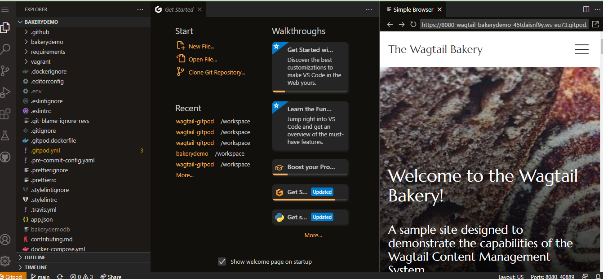
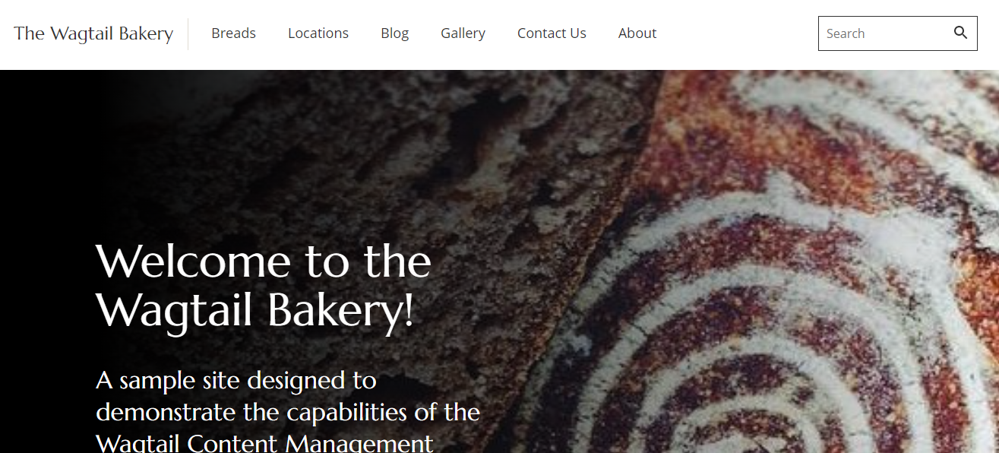
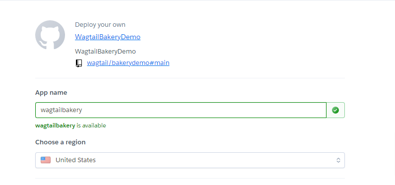
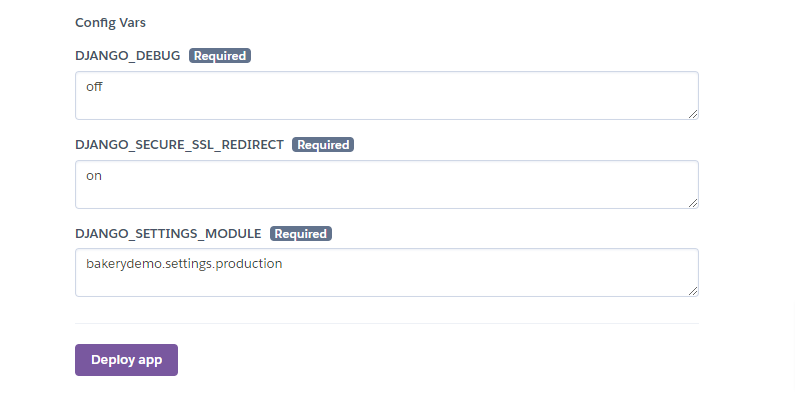
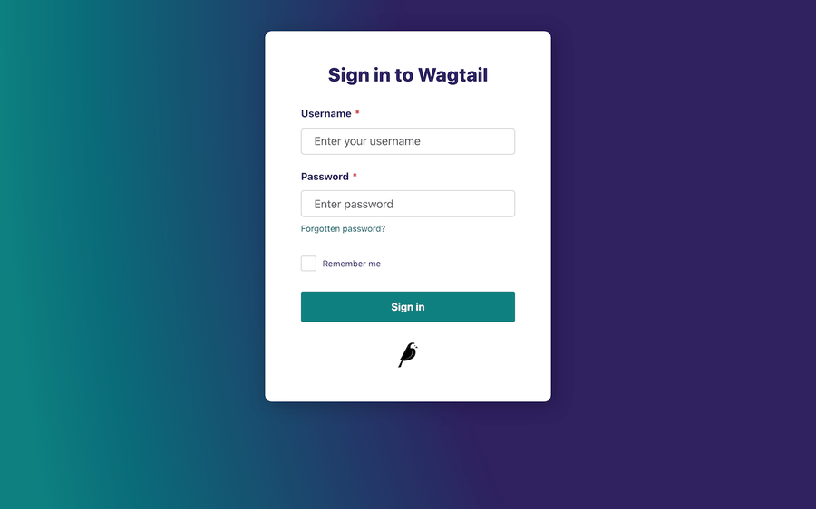
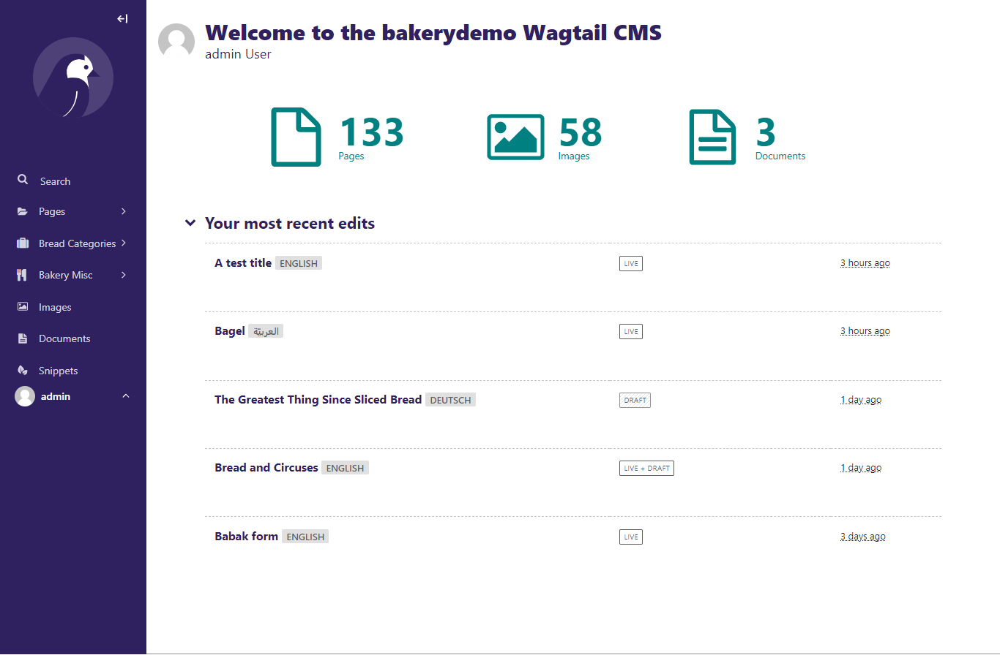

# Getting started

```{note}
This section covers how to get wagtail running, with no coding experience. It contains information about wagtail installation, prerequisite and a sequential guide to setting up your first wagtail website.

```

**In this section**

- Perequesite

- Installation

- Login

<br>
<br>

## Perequisite
- Modern web browser
- Github Account
- No coding experience required

<br>
<br>

## Installation

There are 3 ways in which you can get wagtail running on your browser without having to code; 

<br>


###  1.	Live Demo

We have a demo that updates every night with the newest version of Wagtail and the Wagtail Bakery in it. To access the demo, Click on the big green button below; 

 
[](https://gitpod.io/#https://github.com/wagtail/bakerydemo/)


you’d be directed to the wagtail bakery website. 


You can click on the navigation to access other pages of the site, or follow the login steps at the end of this tutorial, to access the dashboard.
 

<br>

### 2.  Gitpod
The next quickest no-code way to launch the Wagtail Bakery is through Gitpod. Here are the steps:

- Sign up for a free [GitHub account](https://github.com/signup) if you don't have one already.
  
- Click the big green button below
  
[](https://gitpod.io/#https://github.com/wagtail/bakerydemo/)


You’d be asked to sign in with Github, click on **connect with Github**



A new wagtail development environment will open on your browser




- Click on the `Open in browser` Icon beside the address bar, to open your demo website in a different browser.




```{note}
Your changes will not save in Gitpod if you close it. Be sure to copy anything you want to keep.
```
 
<br>

### 3.	Heroku
Heroku is another quick no-code option to set up the Wagtail Bakery on the cloud. Here are the steps:

- Sign up for a [free Heroku account](https://signup.heroku.com/) if you don't have one already.
  
- Open a fresh tab with a copy of our [handy guide](https://wagtail.org/blog/try-wagtail-without-coding/) to trying Wagtail on Heroku.
 
 - Click the big green button below.
  
  [](https://heroku.com/deploy?template=https://github.com/wagtail/bakerydemo)

  - In the app name field, Enter a name like 
  `wagtailbakerydemo`

  



  - Click the **Deploy app** button.




  
  - Follow the steps in our guide for some ideas on what to play with. Create a post or a page, add or destroy blocks, fill up the home page with bread puns (because they always rise to the occasion). This version of the Bakery is yours to play with until you delete it.
 
<br>

## Logging in
- Access the Wagtail login by adding `/admin` to the end of the URL in the bakery preview. <br>
https://wagtaildemo-nightly.herokuapp.com/admin

A login page will display like so:




- Log in with the username `admin` and password `changeme`.
  
- Welcome to the editor dashboard! Have fun playing around with Wagtail! Add a page, delete a blog post, replace the bread pictures with kittens. This site is your playground.




													Next - The dashboard


