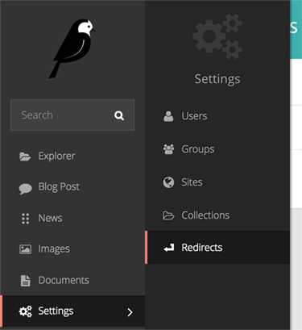
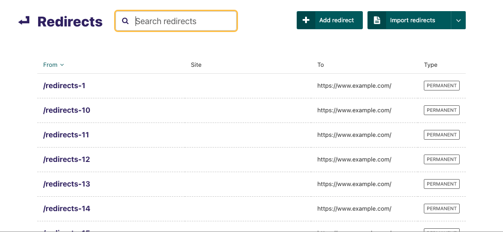
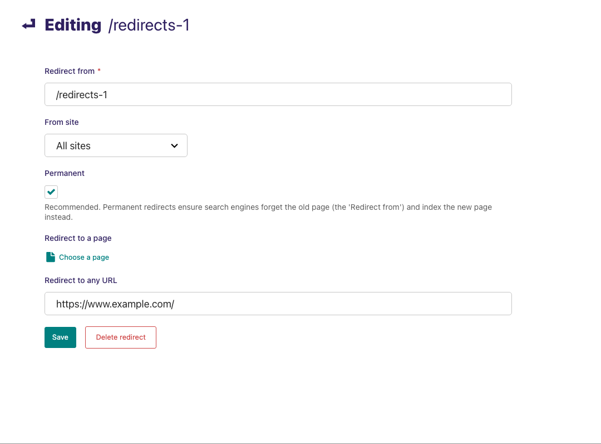

(managing_redirects)=

# Managing Redirects

## About redirects

When dealing with publishing and unpublishing pages you will eventually need to make redirects.
A redirect ensures that when a page is no longer available (404), the visitor and search engines are sent to a new page.
Therefore the visitor won't end up in a breaking journey which would result in a page not found.

Wagtail considers two types of configurable redirects depending on whether _Permanent_ is checked or not:

-   Permanent redirect (checked by default)
-   Temporary redirect

For both redirects the visitor won't experience a difference when visiting a page, but the search engine will react to these two type of redirects differently.

-   In the case of a temporary redirect a search engine will keep track of your old page and will index the redirected page as well.
-   With a permanent redirect, the search engine will mark the old page as obsolete and considers the new page as a replacement.

```{note}
As a best practice Wagtail will check redirects as permanent by default, in order to prevent the undermining of your search engine ranking.
```

## Configuring redirects



To configure redirects head over to 'Redirects', which can be found in the Settings menu, accessible via the left-hand menu bar.



-   Add a redirect by clicking the _Add redirect_ button in the top-right.
-   Search for redirects already configured by entering your search term in the search bar. The results will be automatically updated as you type.
-   Edit the details of a redirect by clicking the URL path in the listing.



-   Set _Redirect from_ to the URL pattern which is no longer available on your site.
-   Set the _From site_ if applicable (for eg: a multisite environment).
-   Check whether the redirect is _Permanent_ or temporary (unchecked).

As a last step you can either redirect to a new page within Wagtail **or** you can redirect the page to a different domain outside of Wagtail.

-   Select your page from the explorer for _Redirect to a page_.
-   Set a full-domain and path for _Redirect to any URL_.

```{note}
Keep in mind a redirect will only be initiated if the page is not found.
It will not be applied to existing pages (200) which will resolve on your site.
```
