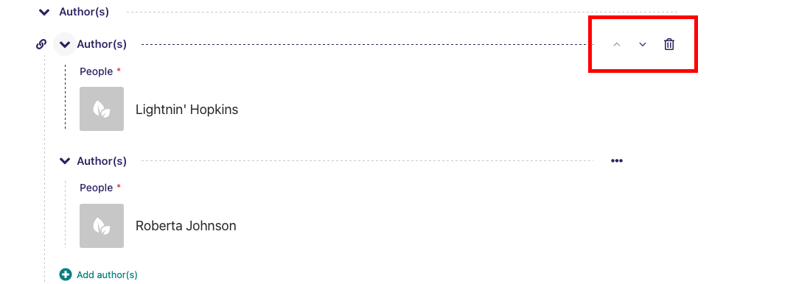
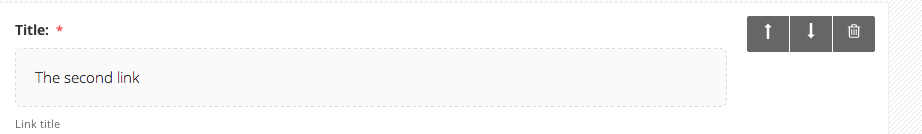

# Adding multiple items

A common feature of Wagtail is the ability to add more than one of a particular type of field or item. For example, you can add as many carousel items or related links as you wish.

-   Whenever you see the white cross in the green circle illustrated here, it means you can add multiple objects or items to a page. Clicking the icon will display the fields required for that piece of content. The image below demonstrates this with a _Related link_ item.

-   You can delete an individual item by pressing the trash can in the top-right.
-   You can add more items by clicking the link with the white cross again.

-   You can reorder your multiple items using the up and down arrows. Doing this will affect the order in which they are displayed on the live page.
