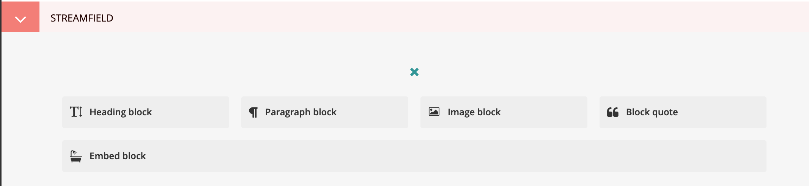
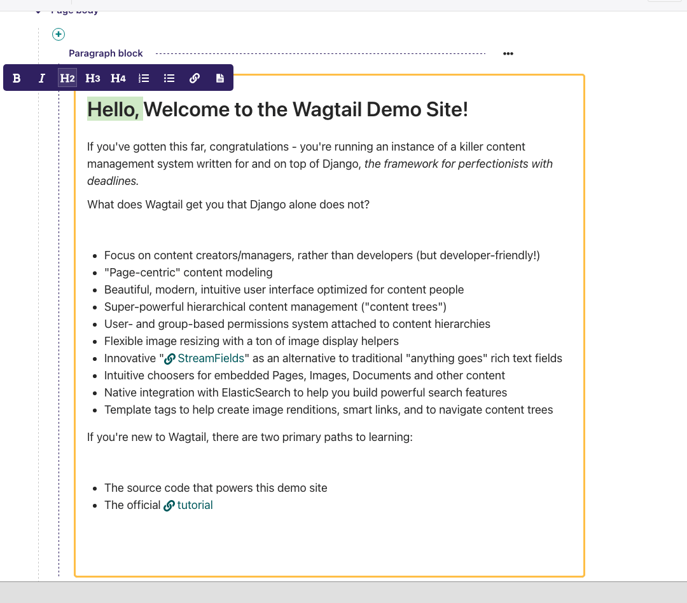
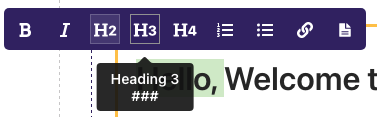
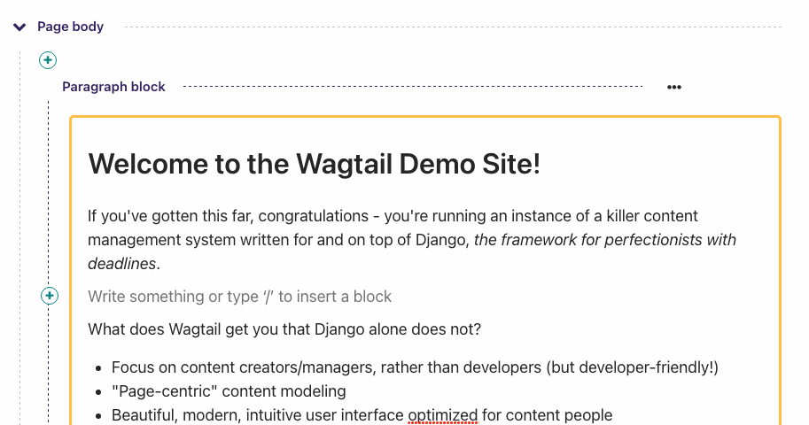
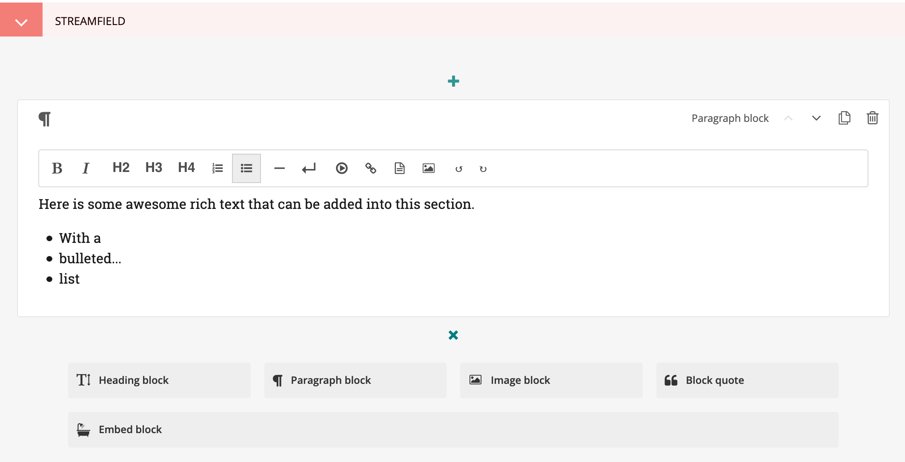
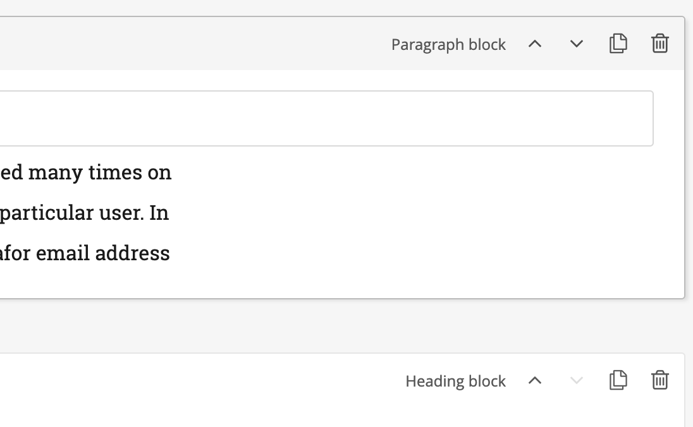

# Creating page body content

Wagtail supports a number of basic fields for creating content, as well as our unique StreamField feature which allows you to construct complex layouts by combining these basic fields in any order.

## StreamField

StreamField allows you to create complex layouts of content on a page by combining a number of different arrangements of content, 'blocks', in any order.



When you first edit a page, you will be presented with the empty StreamField area, with the option to choose one of several block types. The block types on your website may be different from the screenshot here, but the principles are the same.

Click the block type, and the options will disappear, revealing the entry field for that block.

Depending on the block you chose, the field will display differently, and there might even be more than one field! There are a few common field types though that we will talk about here.

-   Basic text field
-   Rich text field
-   Image field

### Basic text field

Basic text fields have no formatting options. How these display will be determined by the style of the page in which they are being inserted. Just click into the field and type!

### Rich text fields

Most of the time though, you need formatting options to create beautiful looking pages. Wagtail provides "rich text" fields, which have formatting options similar to those of word processors.



Those fields present a set of tools which allow you to format and style your text. These tools also allow you to insert links, images, videos clips and links to documents. If you want to know more about a specific tool, hover your mouse on the corresponding button so the tooltip appears:



This tooltip shows a longer description of the tool, and displays its keyboard shortcut if there is one. If the keyboard shortcut does not start with CTRL or ⌘, it's a [Markdown](https://en.wikipedia.org/wiki/Markdown) shortcut to type directly in the editor:



---

That’s the gist of it! If you want more information about the editor, please have a look at its dedicated [user guide](https://www.draftail.org/docs/user-guide). It also contains a list of all of the available keyboard shortcuts, and some tricks and gotchas.

### Adding further blocks in StreamField



-   To add new blocks, click the '+' icons above or below the existing blocks.
-   You'll then be presented once again with the different blocks from which you may choose.
-   You can cancel the addition of a new block by clicking the cross at the top of the block selection interface.
-   You can duplicate a block (including the content) using the button towards the top right corner of an existing block.

### Reordering and deleting content in StreamField



-   Click the arrows on the right-hand side of each block to move blocks up and down in the StreamField order of content.
-   The blocks will be displayed in the front-end in the order that they are placed in this interface.
-   Click the rubbish bin on the far right to delete a field

```{warning}
Once a StreamField field is deleted it cannot be retrieved if the page has not been saved. Save your pages regularly so that if you accidentally delete a field you can reload the page to undo your latest edit.
```
