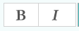
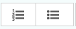
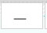
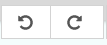
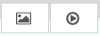
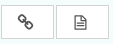

Creating page body content
~~~~~~~~~~~~~~~~~~~~~~~~~~

Wagtail supports a number of basic fields for creating content, as well as our unique StreamField feature which allows you to construct complex layouts by combining these basic fields in any order.

===========
StreamField
===========

StreamField allows you to create complex layouts of content on a page by combining a number of different arrangements of content, 'blocks', in any order.

.. image:: ../../_static/images/screen11_empty_streamfield.png

When you first edit a page, you will be presented with the empty StreamField area, with the option to choose one of several block types. The block types on your website may be different from the screenshot here, but the principles are the same.

Click the block type, and the options will disappear, revealing the entry field for that block.

Depending on the block you chose, the field will display differently, and there might even be more than one field! There are a few common field types though that we will talk about here.

* Basic text field
* Rich text field
* Image field

Basic text field
================

Basic text fields have no formatting options. How these display will be determined by the style of the page in which they are being inserted. Just click into the field and type!

Rich text fields
================

Most of the time though, you need formatting options to create beautiful looking pages. So some fields, like the fields in the 'Paragraph block' shown in the screenshot, have many of the options you would expect from a word processor. These are referred to as rich text fields.

So, when you click into one of these fields, you will be presented with a set of tools which allow you to format and style your text. These tools also allow you to insert links, images, videos clips and links to documents.

.. image:: ../../_static/images/screen11.1.5_streamfield_richtext.png

Below is a summary of what the different buttons represent:

**Bold / Italic:**  Either click then type for bold or italic, or highlight and select to convert existing text to bold or italic.

.. image:: ../../_static/images/screen11.2_formatting_options.png

**Paragraph / heading levels:**  Clicking into a paragraph and selecting one of these options will change the level of the text. H1 is not included as this is reserved for the page title.

**Bulleted and numbered lists**

**Horizontal rule:** Creates a horizontal line at the position of the cursor. If inserted inside a paragraph it will split the paragraph into two separate paragraphs.

**Undo / redo:** As expected will undo or redo the latest actions. Never use the your browser's back button when attempting to undo changes as this could lead to errors. Either use this undo button, or the usual keyboard shortcut, CTRL+Z.

**Insert image / video:** Allows you to insert an image or video into the rich text field. See Inserting images and videos section for more details. See `Inserting images <inserting_images.html>` and `Inserting videos <inserting_videos.html>` sections.

**Insert link / document:** Allows you to insert a link or a document into the rich text field. See Inserting links and Inserting documents for more details. See `Inserting links section <inserting_links.html>`.

Adding further blocks in StreamField
==============================================

.. image:: ../../_static/images/screen11.8_adding_new_blocks.png

* To add new blocks, click the '+' icons above or below the existing blocks.
* You'll then be presented once again with the different blocks from which you may choose.
* You can cancel the addition of a new block by clicking the cross at the top of the block selection interface.

Reordering and deleting content in StreamField
==============================================

.. image:: ../../_static/images/screen11.9_streamfield_reordering.png

* Click the arrows on the right-hand side of each block to move blocks up and down in the StreamField order of content.
* The blocks will be displayed in the front-end in the order that they are placed in this interface.
* Click the rubbish bin on the far right to delete a field

.. Warning::
    Once a StreamField field is deleted it cannot be retrieved if the page has not been saved. Save your pages regularly so that if you accidentally delete a field you can reload the page to undo your latest edit.
