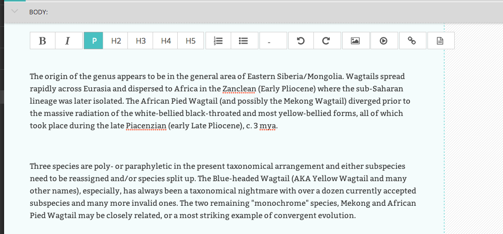

Creating page body content
~~~~~~~~~~~~~~~~~~~~~~~~~~

The majority of the body content within a page will be created within text fields.

There are two types of text entry fields you will see when creating a page. Some, like *Page title* are basic text fields come with no formatting options. This is because all titles display the same across a single page type. Others, *Body* for example, require more formatting, and so a set of tools are provided for this purpose. These are referred to as rich text fields. 

So, when you click into certain fields, for example the *Body* field, you will be presented with a set of tools which allow you to format and style your text. These tools also allow you to insert links, images, videos clips and links to documents.

Below is a summary of what the different buttons represent:

.. image:: ../../_static/images/screen11.1_bold_italic.png

**Bold / Italic:**  Either click then type for bold or italic, or highlight and select to convert existing text to bold or italic.

.. image:: ../../_static/images/screen11.2_formatting_options.png

**Paragraph / heading levels:**  Clicking into a paragraph and selecting one of these options will change the level of the text. H1 is not included as this is reserved for the page title.

.. image:: ../../_static/images/screen11.3_lists.png

**Bulleted and numbered lists**

.. image:: ../../_static/images/screen11.4_horizontal_rule.png

**Horizontal rule:** Creates a horizontal line at the position of the cursor. If inserted inside a paragraph it will split the paragraph into two seperate paragraphs.

.. image:: ../../_static/images/screen11.5_undo_redo.png

**Undo / redo:** As expected will undo or redo the latest actions. Never use the your browser's back button when attempting to undo changes as this could lead to errors. Either use this undo button, or the usual keyboard shortcut, CTRL+Z.

.. image:: ../../_static/images/screen11.6_images_videos.png

**Insert image / video:** Allows you to insert an image or video into the rich text field. See Inserting images and videos section for more details. .. insert links for images and videos here>>

.. image:: ../../_static/images/screen11.7_links_docs.png

**Insert link / document:** Allows you to insert a link or a document into the rich text field. See Inserting links and Inserting documents for more details. .. insert links to Links and documents sections>>