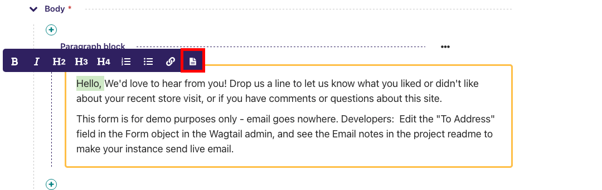
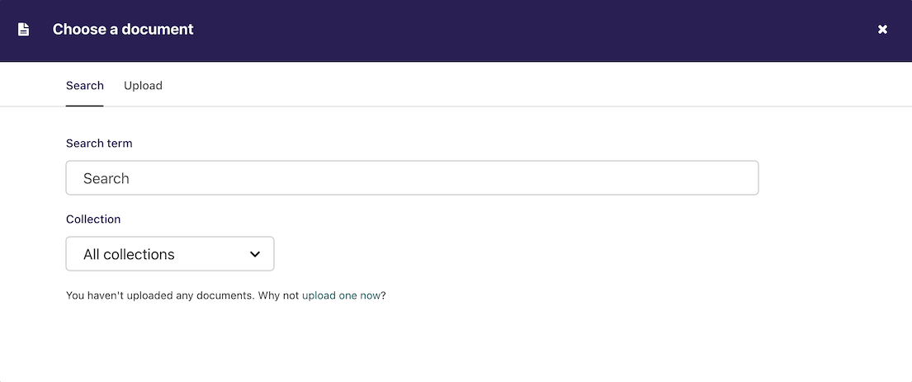

# Inserting links to documents into body text

It is possible to insert links to documents held in the CMS into the body text of a web page by clicking the button above in the rich text field.

The process for doing this is the same as when inserting an image. You are given the choice of either choosing a document from the CMS, or uploading a new document.

