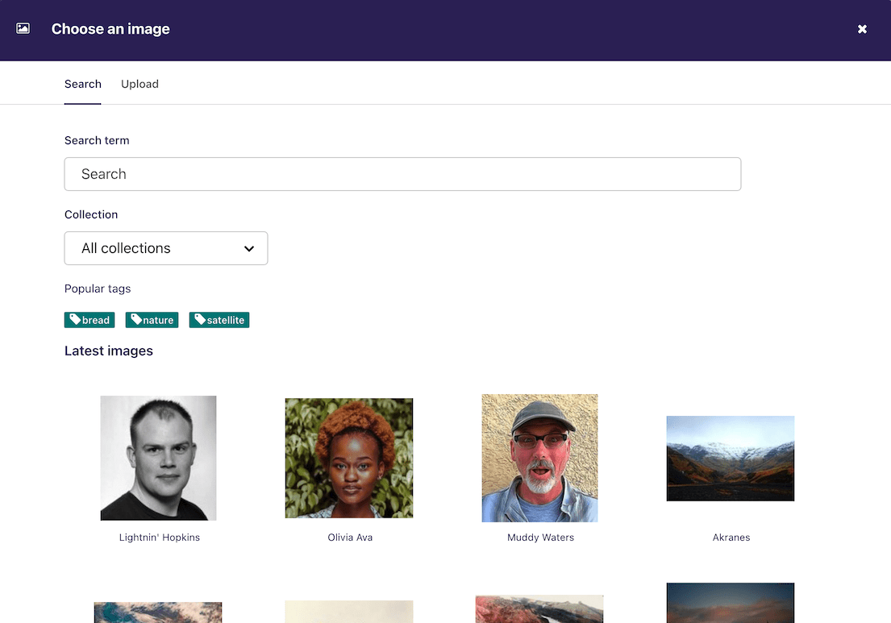
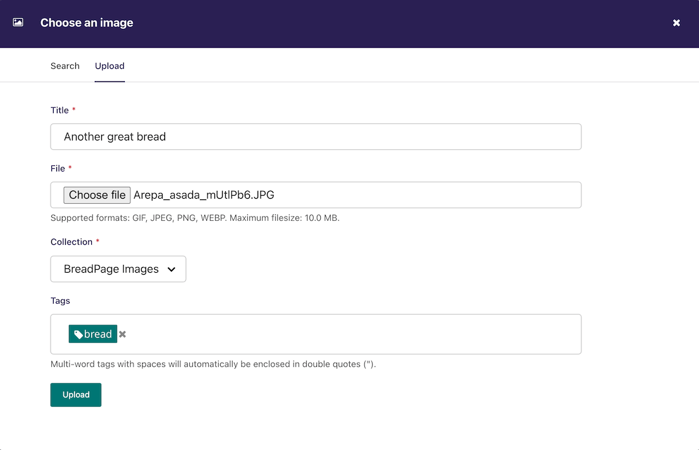
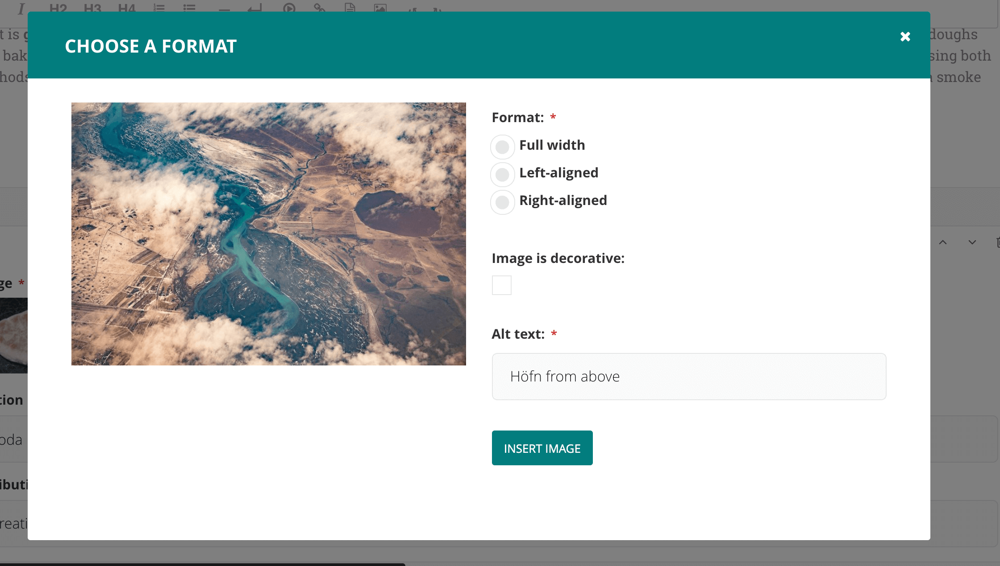

(inserting_images)=

# Inserting images in a page

There will obviously be many instances in which you will want to add images to a page. There are two main ways to add images to pages, either via a specific image chooser field, or via the rich text field image button. Which of these you use will be dependent on the individual setup of your site.

## Inserting images using the image chooser field

Often a specific image field will be used for a main image on a page, or for an image to be used when sharing the page on social media. For the standard page on Torchbox.com, the former is used.


-   You insert an image by clicking the _Choose an image_ button.

## Choosing an image to insert

You have two options when selecting an image to insert:

1. Selecting an image from the existing image library, or…
2. Uploading a new image to the CMS

When you click the _Choose an image_ button you will be presented with a pop-up with two tabs at the top. The first, Search, allows you to search and select from the library. The second, _Upload_, allows you to upload a new image.

**Choosing an image from the image library**

The image below demonstrates finding and inserting an image that is already present in the CMS image library.



1. Typing into the search box will automatically display the results below.
2. Clicking one of the Popular tags will filter the search results by that tag.
3. Clicking an image will take you to the Choose a format window (see image below).

**Uploading a new image to the CMS**



1. You must include an image title for your uploaded image
2. Click the _Choose file_ button to choose an image from your computer.
3. _Tags_ allows you to associate tags with the image you are uploading. This allows them to be more easily found when searching. Each tag should be separated by a space. Good practice for creating multiple word tags is to use an underscore between each word (e.g. western_yellow_wagtail).
4. Click _Upload_ to insert the uploaded image into the carousel. The image will also be added to the main CMS image library for reuse in other content.

## Inserting images using the rich text field

Images can also be inserted into the body text of a page via the rich text editor. When working in a rich text field, click the Image control. You will then be presented with the same options as for inserting images into the main carousel.

In addition, Wagtail allows you to choose the format of your image.



1. You can select how the image is displayed by selecting one of the format options.
2. You can choose if the image is [decorative](https://www.w3.org/WAI/tutorials/images/decorative/), in which case you will not need to enter alt text for your image.
3. If you do not choose for the image to be decorative, you must provide specific [alt text](https://developer.mozilla.org/en-US/docs/Learn/HTML/Multimedia_and_embedding/Images_in_HTML#Alternative_text) for your image.

The format options available are described below:

-   **Full width:** Image will be inserted using the full width of the text area.
-   **Half-width left/right aligned:** Inserts the image at half the width of the text area. If inserted in a block of text, the text will wrap around the image. If two half-width images are inserted together, they will display next to each other.

```{note}
The display of images formatted in this way is dependent on your implementation of Wagtail, so you may get slightly different results.
```
