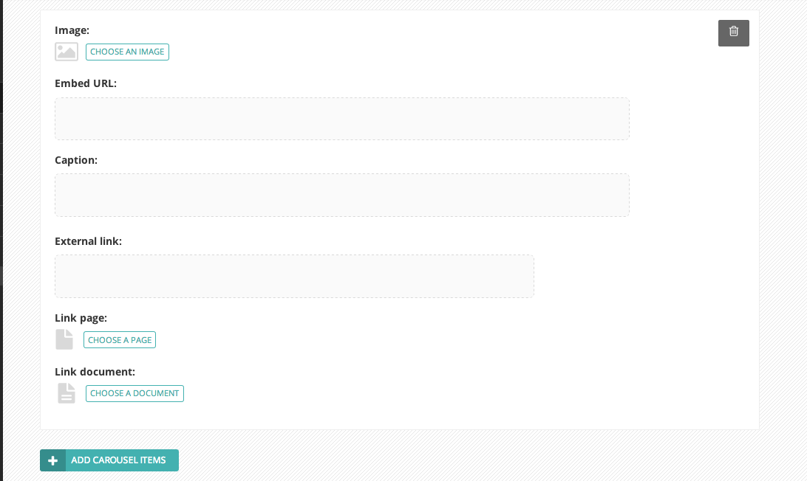

Inserting images and videos in a page
~~~~~~~~~~~~~~~~~~~~~~~~~~~~~~~~~~~~~

There will obviously be many instances in which you will want to add images to a page. There may be multiple ways in which to add an image to a page, depending on the setup of the site that you work on. For example, the Wagtail demo standard page type has two ways to insert images.

* In the main carousel, or…
* Within the body of the page

Inserting images into the carousel
__________________________________

The carousel is where the main, featured images and videos associated with a page should be displayed.

* To insert a carousel item click the Add carousel content link in the Carousel content section.

* You can then insert an image by clicking the *Choose an image* button.
* It is also possible to add videos to a carousel. Simply copy and paste the web address for the video (either YouTube or Vimeo) into the *Embed URL* field and click Insert. A poster image for the video can also be uploaded or selected from the CMS. This is the image displayed before a user has clicked play on the video.
* The *Caption* field allows you to enter a caption to be displayed with your image. This caption also acts as the 'Alternative text' or Alt text for your image. This is a small piece of invisible code that is used by screen readers that enable visually impaired users to hear a description of the image.
* The external link field allows you to enter a web address for pages not within your website.
* Or you can select an internal page using the page chooser (see below for info on the page chooser).
* You can add more items into the same carousel by clicking the Add carousel content link again. Please see Adding multiple items section below for help with removing or ordering carousel items.

Choosing an image to insert
___________________________

You have two options when selecting an image to insert:

#. Selecting an image from the existing image library, or…
#. Uploading a new image to the CMS

When you click the *Choose an image* button you will be presented with a pop-up with two tabs at the top. The first, Search, allows you to search and select from the library. The second, *Upload*, allows you to upload a new image.

**Choosing an image from the image library**

The image below demonstrates finding and  inserting an image that is already present in the CMS image library.

.. image:: ../../images/screen16_selecting_image_from_library.png

#. Typing into the search box will automatically display the results below.
#. Clicking one of the Popular tags will filter the search results by that tag.
#. Clicking an image will take you to the Choose a format window (see image below).

**Uploading a new image to the CMS**

.. image:: ../../images/screen17_upload_image.png

#. You must include an image title for your uploaded image
#. Click the *Choose file* button to choose an image from your computer.
#. This *Tags* allows you to associate tags with the image you are uploading. This allows them to be more easily found when searching. Each tag should be separated by a space. Good practice for creating multiple word tags is to use an underscore between each word (e.g. western_yellow_wagtail).
#. Click *Upload* to insert the uploaded image into the carousel. The image will also be added to the main CMS image library for reuse in other content.

Inserting images into the body text
___________________________________

Images can also be inserted into the body text of a page. When editing the Body field of a standard page, click the image illustrated above. You will then be presented with the same options as for inserting images into the main carousel.

In addition, the Wagtail Demo site allows you to chose an aligmnent for you image.

.. image:: ../../images/screen18_image_alignment.png

#. You can select how the image is displayed by selecting one of the format options.
#. In the Wagtail Demo site, images inserted into the body text do not have embeded captions (these should be added as regular body text). However you must still provide specific alt text for your image.

The aligmnents available are described below:

* **Full width:** Image will be inserted using the full width of the text area.
* **Half-width left/right aligned:** Inserts the image at half the width of the text area. If inserted in a block of text the text will wrap around the image. If two half-width images are inserted together they will display next to each other.

