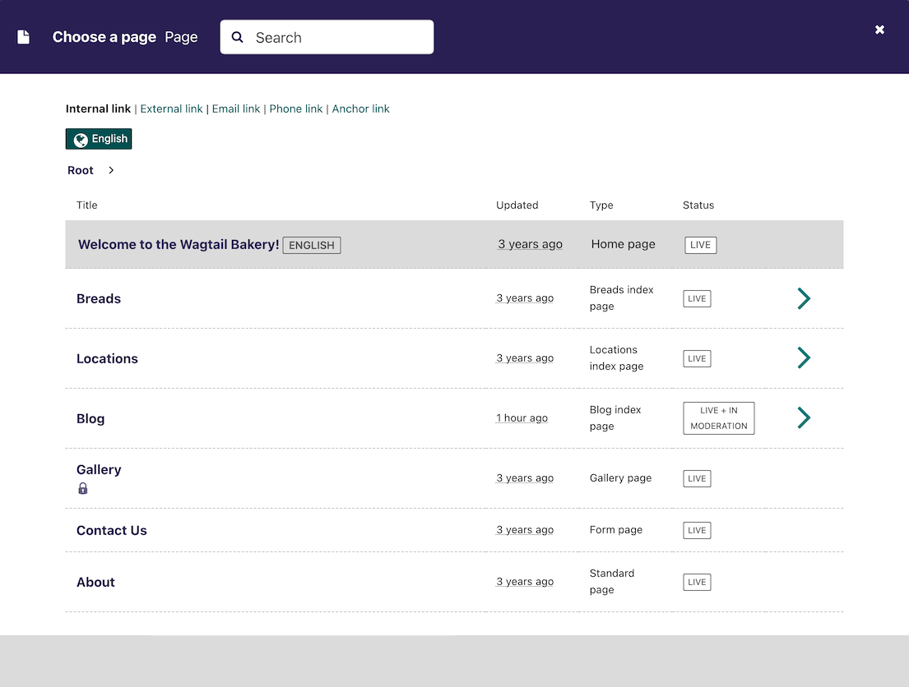

(inserting_links)=

# Inserting links in a page

Similar to images, there are a variety of points at which you will want to add links. The most common place to insert a link will be in the body text of a page. You can insert a link into the body text by clicking the **Insert link** button in the rich text toolbar.

Whichever way you insert a link, you will be presented with the form displayed below.

-   Search for an existing page to link to using the search bar at the top of the pop-up.

-   Below the search bar you can select the type of link you want to insert. The following types are available:

    -   Internal link: A link to an existing page within your website.
    -   External link: A link to a page on another website.
    -   Email link: A link that will open the user's default email client with the email address prepopulated.
    -   Phone link: A link that will open the user's default client for initiating audio calls, with the phone number prepopulated.
    -   Anchor link: A link that will scroll to a given hash id elsewhere on the same page.

-   You can also navigate through the website to find an internal link via the explorer.
