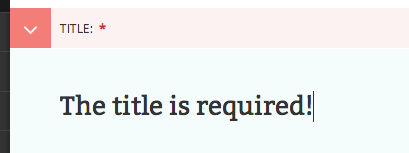
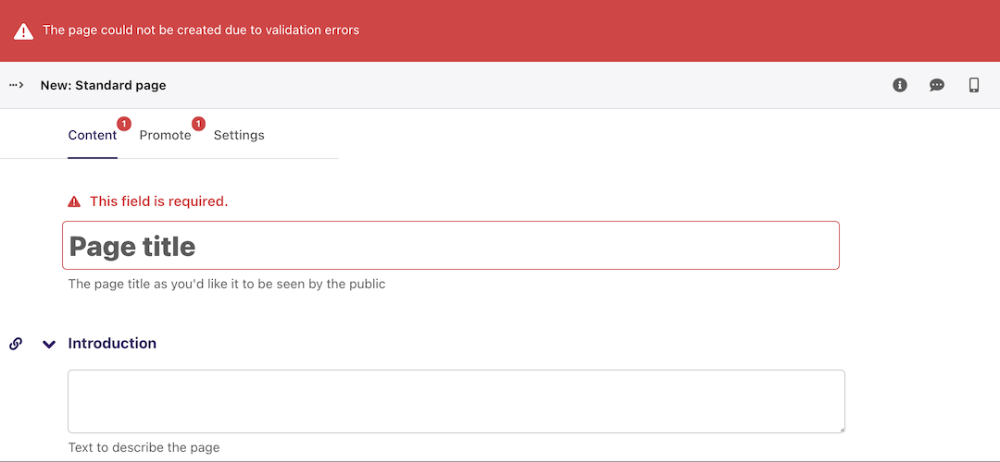

# Required fields

-   Fields marked with an asterisk are required. You will not be able to save a draft or submit the page for moderation without these fields being completed.

-   If you try to save/submit the page with some required fields not filled out, you will see the error displayed here.
-   The number of validation errors for each of the _Promote_ and _Content_ tabs will appear in a red circle, and the text, 'This field is required', will appear below each field that must be completed.

