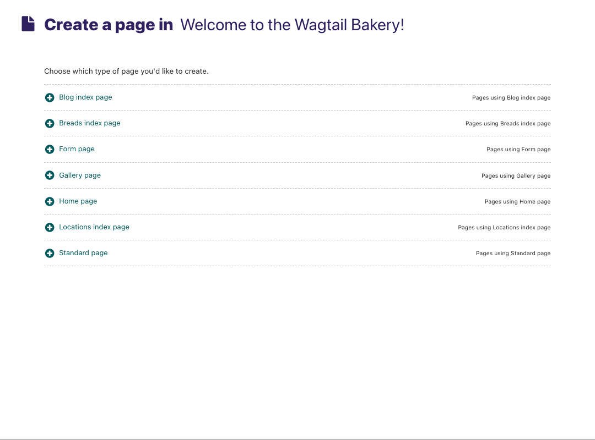
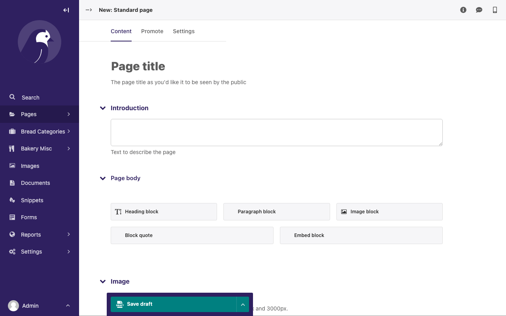

Selecting a page type
~~~~~~~~~~~~~~~~~~~~~

* On the left of the page chooser screen are listed all the types of pages that you can create. Clicking the page type name will take you to the Create new page screen for that page type (see below).
* Clicking the *Pages using … Page* links on the right will display all the pages that exist on the website of this type. This is to help you judge what type of page you will need to complete your task.

* Once you've selected a page type you will be presented with a blank New page screen.
* Click into the areas below each field's heading to start entering content.
