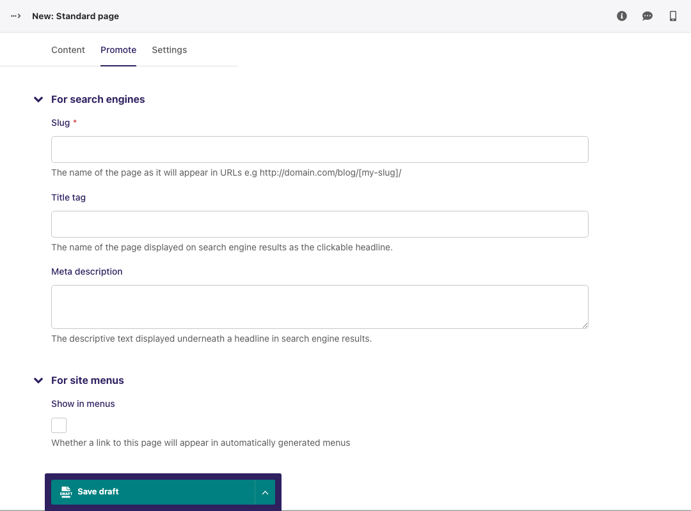

The Promote tab
~~~~~~~~~~~~~~~

A common feature of the *Edit* pages for all page types is the two tabs at the top of the screen. The first, Content, is where you build the content of the page itself.

The second, *Promote*, is where you can set all the 'metadata' (data about data!) for the page. Below is a description of all default fields in the promote tab and what they do.

* **Slug:** The last part of the web address for the page. E.g. the slug for a blog page called 'The best things on the web' would be the-best-things-on-the-web (``www.example.com/blog/the-best-things-on-the-web``). This is automatically generated from the main page title set in the Content tab. This can be overridden by adding a new slug into the field. Slugs should be entirely lowercase, with words separated by hyphens (-).
* **Page title:** An optional, search-engine friendly page title. This is the title that appears in the tab of your browser window. It is also the title that would appear in a search engine if the page was returned as part of a set of search results.
* **Show in menus:** Ticking this box will ensure that the page is included in automatically generated menus on your site. Note: Pages will only display in menus if all of its parent pages also have *Show in menus* ticked.
* **Search description:** This field allows you to add text that will be displayed if the page appears in search results. This is especially useful to distinguish between similarly named pages.

.. Note::
    You may see more fields than this in your promote tab. These are just the default fields, but you are free to add other fields to this section as necessary.
