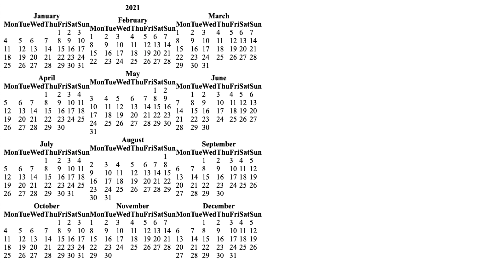
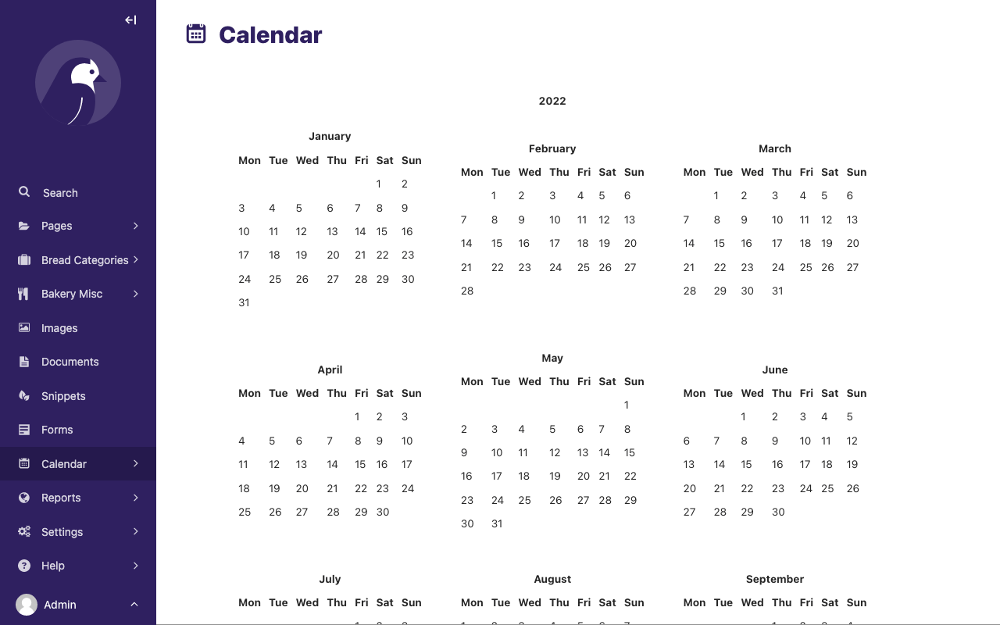
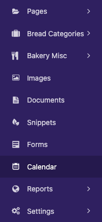
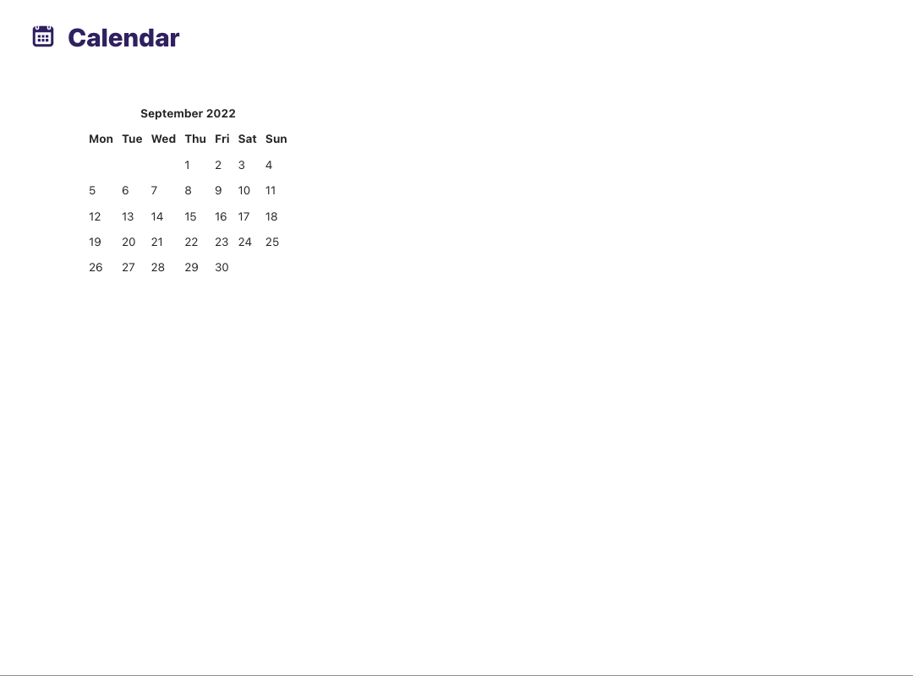
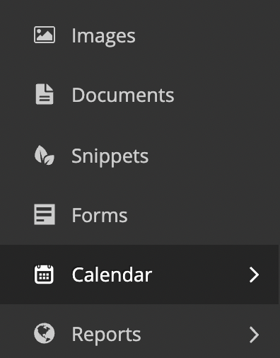

# Creating admin views

The most common use for adding custom views to the Wagtail admin is to provide an interface for managing a Django model. The [Index](../reference/contrib/modeladmin/index) app makes this simple, providing ready-made views for listing, creating and editing objects with minimal configuration.

For other kinds of admin view that don't fit this pattern, you can write your own Django views and register them as part of the Wagtail admin through [hooks](admin_hooks). In this example, we'll implement a view that displays a calendar for the current year, using [the calendar module](https://docs.python.org/3/library/calendar.html) from Python's standard library.

## Defining a view

Within a Wagtail project, create a new `wagtailcalendar` app with `./manage.py startapp wagtailcalendar` and add it to your project's `INSTALLED_APPS`. (In this case we're using the name 'wagtailcalendar' to avoid clashing with the standard library's `calendar` module - in general there is no need to use a 'wagtail' prefix.)

Edit `views.py` as follows - note that this is a plain Django view with no Wagtail-specific code.

```python
import calendar

from django.http import HttpResponse
from django.utils import timezone


def index(request):
    current_year = timezone.now().year
    calendar_html = calendar.HTMLCalendar().formatyear(current_year)

    return HttpResponse(calendar_html)
```

## Registering a URL route

At this point, the standard practice for a Django project would be to add a URL route for this view to your project's top-level URL config module. However, in this case we want the view to only be available to logged-in users, and to appear within the `/admin/` URL namespace which is managed by Wagtail. This is done through the [Register Admin URLs](register_admin_urls) hook.

On startup, Wagtail looks for a `wagtail_hooks` submodule within each installed app. In this submodule, you can define functions to be run at various points in Wagtail's operation, such as building the URL config for the admin, and constructing the main menu.

Create a `wagtail_hooks.py` file within the `wagtailcalendar` app containing the following:

```python
from django.urls import path
from wagtail import hooks

from .views import index


@hooks.register('register_admin_urls')
def register_calendar_url():
    return [
        path('calendar/', index, name='calendar'),
    ]
```

The calendar will now be visible at the URL `/admin/calendar/`.



## Adding a template

Currently this view is outputting a plain HTML fragment. Let's insert this into the usual Wagtail admin page furniture, by creating a template that extends Wagtail's base template `"wagtailadmin/base.html"`.

```{note}
The base template and HTML structure are not considered astable part of Wagtail's API, and may change in futurereleases.
```

Update `views.py` as follows:

```python
import calendar
from django.shortcuts import render
from django.utils import timezone

def index(request):
    current_year = timezone.now().year
    calendar_html = calendar.HTMLCalendar().formatyear(current_year)

    return render(request, 'wagtailcalendar/index.html', {
        'current_year': current_year,
        'calendar_html': calendar_html,
    })
```

Now create a `templates/wagtailcalendar/` folder within the `wagtailcalendar` app, containing `index.html` as follows:

```html+django

{{ current_year }} calendar


    {{ block.super }}
    <style>
        table.month {
            margin: 20px;
        }
        table.month td, table.month th {
            padding: 5px;
        }
    </style>



    

    <div class="nice-padding">
        {{ calendar_html|safe }}
    </div>

```

Here we are overriding three of the blocks defined in the base template: `titletag` (which sets the content of the HTML `<title>` tag), `extra_css` (which allows us to provide additional CSS styles specific to this page), and `content` (for the main content area of the page). We're also including the standard header bar component, and setting a title and icon. For a list of the recognised icon identifiers, see the [style guide](styleguide).

Revisiting `/admin/calendar/` will now show the calendar within the Wagtail admin page furniture.



## Adding a menu item

Our calendar view is now complete, but there's no way to reach it from the rest of the admin backend. To add an item to the sidebar menu, we'll use another hook, [Register Admin Menu Item](register_admin_menu_item). Update `wagtail_hooks.py` as follows:

```python
from django.urls import path, reverse

from wagtail.admin.menu import MenuItem
from wagtail import hooks

from .views import index


@hooks.register('register_admin_urls')
def register_calendar_url():
    return [
        path('calendar/', index, name='calendar'),
    ]


@hooks.register('register_admin_menu_item')
def register_calendar_menu_item():
    return MenuItem('Calendar', reverse('calendar'), icon_name='date')
```

A 'Calendar' item will now appear in the menu.



## Adding a group of menu items

Sometimes you want to group custom views together in a single menu item in the sidebar. Let's create another view to display only the current calendar month:

```{code-block} python
:emphasize-lines: 13-18

import calendar

from django.http import HttpResponse
from django.utils import timezone


def index(request):
    current_year = timezone.now().year
    calendar_html = calendar.HTMLCalendar().formatyear(current_year)

    return HttpResponse(calendar_html)

def month(request):
    current_year = timezone.now().year
    current_month = timezone.now().month
    calendar_html = calendar.HTMLCalendar().format_month(current_year, current_month)

    return HttpResponse(calendar_html)
```

We also need to update `wagtail_hooks.py` to register our URL in the admin interface:

```{code-block} python
:emphasize-lines: 11

from django.urls import path
from wagtail import hooks

from .views import index, month


@hooks.register('register_admin_urls')
def register_calendar_url():
    return [
        path('calendar/', index, name='calendar'),
        path('calendar/month/', month, name='calendar-month'),
    ]
```

The calendar will now be visible at the URL `/admin/calendar/month/`.



Finally we can alter our `wagtail_hooks.py` to include a group of custom menu items. This is similar to adding a single item but involves importing two more classes, `Menu` and `SubmenuMenuItem`.

```{code-block} python
:emphasize-lines: 3,20-25

from django.urls import path, reverse

from wagtail.admin.menu import Menu, MenuItem, SubmenuMenuItem
from wagtail import hooks


from .views import index, month


@hooks.register('register_admin_urls')
def register_calendar_url():
    return [
        path('calendar/', index, name='calendar'),
        path('calendar/month/', month, name='calendar-month'),
    ]


@hooks.register('register_admin_menu_item')
def register_calendar_menu_item():
    submenu = Menu(items=[
        MenuItem('Calendar', reverse('calendar'), icon_name='date'),
        MenuItem('Current month', reverse('calendar-month'), icon_name='date'),
    ])

    return SubmenuMenuItem('Calendar', submenu, classnames='icon icon-date')
```

The 'Calendar' item will now appear as a group of menu items.



When expanded, the 'Calendar' item will now show our two custom menu items.


