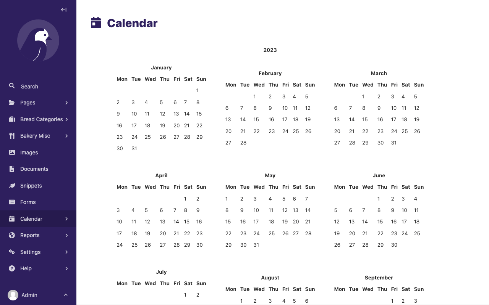
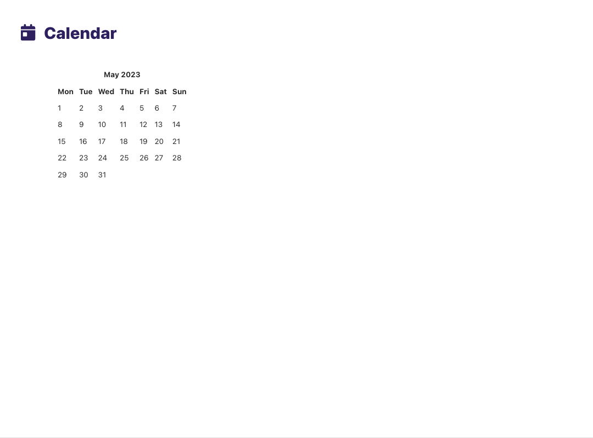
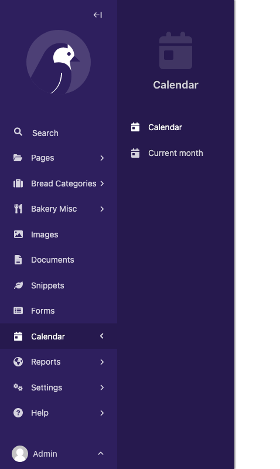

# Creating admin views

The most common use for adding custom views to the Wagtail admin is to provide an interface for managing a Django model. Using [](snippets), Wagtail provides ready-made views for listing, creating, and editing Django models with minimal configuration.

For other kinds of admin views that don't fit this pattern, you can write your own Django views and register them as part of the Wagtail admin through [hooks](admin_hooks). In this example, we'll implement a view that displays a calendar for the current year, using [the calendar module](inv:python#library/calendar) from Python's standard library.

## Defining a view

Within a Wagtail project, create a new `wagtailcalendar` app with `./manage.py startapp wagtailcalendar` and add it to your project's `INSTALLED_APPS`. (In this case, we're using the name 'wagtailcalendar' to avoid clashing with the standard library's `calendar` module - in general, there is no need to use a 'wagtail' prefix.)

Edit `views.py` as follows - note that this is a plain Django view with no Wagtail-specific code.

```python
import calendar

from django.http import HttpResponse
from django.utils import timezone


def index(request):
    current_year = timezone.now().year
    calendar_html = calendar.HTMLCalendar().formatyear(current_year)

    return HttpResponse(calendar_html)
```

## Registering a URL route

At this point, the standard practice for a Django project would be to add a URL route for this view to your project's top-level URL config module. However, in this case, we want the view to only be available to logged-in users, and to appear within the `/admin/` URL namespace which is managed by Wagtail. This is done through the [Register Admin URLs](register_admin_urls) hook.

On startup, Wagtail looks for a `wagtail_hooks` submodule within each installed app. In this submodule, you can define functions to be run at various points in Wagtail's operation, such as building the URL config for the admin and constructing the main menu.

Create a `wagtail_hooks.py` file within the `wagtailcalendar` app containing the following:

```python
from django.urls import path
from wagtail import hooks

from .views import index


@hooks.register('register_admin_urls')
def register_calendar_url():
    return [
        path('calendar/', index, name='calendar'),
    ]
```

The calendar will now be visible at the URL `/admin/calendar/`.


## Adding a template

Currently, this view is outputting a plain HTML fragment. Let's insert this into the usual Wagtail admin page furniture, by creating a template that extends Wagtail's base template `"wagtailadmin/base.html"`.

```{note}
The base template and HTML structure are not considered a stable part of Wagtail's API and may change in future releases.
```

Update `views.py` as follows:

```python
import calendar
from django.shortcuts import render
from django.utils import timezone

def index(request):
    current_year = timezone.now().year
    calendar_html = calendar.HTMLCalendar().formatyear(current_year)

    return render(request, 'wagtailcalendar/index.html', {
        'current_year': current_year,
        'calendar_html': calendar_html,
    })
```

Now create a `templates/wagtailcalendar/` folder within the `wagtailcalendar` app, containing `index.html` and `calendar.css` as follows:

```html+django



{{ current_year }} calendar


    {{ block.super }}
    <link rel="stylesheet" href="">



    

    <div class="nice-padding">
        {{ calendar_html|safe }}
    </div>

```

```css
/* calendar.css */
table.month {
    margin: 20px;
}

table.month td,
table.month th {
    padding: 5px;
}
```

Here we are overriding three of the blocks defined in the base template: `titletag` (which sets the content of the HTML `<title>` tag), `extra_css` (which allows us to provide additional CSS styles specific to this page), and `content` (for the main content area of the page). We're also including the standard header bar component, and setting a title and icon. For a list of the recognized icon identifiers, see the [style guide](styleguide).

Revisiting `/admin/calendar/` will now show the calendar within the Wagtail admin page furniture.



## Adding a menu item

Our calendar view is now complete, but there's no way to reach it from the rest of the admin backend. To add an item to the sidebar menu, we'll use another hook, [Register Admin Menu Item](register_admin_menu_item). Update `wagtail_hooks.py` as follows:

```python
from django.urls import path, reverse

from wagtail.admin.menu import MenuItem
from wagtail import hooks

from .views import index


@hooks.register('register_admin_urls')
def register_calendar_url():
    return [
        path('calendar/', index, name='calendar'),
    ]


@hooks.register('register_admin_menu_item')
def register_calendar_menu_item():
    return MenuItem('Calendar', reverse('calendar'), icon_name='date')
```

A 'Calendar' item will now appear in the menu.


## Adding a group of menu items

Sometimes you want to group custom views in a single menu item in the sidebar. Let's create another view to display only the current calendar month:

```{code-block} python
:emphasize-lines: 15-23

import calendar
from django.shortcuts import render
from django.utils import timezone


def index(request):
    current_year = timezone.now().year
    calendar_html = calendar.HTMLCalendar().formatyear(current_year)

    return render(request, 'wagtailcalendar/index.html', {
        'current_year': current_year,
        'calendar_html': calendar_html,
    })

def month(request):
    current_year = timezone.now().year
    current_month = timezone.now().month
    calendar_html = calendar.HTMLCalendar().formatmonth(current_year, current_month)

    return render(request, 'wagtailcalendar/index.html', {
        'current_year': current_year,
        'calendar_html': calendar_html,
    })
```

We also need to update `wagtail_hooks.py` to register our URL in the admin interface:

```{code-block} python
:emphasize-lines: 11

from django.urls import path
from wagtail import hooks

from .views import index, month


@hooks.register('register_admin_urls')
def register_calendar_url():
    return [
        path('calendar/', index, name='calendar'),
        path('calendar/month/', month, name='calendar-month'),
    ]
```

The calendar will now be visible at the URL `/admin/calendar/month/`.



Finally, we can alter our `wagtail_hooks.py` to include a group of custom menu items. This is similar to adding a single item but involves importing two more classes, `Menu` and `SubmenuMenuItem`.

```{code-block} python
:emphasize-lines: 3,20-25

from django.urls import path, reverse

from wagtail.admin.menu import Menu, MenuItem, SubmenuMenuItem
from wagtail import hooks


from .views import index, month


@hooks.register('register_admin_urls')
def register_calendar_url():
    return [
        path('calendar/', index, name='calendar'),
        path('calendar/month/', month, name='calendar-month'),
    ]


@hooks.register('register_admin_menu_item')
def register_calendar_menu_item():
    submenu = Menu(items=[
        MenuItem('Calendar', reverse('calendar'), icon_name='date'),
        MenuItem('Current month', reverse('calendar-month'), icon_name='date'),
    ])

    return SubmenuMenuItem('Calendar', submenu, icon_name='date')
```

The 'Calendar' item will now appear as a group of menu items. When expanded, the 'Calendar' item will now show our two custom menu items.



(using_base_viewset)=

## Using `ViewSet` to group custom admin views

Registering admin views along with their URLs and menu items is a common pattern in Wagtail. This often involves several related views with shared properties such as the model that we're working with, and its associated icon. To support the pattern, Wagtail implements the concept of a _viewset_, which allows a bundle of views and their URLs to be defined collectively, along with a menu item to be registered with the admin app as a single operation through the [`register_admin_viewset`](register_admin_viewset) hook.

For example, you can group the calendar views from the previous example into a single menu item by creating a {class}`~wagtail.admin.viewsets.base.ViewSet` subclass in `views.py`:

```{code-block} python
from wagtail.admin.viewsets.base import ViewSet

...

class CalendarViewSet(ViewSet):
    add_to_admin_menu = True
    menu_label = "Calendar"
    icon = "date"
    # The `name` will be used for both the URL prefix and the URL namespace.
    # They can be customized individually via `url_prefix` and `url_namespace`.
    name = "calendar"

    def get_urlpatterns(self):
        return [
            # This can be accessed at `/admin/calendar/`
            # and reverse-resolved with the name `calendar:index`.
            # This first URL will be used for the menu item, but it can be
            # customized by overriding the `menu_url` property.
            path('', index, name='index'),

            # This can be accessed at `/admin/calendar/month/`
            # and reverse-resolved with the name `calendar:month`.
            path('month/', month, name='month'),
        ]
```

Then, remove the `register_admin_urls` and `register_admin_menu_item` hooks in `wagtail_hooks.py` in favor of registering the `ViewSet` subclass with the `register_admin_viewset` hook:

```{code-block} python
from .views import CalendarViewSet

@hooks.register("register_admin_viewset")
def register_viewset():
    return CalendarViewSet()
```

Compared to the previous example with the two separate hooks, this will result in a single menu item "Calendar" that takes you to the `/admin/calendar/` URL. The second URL will not have its own menu item, but it will still be accessible at `/admin/calendar/month/`. This is useful for grouping related views together, that may not necessarily need their own menu items.

For further customizations, refer to the {class}`~wagtail.admin.viewsets.base.ViewSet` documentation.

(using_base_viewsetgroup)=

## Combining multiple `ViewSet`s using a `ViewSetGroup`

The {class}`~wagtail.admin.viewsets.base.ViewSetGroup` class can be used to group multiple `ViewSet`s inside a top-level menu item. For example, if you have a different viewset e.g. `EventViewSet` that you want to group with the `CalendarViewSet` from the previous example, you can do so by creating a `ViewSetGroup` subclass in `views.py`:

```{code-block} python
from wagtail.admin.viewsets.base import ViewSetGroup

...

class AgendaViewSetGroup(ViewSetGroup):
    menu_label = "Agenda"
    menu_icon = "table"
    # You can specify instances or subclasses of `ViewSet` in `items`.
    items = (CalendarViewSet(), EventViewSet)
```

Then, remove `add_to_admin_menu` from the viewsets and update the `register_admin_viewset` hook in `wagtail_hooks.py` to register the `ViewSetGroup` instead of the individual viewsets:

```{code-block} python
from .views import AgendaViewSetGroup

@hooks.register("register_admin_viewset")
def register_viewset():
    return AgendaViewSetGroup()
```

This will result in a top-level menu item "Agenda" with the two viewsets' menu items as sub-items, e.g. "Calendar" and "Events".

For further customizations, refer to the {class}`~wagtail.admin.viewsets.base.ViewSetGroup` documentation.

## Adding links in admin views

### Snippets

We will use `BreadTypeSnippet` from the [Wagtail Bakery demo](https://github.com/wagtail/bakerydemo/) as an example.

The snippet URL names follow the following pattern: `wagtailsnippets_{app_label}_{model_name}:{list/edit/inspect/copy/delete}` by default.

In Python, you can use {meth}`~wagtail.admin.viewsets.base.ViewSet.get_url_name` to get the name of the snippet view URL. (e.g. `BreadTypeSnippet.get_url_name("list")`)

So the `BreadTypeSnippet` URLs would look as follows, when used in templates:

```html+django





```

### Pages

New page

```html+django

```

Page usage

```html+django

```

Edit page

```html+django

```

Delete page

```html+django

```

Copy page

```html+django
{% url 'wagtailadmin_pages:copy' page_id }
```

### Images

Images list

```html+django

```

Edit image

```html+django

```

Delete image

```html+django

```

New image

```html+django

```

Image usage

```html+django

```

### AdminURLFinder

To find the url for any model in the admin the `AdminURLFinder` class can be used.

```python
from wagtail.admin.admin_url_finder import AdminURLFinder

finder = AdminURLFinder()

finder.get_edit_url(model_instance)
```
