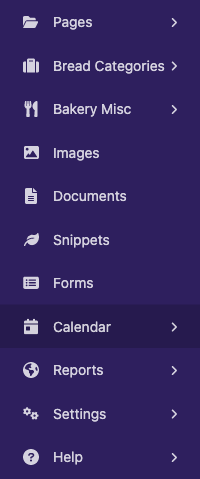

Creating admin views
====================

The most common use for adding custom views to the Wagtail admin is to provide an interface for managing a Django model. The :doc:`/reference/contrib/modeladmin/index` app makes this simple, providing ready-made views for listing, creating and editing objects with minimal configuration.

For other kinds of admin view that don't fit this pattern, you can write your own Django views and register them as part of the Wagtail admin through :ref:`hooks <admin_hooks>`. In this example, we'll implement a view that displays a calendar for the current year, using `the calendar module <https://docs.python.org/3/library/calendar.html>`_ from Python's standard library.

Defining a view
---------------

Within a Wagtail project, create a new ``wagtailcalendar`` app with ``./manage.py startapp wagtailcalendar`` and add it to your project's ``INSTALLED_APPS``. (In this case we're using the name 'wagtailcalendar' to avoid clashing with the standard library's ``calendar`` module - in general there is no need to use a 'wagtail' prefix.)

Edit ``views.py`` as follows - note that this is a plain Django view with no Wagtail-specific code.

.. code-block:: python

  import calendar

  from django.http import HttpResponse
  from django.utils import timezone

  def index(request):
      current_year = timezone.now().year
      calendar_html = calendar.HTMLCalendar().formatyear(current_year)

      return HttpResponse(calendar_html)

Registering a URL route
-----------------------

At this point, the standard practice for a Django project would be to add a URL route for this view to your project's top-level URL config module. However, in this case we want the view to only be available to logged-in users, and to appear within the ``/admin/`` URL namespace which is managed by Wagtail. This is done through the :ref:`register_admin_urls` hook.

On startup, Wagtail looks for a ``wagtail_hooks`` submodule within each installed app. In this submodule, you can define functions to be run at various points in Wagtail's operation, such as building the URL config for the admin, and constructing the main menu.

Create a ``wagtail_hooks.py`` file within the ``wagtailcalendar`` app containing the following:

.. code-block:: python

  from django.urls import path
  from wagtail.core import hooks

  from .views import index

  @hooks.register('register_admin_urls')
  def register_calendar_url():
      return [
          path('calendar/', index, name='calendar'),
      ]

The calendar will now be visible at the URL ``/admin/calendar/``.

.. figure:: ../_static/images/adminviews_calendar.png
   :alt: A calendar, presented in unstyled HTML

Adding a template
-----------------

Currently this view is outputting a plain HTML fragment. Let's insert this into the usual Wagtail admin page furniture, by creating a template that extends Wagtail's base template ``"wagtailadmin/base.html"``.

.. note::
   The base template and HTML structure are not considered a stable part of Wagtail's API, and may change in future releases.

Update ``views.py`` as follows:

.. code-block:: python

  import calendar
  from django.shortcuts import render
  from django.utils import timezone

  def index(request):
      current_year = timezone.now().year
      calendar_html = calendar.HTMLCalendar().formatyear(current_year)

      return render(request, 'wagtailcalendar/index.html', {
          'current_year': current_year,
          'calendar_html': calendar_html,
      })

Now create a ``templates/wagtailcalendar/`` folder within the ``wagtailcalendar`` app, containing ``index.html`` as follows:

.. code-block:: html+django

  
  {{ current_year }} calendar

  
      {{ block.super }}
      
  

  
      

      

          {{ calendar_html|safe }}
      

  

Here we are overriding three of the blocks defined in the base template: ``titletag`` (which sets the content of the HTML ``<title>`` tag), ``extra_css`` (which allows us to provide additional CSS styles specific to this page), and ``content`` (for the main content area of the page). We're also including the standard header bar component, and setting a title and icon. For a list of the recognised icon identifiers, see the :ref:`styleguide`.

Revisiting ``/admin/calendar/`` will now show the calendar within the Wagtail admin page furniture.

.. figure:: ../_static/images/adminviews_calendar_template.png
   :alt: A calendar, shown within the Wagtail admin interface

Adding a menu item
------------------

Our calendar view is now complete, but there's no way to reach it from the rest of the admin backend. To add an item to the sidebar menu, we'll use another hook, :ref:`register_admin_menu_item`. Update ``wagtail_hooks.py`` as follows:

.. code-block:: python

  from django.urls import path, reverse

  from wagtail.admin.menu import MenuItem
  from wagtail.core import hooks

  from .views import index

  @hooks.register('register_admin_urls')
  def register_calendar_url():
      return [
          path('calendar/', index, name='calendar'),
      ]

  @hooks.register('register_admin_menu_item')
  def register_calendar_menu_item():
      return MenuItem('Calendar', reverse('calendar'), icon_name='date')

A 'Calendar' item will now appear in the menu.

