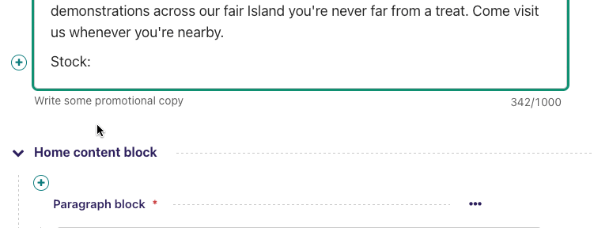
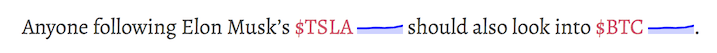

# Extending the Draftail Editor

Wagtail’s rich text editor is built with [Draftail](https://www.draftail.org/), and its functionality can be extended through plugins.

Plugins come in three types:

-   Inline styles – To format a portion of a line, for example `bold`, `italic` or `monospace`.
-   Blocks – To indicate the structure of the content, for example, `blockquote`, `ol`.
-   Entities – To enter additional data/metadata, for example, `link` (with a URL) or `image` (with a file).

All of these plugins are created with a similar baseline, which we can demonstrate with one of the simplest examples – a custom feature for an inline style of `mark`. Place the following in a `wagtail_hooks.py` file in any installed app:

```python
import wagtail.admin.rich_text.editors.draftail.features as draftail_features
from wagtail.admin.rich_text.converters.html_to_contentstate import InlineStyleElementHandler
from wagtail import hooks

# 1. Use the register_rich_text_features hook.
@hooks.register('register_rich_text_features')
def register_mark_feature(features):
    """
    Registering the `mark` feature, which uses the `MARK` Draft.js inline style type,
    and is stored as HTML with a `<mark>` tag.
    """
    feature_name = 'mark'
    type_ = 'MARK'
    tag = 'mark'

    # 2. Configure how Draftail handles the feature in its toolbar.
    control = {
        'type': type_,
        'label': '☆',
        'description': 'Mark',
        # This isn’t even required – Draftail has predefined styles for MARK.
        # 'style': {'textDecoration': 'line-through'},
    }

    # 3. Call register_editor_plugin to register the configuration for Draftail.
    features.register_editor_plugin(
        'draftail', feature_name, draftail_features.InlineStyleFeature(control)
    )

    # 4.configure the content transform from the DB to the editor and back.
    db_conversion = {
        'from_database_format': {tag: InlineStyleElementHandler(type_)},
        'to_database_format': {'style_map': {type_: tag}},
    }

    # 5. Call register_converter_rule to register the content transformation conversion.
    features.register_converter_rule('contentstate', feature_name, db_conversion)

    # 6. (optional) Add the feature to the default features list to make it available
    # on rich text fields that do not specify an explicit 'features' list
    features.default_features.append('mark')
```

These steps will always be the same for all Draftail plugins. The important parts are to:

-   Consistently use the feature’s Draft.js type or Wagtail feature names where appropriate.
-   Give enough information to Draftail so it knows how to make a button for the feature, and how to render it (more on this later).
-   Configure the conversion to use the right HTML element (as they are stored in the DB).

For detailed configuration options, head over to the [Draftail documentation](https://www.draftail.org/docs/formatting-options) to see all of the details. Here are some parts worth highlighting about controls:

-   The `type` is the only mandatory piece of information.
-   To display the control in the toolbar, combine `icon`, `label` and `description`.
-   The controls’ `icon` can be a string to use an icon font with CSS classes, say `'icon': 'fas fa-user',`. It can also be an array of strings, to use SVG paths, or SVG symbol references for example `'icon': ['M100 100 H 900 V 900 H 100 Z'],`. The paths need to be set for a 1024x1024 viewbox.

## Creating new inline styles

In addition to the initial example, inline styles take a `style` property to define what CSS rules will be applied to text in the editor. Be sure to read the [Draftail documentation](https://www.draftail.org/docs/formatting-options) on inline styles.

Finally, the DB to/from conversion uses an `InlineStyleElementHandler` to map from a given tag (`<mark>` in the example above) to a Draftail type, and the inverse mapping is done with [Draft.js exporter configuration](https://github.com/springload/draftjs_exporter) of the `style_map`.

## Creating new blocks

Blocks are nearly as simple as inline styles:

```python
import wagtail.admin.rich_text.editors.draftail.features as draftail_features
from wagtail.admin.rich_text.converters.html_to_contentstate import BlockElementHandler

@hooks.register('register_rich_text_features')
def register_help_text_feature(features):
    """
    Registering the `help-text` feature, which uses the `help-text` Draft.js block type,
    and is stored as HTML with a `<div class="help-text">` tag.
    """
    feature_name = 'help-text'
    type_ = 'help-text'

    control = {
        'type': type_,
        'label': '?',
        'description': 'Help text',
        # Optionally, we can tell Draftail what element to use when displaying those blocks in the editor.
        'element': 'div',
    }

    features.register_editor_plugin(
        'draftail', feature_name, draftail_features.BlockFeature(control, css={'all': ['help-text.css']})
    )

    features.register_converter_rule('contentstate', feature_name, {
        'from_database_format': {'div[class=help-text]': BlockElementHandler(type_)},
        'to_database_format': {'block_map': {type_: {'element': 'div', 'props': {'class': 'help-text'}}}},
    })
```

Here are the main differences:

-   We can configure an `element` to tell Draftail how to render those blocks in the editor.
-   We register the plugin with `BlockFeature`.
-   We set up the conversion with `BlockElementHandler` and `block_map`.

Optionally, we can also define styles for the blocks with the `Draftail-block--help-text` (`Draftail-block--<block type>`) CSS class.

That’s it! The extra complexity is that you may need to write CSS to style the blocks in the editor.

## Creating new entities

```{warning}
This is an advanced feature. Please carefully consider whether you really need this.
```

Entities aren’t simply formatting buttons in the toolbar. They usually need to be much more versatile, communicating to APIs or requesting further user input. As such,

-   You will most likely need to write a **hefty dose of JavaScript**, some of it with React.
-   The API is very **low-level**. You will most likely need some **Draft.js knowledge**.
-   Custom UIs in rich text can be brittle. Be ready to spend time **testing in multiple browsers**.

The good news is that having such a low-level API will enable third-party Wagtail plugins to innovate on rich text features, proposing new kinds of experiences.
But in the meantime, consider implementing your UI through [StreamField](../topics/streamfield.rst) instead, which has a battle-tested API meant for Django developers.

Here are the main requirements to create a new entity feature:

-   As for inline styles and blocks, register an editor plugin.
-   The editor plugin must define a `source`: a React component responsible for creating new entity instances in the editor, using the Draft.js API.
-   The editor plugin also needs a `decorator` (for inline entities) or `block` (for block entities): a React component responsible for displaying entity instances within the editor.
-   Like for inline styles and blocks, set up the to/from DB conversion.
-   The conversion usually is more involved, since entities contain data that needs to be serialised to HTML.

To write the React components, Wagtail exposes its own React, Draft.js, and Draftail dependencies as global variables. Read more about this in [ectending clientside components](extending_clientside_components).
To go further, please look at the [Draftail documentation](https://www.draftail.org/docs/formatting-options) as well as the [Draft.js exporter documentation](https://github.com/springload/draftjs_exporter).

Here is a detailed example to showcase how those tools are used in the context of Wagtail.
For the sake of our example, we can imagine a news team working at a financial newspaper.
They want to write articles about the stock market, refer to specific stocks anywhere inside of their content (for example "$TSLA" tokens in a sentence), and then have their article automatically enriched with the stock’s information (a link, a number, a sparkline).

The editor toolbar could contain a "stock chooser" that displays a list of available stocks, then inserts the user’s selection as a textual token. For our example, we will just pick a stock at random:



Those tokens are then saved in the rich text on publish. When the news article is displayed on the site, we then insert live market data coming from an API next to each token:



In order to achieve this, we start with registering the rich text feature like for inline styles and blocks:

```python
@hooks.register('register_rich_text_features')
def register_stock_feature(features):
    features.default_features.append('stock')
    """
    Registering the `stock` feature, which uses the `STOCK` Draft.js entity type,
    and is stored as HTML with a `<span data-stock>` tag.
    """
    feature_name = 'stock'
    type_ = 'STOCK'

    control = {
        'type': type_,
        'label': '$',
        'description': 'Stock',
    }

    features.register_editor_plugin(
        'draftail', feature_name, draftail_features.EntityFeature(
            control,
            js=['stock.js'],
            css={'all': ['stock.css']}
        )
    )

    features.register_converter_rule('contentstate', feature_name, {
        # Note here that the conversion is more complicated than for blocks and inline styles.
        'from_database_format': {'span[data-stock]': StockEntityElementHandler(type_)},
        'to_database_format': {'entity_decorators': {type_: stock_entity_decorator}},
    })
```

The `js` and `css` keyword arguments on `EntityFeature` can be used to specify additional JS and CSS files to load when this feature is active. Both are optional. Their values are added to a `Media` object, more documentation on these objects is available in the [Django Form Assets documentation](django:topics/forms/media).

Since entities hold data, the conversion to/from database format is more complicated. We have to create two handlers:

```python
from draftjs_exporter.dom import DOM
from wagtail.admin.rich_text.converters.html_to_contentstate import InlineEntityElementHandler

def stock_entity_decorator(props):
    """
    Draft.js ContentState to database HTML.
    Converts the STOCK entities into a span tag.
    """
    return DOM.create_element('span', {
        'data-stock': props['stock'],
    }, props['children'])


class StockEntityElementHandler(InlineEntityElementHandler):
    """
    Database HTML to Draft.js ContentState.
    Converts the span tag into a STOCK entity, with the right data.
    """
    mutability = 'IMMUTABLE'

    def get_attribute_data(self, attrs):
        """
        Take the `stock` value from the `data-stock` HTML attribute.
        """
        return { 'stock': attrs['data-stock'] }
```

Note how they both do similar conversions, but use different APIs. `to_database_format` is built with the [Draft.js exporter](https://github.com/springload/draftjs_exporter) components API, whereas `from_database_format` uses a Wagtail API.

The next step is to add JavaScript to define how the entities are created (the `source`), and how they are displayed (the `decorator`). Within `stock.js`, we define the source component:

```javascript
const React = window.React;
const Modifier = window.DraftJS.Modifier;
const EditorState = window.DraftJS.EditorState;

const DEMO_STOCKS = ['AMD', 'AAPL', 'TWTR', 'TSLA', 'BTC'];

// Not a real React component – just creates the entities as soon as it is rendered.
class StockSource extends React.Component {
    componentDidMount() {
        const { editorState, entityType, onComplete } = this.props;

        const content = editorState.getCurrentContent();
        const selection = editorState.getSelection();

        const randomStock =
            DEMO_STOCKS[Math.floor(Math.random() * DEMO_STOCKS.length)];

        // Uses the Draft.js API to create a new entity with the right data.
        const contentWithEntity = content.createEntity(
            entityType.type,
            'IMMUTABLE',
            {
                stock: randomStock,
            },
        );
        const entityKey = contentWithEntity.getLastCreatedEntityKey();

        // We also add some text for the entity to be activated on.
        const text = `$${randomStock}`;

        const newContent = Modifier.replaceText(
            content,
            selection,
            text,
            null,
            entityKey,
        );
        const nextState = EditorState.push(
            editorState,
            newContent,
            'insert-characters',
        );

        onComplete(nextState);
    }

    render() {
        return null;
    }
}
```

This source component uses data and callbacks provided by [Draftail](https://www.draftail.org/docs/api).
It also uses dependencies from global variables – see [Extending clientside components](extending_clientside_components).

We then create the decorator component:

```javascript
const Stock = (props) => {
    const { entityKey, contentState } = props;
    const data = contentState.getEntity(entityKey).getData();

    return React.createElement(
        'a',
        {
            role: 'button',
            onMouseUp: () => {
                window.open(`https://finance.yahoo.com/quote/${data.stock}`);
            },
        },
        props.children,
    );
};
```

This is a straightforward React component. It does not use JSX since we do not want to have to use a build step for our JavaScript.

Finally, we register the JS components of our plugin:

```javascript
window.draftail.registerPlugin({
    type: 'STOCK',
    source: StockSource,
    decorator: Stock,
});
```

And that’s it! All of this setup will finally produce the following HTML on the site’s front-end:

```html
<p>
    Anyone following Elon Musk’s <span data-stock="TSLA">$TSLA</span> should
    also look into <span data-stock="BTC">$BTC</span>.
</p>
```

To fully complete the demo, we can add a bit of JavaScript to the front-end in order to decorate those tokens with links and a little sparkline.

```javascript
document.querySelectorAll('[data-stock]').forEach((elt) => {
    const link = document.createElement('a');
    link.href = `https://finance.yahoo.com/quote/${elt.dataset.stock}`;
    link.innerHTML = `${elt.innerHTML}<svg width="50" height="20" stroke-width="2" stroke="blue" fill="rgba(0, 0, 255, .2)"><path d="M4 14.19 L 4 14.19 L 13.2 14.21 L 22.4 13.77 L 31.59 13.99 L 40.8 13.46 L 50 11.68 L 59.19 11.35 L 68.39 10.68 L 77.6 7.11 L 86.8 7.85 L 96 4" fill="none"></path><path d="M4 14.19 L 4 14.19 L 13.2 14.21 L 22.4 13.77 L 31.59 13.99 L 40.8 13.46 L 50 11.68 L 59.19 11.35 L 68.39 10.68 L 77.6 7.11 L 86.8 7.85 L 96 4 V 20 L 4 20 Z" stroke="none"></path></svg>`;

    elt.innerHTML = '';
    elt.appendChild(link);
});
```

Custom block entities can also be created (have a look at the separate [Draftail documentation](https://www.draftail.org/docs/blocks)), but these are not detailed here since [StreamField](streamfield_topic) is the go-to way to create block-level rich text in Wagtail.

## Integration of the Draftail widgets

To further customise how the Draftail widgets are integrated into the UI, there are additional extension points for CSS and JS:

-   In JavaScript, use the `[data-draftail-input]` attribute selector to target the input which contains the data, and `[data-draftail-editor-wrapper]` for the element which wraps the editor.
-   The editor instance is bound to the input field for imperative access. Use `document.querySelector('[data-draftail-input]').draftailEditor`.
-   In CSS, use the classes prefixed with `Draftail-`.
