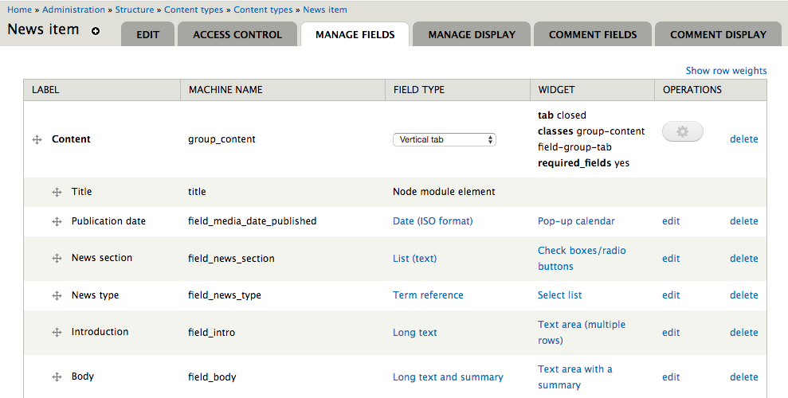

# The Zen of Wagtail

Wagtail has been born out of many years of experience building websites, learning approaches that work and ones that don't, and striking a balance between power and simplicity, structure and flexibility. We hope you'll find that Wagtail is in that sweet spot. However, as a piece of software, Wagtail can only take that mission so far - it's now up to you to create a site that's beautiful and a joy to work with. So, while it's tempting to rush ahead and start building, it's worth taking a moment to understand the design principles that Wagtail is built on.

In the spirit of ["The Zen of Python"](https://www.python.org/dev/peps/pep-0020/), The Zen of Wagtail is a set of guiding principles, both for building websites in Wagtail, and for the ongoing development of Wagtail itself.

## Wagtail is not an instant website in a box.

You can't make a beautiful website by plugging off-the-shelf modules together - expect to write code.

## Always wear the right hat.

The key to using Wagtail effectively is to recognise that there are multiple roles involved in creating a website: the content author, site administrator, developer and designer. These may well be different people, but they don't have to be - if you're using Wagtail to build your personal blog, you'll probably find yourself hopping between those different roles. Either way, it's important to be aware of which of those hats you're wearing at any moment, and to use the right tools for that job. A content author or site administrator will do the bulk of their work through the Wagtail admin interface; a developer or designer will spend most of their time writing Python, HTML or CSS code. This is a good thing: Wagtail isn't designed to replace the job of programming. Maybe one day someone will come up with a drag-and-drop UI for building websites that's as powerful as writing code, but Wagtail is not that tool, and does not try to be.

A common mistake is to push too much power and responsibility into the hands of the content author and site administrator - indeed, if those people are your clients, they'll probably be loudly clamouring for exactly that. The success of your site depends on your ability to say no. The real power of content management comes not from handing control over to CMS users, but from setting clear boundaries between the different roles. Amongst other things, this means not having editors doing design and layout within the content editing interface, and not having site administrators building complex interaction workflows that would be better achieved in code.

## A CMS should get information out of an editor's head and into a database, as efficiently and directly as possible.

Whether your site is about cars, cats, cakes or conveyancing, your content authors will be arriving at the Wagtail admin interface with some domain-specific information they want to put up on the website. Your aim as a site builder is to extract and store this information in its raw form - not one particular author's idea of how that information should look.

Keeping design concerns out of page content has numerous advantages. It ensures that the design remains consistent across the whole site, not subject to the whims of editors from one day to the next. It allows you to make full use of the informational content of the pages - for example, if your pages are about events, then having a dedicated "Event" page type with data fields for the event date and location will let you present the events in a calendar view or filtered listing, which wouldn't be possible if those were just implemented as different styles of heading on a generic page. Finally, if you redesign the site at some point in the future, or move it to a different platform entirely, you can be confident that the site content will work in its new setting, and not be reliant on being formatted a particular way.

Suppose a content author comes to you with a request: "We need this text to be in bright pink Comic Sans". Your question to them should be "Why? What's special about this particular bit of text?" If the reply is "I just like the look of it", then you'll have to gently persuade them that it's not up to them to make design choices. (Sorry.) But if the answer is "it's for our Children's section", then that gives you a way to divide the editorial and design concerns: give your editors the ability to designate certain pages as being "the Children's section" (through tagging, different page models, or the site hierarchy) and let designers decide how to apply styles based on that.

## The best user interface for a programmer is usually a programming language.

A common sight in content management systems is a point-and-click interface to let you define the data model that makes up a page:

It looks nice in the sales pitch, but in reality, no CMS end-user can realistically make that kind of fundamental change - on a live site, no less - unless they have a programmer's insight into how the site is built, and what impact the change will have. As such, it will always be the programmer's job to negotiate that point-and-click interface - all you've done is taken them away from the comfortable world of writing code, where they have a whole ecosystem of tools, from text editors to version control systems, to help them develop, test and deploy their code changes.

Wagtail recognises that most programming tasks are best done by writing code, and does not try to turn them into box-filling exercises when there's no good reason to. Likewise, when building functionality for your site, you should keep in mind that some features are destined to be maintained by the programmer rather than a content editor, and consider whether making them configurable through the Wagtail admin is going to be more of a hindrance than a convenience. For example, Wagtail provides a form builder to allow content authors to create general-purpose data collection forms. You might be tempted to use this as the basis for more complex forms that integrate with (for example) a CRM system or payment processor - however, in this case there's no way to edit the form fields without rewriting the backend logic, so making them editable through Wagtail has limited value. More likely, you'd be better off building these using Django's form framework, where the form fields are defined entirely in code.
