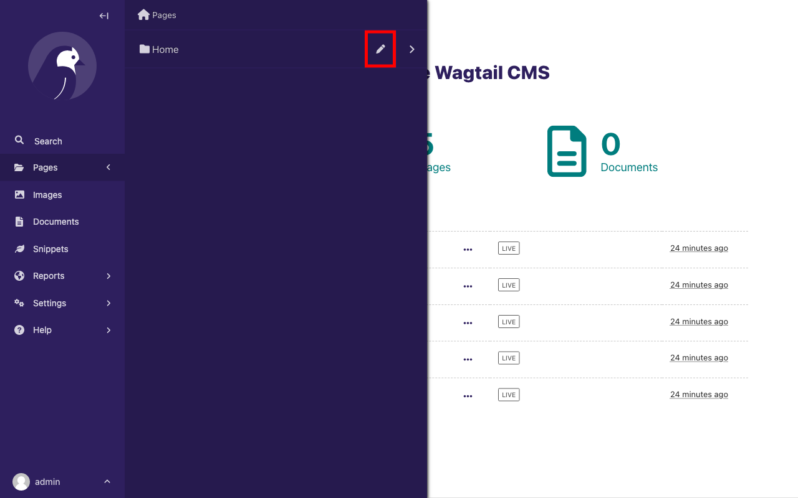
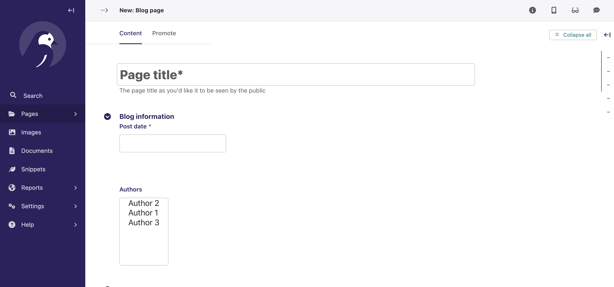
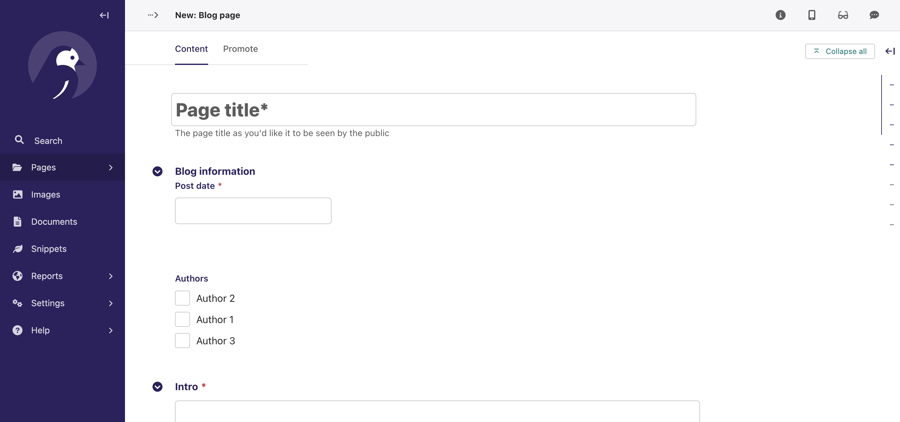
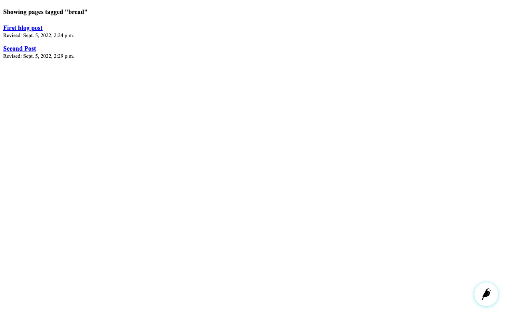

# Your first Wagtail site

This tutorial shows you how to build a blog using Wagtail. Also, the tutorial gives you hands-on experience with some of Wagtail's features.

To complete this tutorial, we recommend that you have some basic programming knowledge, as well as an understanding of web development concepts. A basic understanding of Python and the Django framework ensures a more grounded understanding of this tutorial, but it's not mandatory.

```{note}
If you want to add Wagtail to an existing Django project instead, see [](integrating_into_django).
```

## Install and run Wagtail

### Install dependencies

View the [compatible versions of Python](compatible_django_python_versions) that Wagtail supports.

To check if you have an appropriate version of Python 3, run the following command:

```sh
python --version
# Or:
python3 --version
# **On Windows** (cmd.exe, with the Python Launcher for Windows):
py --version
```

If none of the preceding commands return a version number, or return a version lower than 3.9, then [install Python 3](https://www.python.org/downloads/).

(virtual_environment_creation)=

### Create and activate a virtual environment

This tutorial recommends using a virtual environment, which isolates installed dependencies from other projects.
This tutorial uses [`venv`](inv:python#tutorial/venv), which is packaged with Python 3. On Ubuntu, it may be necessary to run `sudo apt install python3-venv` to install it.

**On Windows** (cmd.exe), run the following command to create a virtual environment:

```doscon
py -m venv mysite\env
```

Activate this virtual environment using:

```doscon
mysite\env\Scripts\activate.bat

# if mysite\env\Scripts\activate.bat doesn't work, run:

mysite\env\Scripts\activate
```

**On GNU/Linux or MacOS** (bash):

Create the virtual environment using:

```sh
python -m venv mysite/env
```

Activate the virtual environment using:

```sh
source mysite/env/bin/activate
```

Upon activation, your command line will show `(env)` to indicate that you're now working within this virtual environment.

**For other shells** see the [`venv` documentation](inv:python#tutorial/venv).

```{note}
If you're using version control such as git, then `mysite` is the directory for your project.
You must exclude the `env` directory from any version control.
```

### Install Wagtail

To install Wagtail and its dependencies, use pip, which is packaged with Python:

```sh
pip install wagtail
```

### Generate your site

Wagtail provides a `start` command similar to `django-admin startproject`. Running `wagtail start mysite` in your project generates a new `mysite` folder with a few Wagtail-specific extras, including the required project settings, a "home" app with a blank `HomePage` model and basic templates, and a sample "search" app.

Because the folder `mysite` was already created by `venv`, run `wagtail start` with an additional argument to specify the destination directory:

```sh
wagtail start mysite mysite
```

Here is the generated project structure:

```text
mysite/
├── .dockerignore
├── Dockerfile
├── home/
├── manage.py*
├── mysite/
├── requirements.txt
└── search/
```

<!-- Generated with: tree -a -L 1 -F -I env mysite -->

### Install project dependencies

```sh
cd mysite
pip install -r requirements.txt
```

This ensures that you have the relevant versions of Wagtail, Django, and any other dependencies for the project that you've just created.
The `requirements.txt` file contains all the dependencies needed to run the project.

### Create the database

By default, your database is SQLite. To match your database tables with your project's models, run the following command:

```sh
python manage.py migrate
```

This command ensures that the tables in your database match the models in your project. Every time you alter your model, then you must run the `python manage.py migrate` command to update the database. For example, if you add a field to a model, then you must run the command.

### Create an admin user

```sh
python manage.py createsuperuser
```

This prompts you to create a new admin user account with full permissions. It's important to note that for security reasons, the password text won’t be visible while typing.

### Start the server

```sh
python manage.py runserver
```

After the server starts, go to <http://127.0.0.1:8000> to see Wagtail’s welcome page:


```{note}
This tutorial uses `http://127.0.0.1:8000` as the URL for your development server but depending on your setup, this could be a different IP address or port. Please read the console output of `manage.py runserver` to determine the correct URL for your local site.
```

You can now access the [admin interface](https://guide.wagtail.org/en-latest/concepts/wagtail-interfaces/#admin-interface) by logging into <http://127.0.0.1:8000/admin> with the username and password that you entered while creating an admin user with `createsuperuser`.


## Extend the HomePage model

Out of the box, the "home" app defines a blank `HomePage` model in `models.py`, along with a migration that creates a homepage and configures Wagtail to use it.

Edit `home/models.py` as follows, to add a `body` field to the model:

```python
from django.db import models

from wagtail.models import Page
from wagtail.fields import RichTextField


class HomePage(Page):
    body = RichTextField(blank=True)

    content_panels = Page.content_panels + ["body"]
```

`body` is a `RichTextField`, a special Wagtail field. When `blank=True`,
it means the field isn't mandatory and you can leave it empty. You can use any of the [Django core fields](inv:django#ref/models/fields). `content_panels` define the capabilities and the layout of the editing interface. Adding fields to `content_panels` enables you to edit them in the Wagtail [admin interface](https://guide.wagtail.org/en-latest/concepts/wagtail-interfaces/#admin-interface). You can read more about this on [Page models](../topics/pages).

Run:

```sh
# Creates the migrations file.
python manage.py makemigrations

# Executes the migrations and updates the database with your model changes.
python manage.py migrate
```

You must run the preceding commands each time you make changes to the model definition. Here is the expected output from the terminal:

```text
Migrations for 'home':
  home/migrations/0003_homepage_body.py
    - Add field body to homepage
Operations to perform:
  Apply all migrations: admin, auth, contenttypes, home, sessions, taggit, wagtailadmin, wagtailcore, wagtaildocs, wagtailembeds, wagtailforms, wagtailimages, wagtailredirects, wagtailsearch, wagtailusers
Running migrations:
  Applying home.0003_homepage_body... OK
```

You can now edit the homepage within the Wagtail [admin interface](https://guide.wagtail.org/en-latest/concepts/wagtail-interfaces/#admin-interface). On your [Sidebar](https://guide.wagtail.org/en-latest/how-to-guides/find-your-way-around/#the-sidebar), go to **Pages** and click edit beside **Home** to see the new body field.



Enter the text "Welcome to our new site!" into the body field, and publish the page by selecting **Publish** at the bottom of the page editor, rather than **Save Draft**.

You must update the page template to reflect the changes made
to the model. Wagtail uses normal Django templates to render each page
type. By default, it looks for a template filename formed from the app and model name,
separating capital letters with underscores. For example, `HomePage` within the "home" app becomes
`home/home_page.html`. This template file can exist in any location that
[Django's template rules](<inv:django#intro/tutorial03:write views that actually do something>) recognize. Conventionally, you can place it within a `templates` folder within the app.

Edit `home/templates/home/home_page.html` to contain the following:

```html+django


<!-- load wagtailcore_tags by adding this: -->


template-homepage

<!-- replace everything below with: -->

    {{ page.body|richtext }}

```

`base.html` refers to a parent template. It must always be the first template tag that you use in a template. Extending from this template saves you from rewriting code and allows pages across your app to share a similar frame. By using block tags in the child template, you can override specific content within the parent template.

Also, you must load `wagtailcore_tags` at the top of the template and provide additional tags to those provided by Django.


### Wagtail template tags

In addition to Django's [template tags and filters](inv:django#ref/templates/builtins),
Wagtail provides a number of its own [template tags & filters](template_tags_and_filters),
which you can load by including `` at the top of
your template file.

This tutorial uses the _richtext_ filter to escape and print the contents
of a `RichTextField`:

```html+django

{{ page.body|richtext }}
```

Produces:

```html
<p>Welcome to our new site!</p>
```

**Note:** You must include `` in each
template that uses Wagtail's tags. If the tags aren't loaded, Django throws a `TemplateSyntaxError`.

## A basic blog

You are now ready to create a blog, use the following command line to create a new app in your Wagtail project.

```sh
python manage.py startapp blog
```

Add the new `blog` app to `INSTALLED_APPS` in `mysite/settings/base.py`.

```python
INSTALLED_APPS = [
    "blog", # <- Our new blog app.
    "home",
    "search",
    "wagtail.contrib.forms",
    "wagtail.contrib.redirects",
    "wagtail.embeds",
    "wagtail.sites",
    "wagtail.users",
    #... other packages
]
```

```{note}
You must register all apps within the `INSTALLED_APPS` section of the `base.py` file in the `mysite/settings` directory. Look at this file to see how the `start` command lists your project’s apps.
```

### Blog index and posts

Start with creating a simple index page for your blog. Edit `blog/models.py` to include:

```python
from django.db import models

# Add these:
from wagtail.models import Page
from wagtail.fields import RichTextField


class BlogIndexPage(Page):
    intro = RichTextField(blank=True)

    content_panels = Page.content_panels + ["intro"]
```

Since you added a new model to your app, you must create and run a database migration:

```sh
python manage.py makemigrations
python manage.py migrate
```

Also, since the model name is `BlogIndexPage`, the default template name,
unless you override it, is `blog_index_page.html`. Django looks for a template whose name matches the name of your Page model within the templates directory in your blog app folder. You can override this default behavior if you want to. To create a template for the
`BlogIndexPage` model, create a file at the location `blog/templates/blog/blog_index_page.html`.

```{note}
You need to create the folders `templates/blog` within your `blog` app folder.
```

In your `blog_index_page.html` file enter the following content:

```html+django




template-blogindexpage


    <h1>{{ page.title }}</h1>

    <div class="intro">{{ page.intro|richtext }}</div>

    
        <h2><a href="">{{ post.title }}</a></h2>
        {{ post.specific.intro }}
        {{ post.specific.body|richtext }}
    


```

Other than using `get_children`, the preceding `blog_index_page.html` template is similar to your previous work with the `home_page.html` template. You will learn about the use of `get_children` later in the tutorial.

If you have a Django background, then you will notice that the `pageurl` tag is similar to Django's `url` tag, but takes a Wagtail Page object as an additional argument.

Now that this is complete, here is how you can create a page from the Wagtail [admin interface](https://guide.wagtail.org/en-latest/concepts/wagtail-interfaces/#admin-interface):

1.  Go to <http://127.0.0.1:8000/admin> and sign in with your admin user details.
2.  In the Wagtail [admin interface](https://guide.wagtail.org/en-latest/concepts/wagtail-interfaces/#admin-interface), go to Pages, then click Home.
3.  Add a child page to the Home page by clicking the **`+`** icon (Add child page) at the top of the screen.
4.  Choose **Blog index page** from the list of the page types.
5.  Use "Blog" as your page title, make sure it has the slug "blog" on the Promote tab, and publish it.

You can now access the URL, <http://127.0.0.1:8000/blog> on your site. Note how the slug from the Promote tab defines the page URL.

Now create a model and template for your blog posts. Edit `blog/models.py` to include:

```python
from django.db import models
from wagtail.models import Page
from wagtail.fields import RichTextField

# add this:
from wagtail.search import index

# keep the definition of BlogIndexPage model, and add the BlogPage model:

class BlogPage(Page):
    date = models.DateField("Post date")
    intro = models.CharField(max_length=250)
    body = RichTextField(blank=True)

    search_fields = Page.search_fields + [
        index.SearchField('intro'),
        index.SearchField('body'),
    ]

    content_panels = Page.content_panels + ["date", "intro", "body"]
```

In the model above, you import `index` as this makes the model searchable. You then list fields that you want to be searchable for the user.

You have to migrate your database again because of the new changes in your `models.py` file:

```sh
python manage.py makemigrations
python manage.py migrate
```

Create a new template file at the location `blog/templates/blog/blog_page.html`. Now add the following content to your `blog_page.html` file:

```html+django




template-blogpage


    <h1>{{ page.title }}</h1>
    <p class="meta">{{ page.date }}</p>

    <div class="intro">{{ page.intro }}</div>

    {{ page.body|richtext }}

    <p><a href="{{ page.get_parent.url }}">Return to blog</a></p>


```

Note the use of Wagtail's built-in `get_parent()` method to obtain the
URL of the blog this post is a part of.

Now, go to your [admin interface](https://guide.wagtail.org/en-latest/concepts/wagtail-interfaces/#admin-interface) and create a few blog posts as children of `BlogIndexPage` by following these steps:

1.  Click **Pages** from the Wagtail [Sidebar](https://guide.wagtail.org/en-latest/how-to-guides/find-your-way-around/#the-sidebar), and then click **Home**
2.  Hover on **Blog** and click **Add child page**.


Select the page type, **Blog page**:


Populate the fields with the content of your choice:


To add a link from your rich text **Body** field, highlight the text you want to attach the link to. You can now see a pop-up modal which has several actions represented by their icons. Click on the appropriate icon to add a link. You can also click the **+** icon, which appears at the left-hand side of the field to get similar actions as those shown in the pop-up modal.

To add an image, press enter to move to the next line in the field. Then click the **+** icon and select **Image** from the list of actions to add an image.

```{NOTE}
Wagtail gives you full control over the kind of content you can create under
various parent content types. By default, any page type can be a child of any
other page type.
```

Publish each blog post when you are done editing.

Congratulations! You now have the beginnings of a working blog. If you go to
<http://127.0.0.1:8000/blog> in your browser, you can see all the posts that you created by following the preceding steps:


Titles should link to post pages, and a link back to the blog's homepage should appear in the footer of each post page.

### Parents and children

Much of the work in Wagtail revolves around the concept of _hierarchical tree structures_ consisting of nodes and leaves. You can read more on this [Theory](../reference/pages/theory). In this case, the `BlogIndexPage` serves as a _node_, and individual `BlogPage` instances represent the _leaves_.

Take another look at the guts of `blog_index_page.html`:

```html+django

    <h2><a href="">{{ post.title }}</a></h2>
    {{ post.specific.intro }}
    {{ post.specific.body|richtext }}

```

Every "page" in Wagtail can call out to its parent or children
from its position in the hierarchy. But why do you have to
specify `post.specific.intro` rather than `post.intro`?
This has to do with the way you define your model, `class BlogPage(Page)`. The `get_children()` method gets you a list of instances of the `Page` base class.
When you want to reference properties of the instances that inherit from the base class,
Wagtail provides the `specific` method that retrieves the actual `BlogPage` record.
While the "title" field is present on the base `Page` model, "intro" is only present
on the `BlogPage` model. So you need `.specific` to access it.

You can simplify the template code by using the Django `with` tag. Now, modify your `blog_index_page.html`:

```html+django

    
        <h2><a href="">{{ post.title }}</a></h2>
        <p>{{ post.intro }}</p>
        {{ post.body|richtext }}
    

```

When you start writing more customized Wagtail code, you'll find a whole set of QuerySet
modifiers to help you navigate the hierarchy.

```python
# Given a page object 'somepage':
MyModel.objects.descendant_of(somepage)
child_of(page) / not_child_of(somepage)
ancestor_of(somepage) / not_ancestor_of(somepage)
parent_of(somepage) / not_parent_of(somepage)
sibling_of(somepage) / not_sibling_of(somepage)
# ... and ...
somepage.get_children()
somepage.get_ancestors()
somepage.get_descendants()
somepage.get_siblings()
```

For more information, see [Page QuerySet reference](../reference/pages/queryset_reference)

### Overriding Context

With a keen eye, you may have noticed problems with the blog index page:

1.  Posts are in chronological order. Generally blogs display content in _reverse_ chronological order.
2.  Posts drafts are visible. You want to make sure that it displays only _published_ content.

To accomplish these, you need to do more than grab the index
page's children in the template. Instead, you want to modify the
QuerySet in the model definition. Wagtail makes this possible via
the overridable `get_context()` method.

Modify your `BlogIndexPage` model:

```python
class BlogIndexPage(Page):
    intro = RichTextField(blank=True)
    # add the get_context method:
    def get_context(self, request):
        # Update context to include only published posts, ordered by reverse-chron
        context = super().get_context(request)
        blogpages = self.get_children().live().order_by('-first_published_at')
        context['blogpages'] = blogpages
        return context

    # ...
```

Here is a quick breakdown of the changes that you made:

1.  You retrieved the original context.
2.  You created a custom QuerySet modifier.
3.  You added the custom QuerySet modifier to the retrieved context.
4.  You returned the modified context to the view.

You also need to modify your `blog_index_page.html` template slightly. Change:

`` to ``

Now, unpublish one of your posts. The unpublished post should disappear from your blog's index page. Also, the remaining posts should now be sorted with the most recently published posts coming first.

### Images

The next feature that you need to add is the ability to attach an image gallery to your blog posts. While it's possible to simply insert images into the rich text `body` field, there are several advantages to setting up your gallery images as a new dedicated object type within the database. This way, you have full control over the layout and styling of the images on the template, rather than having to lay them out in a particular way within the field. It also makes it possible for you to use the images elsewhere, independently of the blog text. For example, displaying a thumbnail on the blog's index page.

Now modify your `BlogPage` model and add a new `BlogPageGalleryImage` model to `blog/models.py`:

```python
# New imports added for ParentalKey, Orderable

from modelcluster.fields import ParentalKey

from wagtail.models import Page, Orderable
from wagtail.fields import RichTextField
from wagtail.search import index

# ... Keep the definition of BlogIndexPage, update the content_panels of BlogPage, and add a new BlogPageGalleryImage model:

class BlogPage(Page):
    date = models.DateField("Post date")
    intro = models.CharField(max_length=250)
    body = RichTextField(blank=True)

    search_fields = Page.search_fields + [
        index.SearchField('intro'),
        index.SearchField('body'),
    ]

    content_panels = Page.content_panels + [
        "date", "intro", "body",

        # Add this
         "gallery_images",
        ]


class BlogPageGalleryImage(Orderable):
    page = ParentalKey(BlogPage, on_delete=models.CASCADE, related_name='gallery_images')
    image = models.ForeignKey(
        'wagtailimages.Image', on_delete=models.CASCADE, related_name='+'
    )
    caption = models.CharField(blank=True, max_length=250)

    panels = ["image", "caption"]
```

Run `python manage.py makemigrations` and `python manage.py migrate`.

There are a few new concepts here:

1.  Inheriting from `Orderable` adds a `sort_order` field to the model to keep track of the ordering of images in the gallery.
2.  The `ParentalKey` to `BlogPage` is what attaches the gallery images to a specific page. A `ParentalKey` works similarly to a `ForeignKey`, but also defines `BlogPageGalleryImage` as a "child" of the `BlogPage` model, so that it's treated as a fundamental part of the page in operations like submitting for moderation, and tracking revision history.
3.  `image` is a `ForeignKey` to Wagtail's built-in `Image` model, which stores the actual images. This appears in the page editor as a pop-up interface for choosing an existing image or uploading a new one. This way, you allow an image to exist in multiple galleries. This creates a many-to-many relationship between pages and images.
4.  Specifying `on_delete=models.CASCADE` on the foreign key means that deleting the image from the system also deletes the gallery entry. In other situations, it might be appropriate to leave the gallery entry in place. For example, if an "our staff" page includes a list of people with headshots, and you delete one of those photos, but prefer to leave the person in place on the page without a photo. In this case, you must set the foreign key to `blank=True, null=True, on_delete=models.SET_NULL`.
5.  Finally, adding the `InlinePanel` to `BlogPage.content_panels` makes the gallery images available on the editing interface for `BlogPage`.

After editing your `blog/models.py`, you should see **Images** in your [Sidebar](https://guide.wagtail.org/en-latest/how-to-guides/find-your-way-around/#the-sidebar) and a **Gallery images** field with the option to upload images and provide a caption for it in the [Edit Screen](https://guide.wagtail.org/en-latest/concepts/wagtail-interfaces/#edit-screen) of your blog posts.

Edit your blog page template `blog_page.html` to include the images section:

```html+django
<!-- Load the wagtailimages_tags: -->


template-blogpage


    <h1>{{ page.title }}</h1>
    <p class="meta">{{ page.date }}</p>

    <div class="intro">{{ page.intro }}</div>

    {{ page.body|richtext }}

    <!-- Add this: -->
    
        <div style="float: inline-start; margin: 10px">
            
            <p>{{ item.caption }}</p>
        </div>
    

    <p><a href="{{ page.get_parent.url }}">Return to blog</a></p>


```

Make sure to upload some images when editing the blog page on your Wagtail admin if you want to display them after editing your blog page template.

Here, you use the `` tag, which exists in the `wagtailimages_tags` library, imported at the top of the template to insert an `` element, with a `fill-320x240` parameter to resize and crop the image to fill a 320x240 rectangle. You can read more about using images in templates in the [docs](../topics/images).


Since your gallery images are database objects in their own right, you can now query and re-use them independently of the blog post body. Now, define a `main_image` method in your `BlogPage` model, which returns the image from the first gallery item or `None` if no gallery items exist:

```python
class BlogPage(Page):
    date = models.DateField("Post date")
    intro = models.CharField(max_length=250)
    body = RichTextField(blank=True)
    # Add the main_image method:
    def main_image(self):
        gallery_item = self.gallery_images.first()
        if gallery_item:
            return gallery_item.image
        else:
            return None

    search_fields = Page.search_fields + [
        index.SearchField('intro'),
        index.SearchField('body'),
    ]

    content_panels = Page.content_panels + ["date", "intro", "body", "gallery_images"]
```

This method is now available from your templates. Update `blog_index_page.html` to load the `wagtailimages_tags` library and include the main image as a thumbnail alongside each post:

```html+django
<!-- Load wagtailimages_tags: -->


<!-- Modify this: -->

    
        <h2><a href="">{{ post.title }}</a></h2>

        <!-- Add this: -->
        
            
        

        <p>{{ post.intro }}</p>
        {{ post.body|richtext }}
    

```

(tutorial_categories)=

### Authors

You probably want your blog posts to have authors, which is an essential feature of blogs. The way to go about this is to have a fixed list, managed by the site owner through a separate area of the [admin interface](https://guide.wagtail.org/en-latest/concepts/wagtail-interfaces/#admin-interface).

First, define an `Author` model. This model isn't a page in its own right. You have to define it as a standard Django `models.Model` rather than inheriting from `Page`. Wagtail introduces the concept of **Snippets** for reusable pieces of content which don't exist as part of the page tree themselves. You can manage snippets through the [admin interface](https://guide.wagtail.org/en-latest/concepts/wagtail-interfaces/#admin-interface). You can register a model as a snippet by adding the `@register_snippet` decorator. Also, you can use all the fields types that you've used so far on pages on snippets too.

To create Authors and give each author an author image as well as a name, add the following to `blog/models.py`:

```python
# Add this to the top of the file
from wagtail.snippets.models import register_snippet

# ... Keep BlogIndexPage, BlogPage, BlogPageGalleryImage models, and then add the Author model:
@register_snippet
class Author(models.Model):
    name = models.CharField(max_length=255)
    author_image = models.ForeignKey(
        'wagtailimages.Image', null=True, blank=True,
        on_delete=models.SET_NULL, related_name='+'
    )

    panels = ["name", "author_image"]

    def __str__(self):
        return self.name

    class Meta:
        verbose_name_plural = 'Authors'
```

```{note}
Note that you are using `panels` rather than `content_panels` here. Since snippets generally have no need for fields such as slug or publish date, the editing interface for them is not split into separate 'content' / 'promote' / 'settings' tabs. So there is no need to distinguish between 'content panels' and 'promote panels'.
```

Migrate this change by running `python manage.py makemigrations` and `python manage.py migrate`. Create a few authors through the **Snippets** area which now appears in your Wagtail [admin interface](https://guide.wagtail.org/en-latest/concepts/wagtail-interfaces/#admin-interface).

You can now add authors to the `BlogPage` model, as a many-to-many field. The field type to use for this is `ParentalManyToManyField`. This field is a variation of the standard Django `ManyToManyField` that ensures the selected objects are properly associated with the page record in the revision history. It operates in a similar manner to how `ParentalKey` replaces `ForeignKey` for one-to-many relations. To add authors to the `BlogPage`, modify `models.py` in your blog app folder:

```python
# New imports added for ParentalManyToManyField, and MultiFieldPanel
from django.db import models

from modelcluster.fields import ParentalKey, ParentalManyToManyField
from wagtail.models import Page, Orderable
from wagtail.fields import RichTextField
from wagtail.admin.panels import MultiFieldPanel
from wagtail.search import index
from wagtail.snippets.models import register_snippet

class BlogPage(Page):
    date = models.DateField("Post date")
    intro = models.CharField(max_length=250)
    body = RichTextField(blank=True)

    # Add this:
    authors = ParentalManyToManyField('blog.Author', blank=True)

    # ... Keep the main_image method and search_fields definition. Modify your content_panels:
    content_panels = Page.content_panels + [
        MultiFieldPanel(["date", "authors"], heading="Blog information"),
        "intro", "body", "gallery_images"
    ]
```

Here you have used the  `MultiFieldPanel` in `content_panels` to group the `date` and `authors` fields together for readability. By doing this, you are creating a single panel object that encapsulates multiple fields within a list or tuple into a single `heading` string. This feature is particularly useful for organizing related fields in the admin interface, making the UI more intuitive for content editors.

Migrate your database by running `python manage.py makemigrations` and `python manage.py migrate`, and then go to your [admin interface](https://guide.wagtail.org/en-latest/concepts/wagtail-interfaces/#admin-interface) . Notice that the list of authors is presented as a multiple select box. This is the default representation for a multiple choice field - however, users often find a set of checkboxes to be more familiar and easier to work with.



You can do this by replacing the definition of `"authors"` in content_panels with a `FieldPanel` object. `FieldPanel("authors")` is equivalent to writing `"authors"`, but allows passing additional optional arguments such as `widget`:

```python
# New imports added for forms, and FieldPanel
from django import forms
from django.db import models

from modelcluster.fields import ParentalKey, ParentalManyToManyField
from wagtail.models import Page, Orderable
from wagtail.fields import RichTextField
from wagtail.admin.panels import FieldPanel, MultiFieldPanel
from wagtail.search import index
from wagtail.snippets.models import register_snippet

class BlogPage(Page):
    date = models.DateField("Post date")
    intro = models.CharField(max_length=250)
    body = RichTextField(blank=True)

    authors = ParentalManyToManyField('blog.Author', blank=True)

    content_panels = Page.content_panels + [
        MultiFieldPanel([
            "date",
            # Change this:
            FieldPanel("authors", widget=forms.CheckboxSelectMultiple),
        ], heading="Blog information"),
        "intro", "body", "gallery_images"
    ]
```

In the preceding model modification, you used the `widget` keyword argument on the `FieldPanel` definition to specify a more user-friendly checkbox-based widget instead of the default list. Now go to your admin interface and you should see the author list displayed as a checklist.



Update the `blog_page.html` template to display the authors:

```html+django

    <h1>{{ page.title }}</h1>
    <p class="meta">{{ page.date }}</p>

    <!-- Add this: -->
    
        
            <h3>Posted by:</h3>
            <ul>
                
                    <li style="display: inline">
                        
                        {{ author.name }}
                    </li>
                
            </ul>
        
    

    <div class="intro">{{ page.intro }}</div>

    {{ page.body|richtext }}

    
        <div style="float: inline-start; margin: 10px">
            
            <p>{{ item.caption }}</p>
        </div>
    

    <p><a href="{{ page.get_parent.url }}">Return to blog</a></p>


```

Add some authors to your blog posts, and publish them. Clicking on your blog posts from your blog index page should now give you a page similar to this image:


### Tag posts

Let's say you want to let editors "tag" their posts, so that readers can, for example,
view all bicycle-related content together. For this, you have to invoke
the tagging system bundled with Wagtail, attach it to the `BlogPage`
model and content panels, and render linked tags on the blog post template.
Of course, you'll also need a working tag-specific URL view as well.

First, alter `models.py` once more:

```python
from django import forms
from django.db import models

# New imports added for ClusterTaggableManager, TaggedItemBase

from modelcluster.fields import ParentalKey, ParentalManyToManyField
from modelcluster.contrib.taggit import ClusterTaggableManager
from taggit.models import TaggedItemBase

from wagtail.models import Page, Orderable
from wagtail.fields import RichTextField
from wagtail.admin.panels import FieldPanel, InlinePanel, MultiFieldPanel
from wagtail.search import index


# ... Keep the definition of BlogIndexPage model and add a new BlogPageTag model
class BlogPageTag(TaggedItemBase):
    content_object = ParentalKey(
        'BlogPage',
        related_name='tagged_items',
        on_delete=models.CASCADE
    )

# Modify the BlogPage model:
class BlogPage(Page):
    date = models.DateField("Post date")
    intro = models.CharField(max_length=250)
    body = RichTextField(blank=True)
    authors = ParentalManyToManyField('blog.Author', blank=True)

    # Add this:
    tags = ClusterTaggableManager(through=BlogPageTag, blank=True)

    # ... Keep the main_image method and search_fields definition. Then modify the content_panels:
    content_panels = Page.content_panels + [
        MultiFieldPanel([
            "date",
            FieldPanel("authors", widget=forms.CheckboxSelectMultiple),

            # Add this:
            "tags",
        ], heading="Blog information"),
            "intro", "body", "gallery_images"
        ]
```

Run `python manage.py makemigrations` and `python manage.py migrate`.

The changes you made can be summarized as follows:

-   New `modelcluster` and `taggit` imports
-   Addition of a new `BlogPageTag` model, and a `tags` field on `BlogPage`.

Edit one of your `BlogPage` instances, and you should now be able to tag posts:


To render tags on a `BlogPage`, add this to `blog_page.html`:

```html+django
<p><a href="{{ page.get_parent.url }}">Return to blog</a></p>

<!-- Add this: -->

    
        <div class="tags">
            <h3>Tags</h3>
            
                <a href="?tag={{ tag }}"><button type="button">{{ tag }}</button></a>
            
        </div>
    

```

Notice that you're linking to pages here with the builtin `slugurl`
tag rather than `pageurl`, which you used earlier. The difference is that `slugurl` takes a `Page` slug (from the Promote tab) as an argument. `pageurl` is more commonly used because it's unambiguous and avoids extra database lookups. But in the case of this loop, the `Page` object isn't readily available, so you fall back on the less-preferred `slugurl` tag.

With the modifications that you've made so far, visiting a blog post with tags displays a series of linked buttons at the bottom, one for each tag associated with the post. However, clicking on a button will result in a **404** error page, as you are yet to define a "tags" view.

Return to `blog/models.py` and add a new `BlogTagIndexPage` model:

```python
class BlogTagIndexPage(Page):

    def get_context(self, request):

        # Filter by tag
        tag = request.GET.get('tag')
        blogpages = BlogPage.objects.filter(tags__name=tag)

        # Update template context
        context = super().get_context(request)
        context['blogpages'] = blogpages
        return context
```

Note that this Page-based model defines no fields of its own.
Even without fields, subclassing `Page` makes it a part of the
Wagtail ecosystem, so that you can give it a title and URL in the
admin. You can also override its `get_context()` method to add a
QuerySet to the context dictionary, making it available to the template.

Migrate this by running `python manage.py makemigrations` and then `python manage.py migrate`. After migrating the new changes, create a new `BlogTagIndexPage` in the admin interface. To create the `BlogTagIndexPage`, follow the same process you followed in creating the `BlogIndexPage` and give it the slug "tags" on the Promote tab. This means the `BlogTagIndexPage` is a child of the home page and parallel to `Blog` in the admin interface.

Access `/tags` and Django will tell you what you probably already knew.
You need to create the template, `blog/templates/blog/blog_tag_index_page.html` and add the following content to it:

```html+django





    
        <h4>Showing pages tagged "{{ request.GET.tag }}"</h4>
    

    

          <p>
              <strong><a href="">{{ blogpage.title }}</a></strong><br />
              <small>Revised: {{ blogpage.latest_revision_created_at }}</small><br />
          </p>

    
        No pages found with that tag.
    


```

In the preceding `blog_tag_index_page.html` template, you're calling the built-in `latest_revision_created_at` field on the `Page` model. It's handy to know this is always available.

Clicking the tag button at the bottom of a blog post renders a page like this:



## Congratulations!

You completed this tutorial 🥳. Applaud yourself, and get yourself a cookie!

Thank you for reading and welcome to the Wagtail community!

## Where next

-   Read our [full tutorial](../tutorial/index.md) to transform your blog site into a fully deployable portfolio site.
-   Read the Wagtail [topics](../topics/index) and [reference](../reference/index) documentation
-   Learn how to implement [StreamField](../topics/streamfield) for freeform page content
-   Browse through the [advanced topics](../advanced_topics/index) section and read [third-party tutorials](../advanced_topics/third_party_tutorials)
