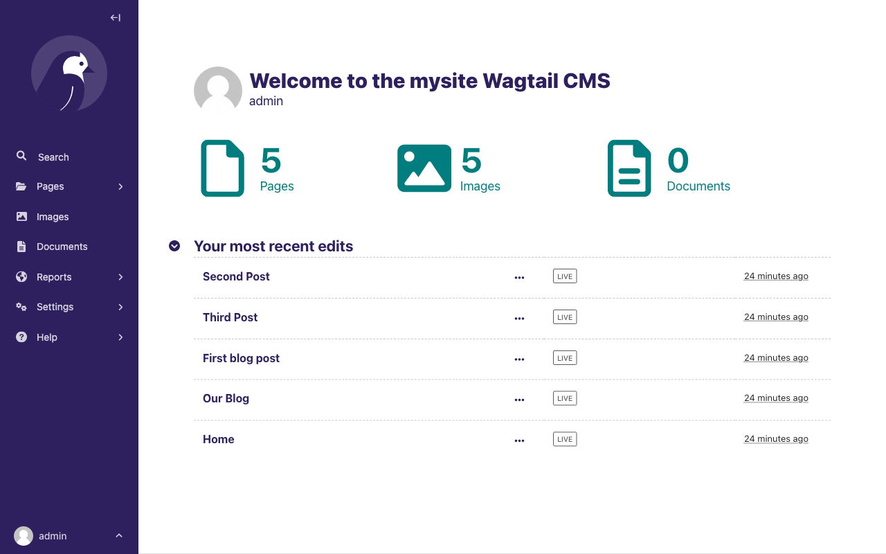
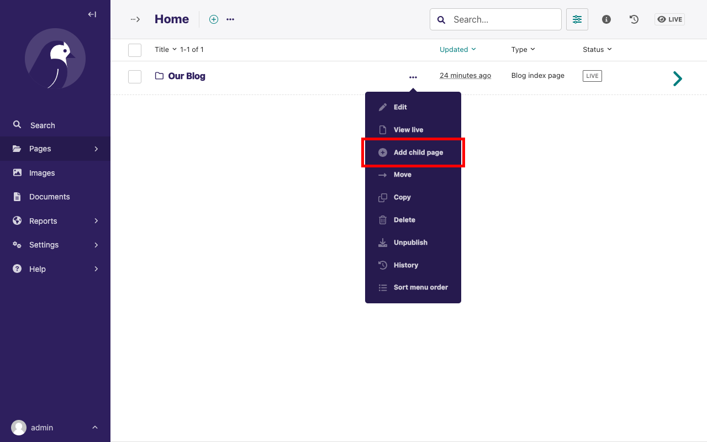

# Your first Wagtail site

This tutorial shows you how to build a blog using Wagtail. This tutorial gives you hands-on experience with some of Wagtail's features.

A basic knowledge of Python programming and the Django framework will help you follow this tutorial.

```{note}
If you'd like to add Wagtail to an existing Django project instead, see [](integrating_into_django).
```

## Install and run Wagtail

### Install dependencies

Wagtail supports Python 3.7, 3.8, 3.9, 3.10, and 3.11.

To check if you have an appropriate version of Python 3, run the following commmand:

```sh
python --version
# Or:
python3 --version
# **On Windows** (cmd.exe, with the Python Launcher for Windows):
py --version
```

If these commands do not return a version number, or return a version lower than 3.7, then [install Python 3](https://www.python.org/downloads/).

```{note}
Before installing Wagtail, it's necessary to install the **libjpeg** and **zlib** libraries, which provide support for working with JPEG, PNG, and GIF images through the Python **Pillow** library.
The way to do this varies by platform. See Pillow's
[platform-specific installation instructions](https://pillow.readthedocs.io/en/stable/installation.html#external-libraries).
```

(virtual_environment_creation)=

### Create and activate a virtual environment

We recommend using a virtual environment, which isolates installed dependencies from other projects.
This tutorial uses [`venv`](https://docs.python.org/3/tutorial/venv.html), which is packaged with Python 3.

**On Windows** (cmd.exe), run the following commands:

```doscon
py -m venv mysite\env
# Then:
mysite\env\Scripts\activate.bat

# If mysite\env\Scripts\activate.bat does not work, run:
mysite\env\Scripts\activate
```

**On GNU/Linux or MacOS** (bash):

```sh
python -m venv mysite/env
# Then:
source mysite/env/bin/activate
```

**For other shells** see the [`venv` documentation](https://docs.python.org/3/library/venv.html).

```{note}
If you're using version control such as git, then `mysite` is the directory for your project.
You must exclude the `env` directory from any version control.
```

### Install Wagtail

Use pip, which is packaged with Python, to install Wagtail and its dependencies:

```sh
pip install wagtail
```

### Generate your site

Wagtail provides a `start` command similar to `django-admin startproject`.
Running `wagtail start mysite` in your project generates a new `mysite` folder with a few Wagtail-specific extras, including the required project settings, a "home" app with a blank `HomePage` model and basic templates, and a sample "search" app.

Because the folder `mysite` was already created by `venv`, run
`wagtail start` with an additional argument to specify the destination directory:

```sh
wagtail start mysite mysite
```

Here is the generated project structure:

```text
mysite/
├── .dockerignore
├── Dockerfile
├── home/
├── manage.py*
├── mysite/
├── requirements.txt
└── search/
```

<!-- Generated with: tree -a -L 1 -F -I env mysite -->

```{note}
Generally, in Wagtail, each page type, or content type, is represented by a single app. However, different apps can be aware of each other and access each other's data. All of the apps need to be registered within the `INSTALLED_APPS` section of the `base.py` file in the `mysite/settings` directory. Look at this file to see how the `start` command has listed them in there.
```

### Install project dependencies

```sh
cd mysite
pip install -r requirements.txt
```

This ensures that you have the relevant versions of Wagtail, Django, and any other dependencies for the project that you create.
The `requirements.txt` file contains all the dependencies needed in order to run the project.

### Create the database

If you haven't updated the project settings, this will be a SQLite database file in the project directory.

```sh
python manage.py migrate
```

This command ensures that the tables in your database match the models in your project. Every time you alter your model, for example, if you add a field to a model, then you must run the `python manage.py migrate` command to update your database.

### Create an admin user

```sh
python manage.py createsuperuser
```

This will prompt you to create a new admin user account with full permissions. It's important to note that for security reasons, the password text won’t be visible while typing.

### Start the server

```sh
python manage.py runserver
```

After the server starts, go to <http://127.0.0.1:8000> to see Wagtail’s welcome page:


```{note}
This tutorial uses `http://127.0.0.1:8000` as the URL for your development server but depending on your setup, this could be a different IP address or port. Please read the console output of `manage.py runserver` to determine the correct url for your local site.
```

You can now access the [admin interface](https://guide.wagtail.org/en-latest/concepts/wagtail-interfaces/#admin-interface) by logging into <http://127.0.0.1:8000/admin> with the username and password that you entered while creating an admin user with `createsuperuser`.



## Extend the HomePage model

Out of the box, the "home" app defines a blank `HomePage` model in `models.py`, along with a migration that creates a homepage and configures Wagtail to use it.

Edit `home/models.py` as follows, to add a `body` field to the model:

```python
from django.db import models

from wagtail.models import Page
from wagtail.fields import RichTextField
from wagtail.admin.panels import FieldPanel


class HomePage(Page):
    body = RichTextField(blank=True)

    content_panels = Page.content_panels + [
        FieldPanel('body'),
    ]
```

`body` is a `RichTextField`, a special Wagtail field. When `blank=True`,
it means the field is not required and you can leave it empty. You can use any of the [Django core fields](https://docs.djangoproject.com/en/stable/ref/models/fields). `content_panels` define the capabilities and the layout of the editing interface. Adding fields to `content_panels` enables you to edit them in the Wagtail [Admin interface](https://guide.wagtail.org/en-latest/concepts/wagtail-interfaces/#admin-interface).
[You can read more about this on Page models](../topics/pages).

Run:

```sh
# Creates the migrations file.
python manage.py makemigrations

# Executes the migrations and updates the database with your model changes.
python manage.py migrate
```

You **must** run the above commands each time you make changes to the model definition. Here is the expected output from the terminal:

```txt
Migrations for 'home':
  home/migrations/0003_homepage_body.py
    - Add field body to homepage
Operations to perform:
  Apply all migrations: admin, auth, contenttypes, home, sessions, taggit, wagtailadmin, wagtailcore, wagtaildocs, wagtailembeds, wagtailforms, wagtailimages, wagtailredirects, wagtailsearch, wagtailusers
Running migrations:
  Applying home.0003_homepage_body... OK
```

You can now edit the homepage within the Wagtail [Admin interface](https://guide.wagtail.org/en-latest/concepts/wagtail-interfaces/#admin-interface) (on the side bar go to **Pages** and click edit beside **Homepage**) to see the new body field.


Enter the text "Welcome to our new site!" into the body field, and publish the page by selecting **Publish** at the bottom of the page editor, rather than **Save Draft**.

You must update the page template to reflect the changes made
to the model. Wagtail uses normal Django templates to render each page
type. By default, it looks for a template filename formed from the app and model name,
separating capital letters with underscores. For example, HomePage within the 'home' app becomes
`home/home_page.html`. This template file can exist in any location that
[Django's template rules](https://docs.djangoproject.com/en/stable/intro/tutorial03/#write-views-that-actually-do-something) recognize. Conventionally, you can place it within a `templates` folder within the app.

Edit `home/templates/home/home_page.html` to contain the following:

```html+django


<!-- load wagtailcore_tags by adding this: -->


template-homepage

<!-- replace everything below with: -->

    {{ page.body|richtext }}

```

`base.html` refers to a parent template. It must always be the first template tag that you use in a template. Extending from this template saves you from rewriting code and allows pages across your app to share a similar frame. By using block tags in the child template, you can override specific content within the parent template.

Also, you must load `wagtailcore_tags` at the top of the template and provide additional tags to those provided by Django.


### Wagtail template tags

In addition to Django's [template tags and filters](django:ref/templates/builtins),
Wagtail provides a number of its own [template tags & filters](template_tags_and_filters)
which you can load by including `` at the top of
your template file.

This tutorial uses the _richtext_ filter to escape and print the contents
of a `RichTextField`:

```html+django

{{ page.body|richtext }}
```

Produces:

```html
<p>Welcome to our new site!</p>
```

**Note:** You must include `` in each
template that uses Wagtail's tags. Django throws a `TemplateSyntaxError`
if the tags aren't loaded.

## A basic blog

You are now ready to create a blog, use the following command line to create a new app in your Wagtail project.

```sh
python manage.py startapp blog
```

Add the new `blog` app to `INSTALLED_APPS` in `mysite/settings/base.py`.

```python
INSTALLED_APPS = [
    "blog", # <- Our new blog app.
    "home",
    "search",
    "wagtail.contrib.forms",
    "wagtail.contrib.redirects",
    "wagtail.embeds",
    "wagtail.sites",
    "wagtail.users",
    #... other packages
]
```

### Blog index and posts

Let's start with creating a simple index page for our blog. Edit `blog/models.py` to include:

```python
from django.db import models

# Add these:
from wagtail.models import Page
from wagtail.fields import RichTextField
from wagtail.admin.panels import FieldPanel


class BlogIndexPage(Page):
    intro = RichTextField(blank=True)

    content_panels = Page.content_panels + [
        FieldPanel('intro')
    ]
```

A new model has been added, so we need to create and run a database migration:

```sh
python manage.py makemigrations
python manage.py migrate
```

Since the model is called `BlogIndexPage`, the default template name,
unless overridden, is `blog_index_page.html`. Django looks for a template whose name matches the name of your Page model within the templates directory in your blog app folder. You can override this default behaviour if want to. To create a template for the
`BlogIndexPage` model, create a file at the location `blog/templates/blog/blog_index_page.html`.

```{note}
You need to create the folders `templates/blog` within your `blog` app folder.
```

In your `blog_index_page.html` file enter the following content:

```html+django




template-blogindexpage


    <h1>{{ page.title }}</h1>

    <div class="intro">{{ page.intro|richtext }}</div>

    
        <h2><a href="">{{ post.title }}</a></h2>
        {{ post.specific.intro }}
        {{ post.specific.body|richtext }}
    


```

Most of this should be familiar from our previous work with the `home_page.html` template, but we'll explain `get_children` a bit later.
If you have a Django background, then you can notice that the `pageurl` tag is similar to Django's `url` tag, but takes a Wagtail Page object as an additional argument.

Now you can create a new page. Here is how you can create one from the Wagtail admin interface:

1.  Go to <http://127.0.0.1:8000/admin> and sign in with your admin user details.
2.  In the Wagtail [admin interface](https://guide.wagtail.org/en-latest/concepts/wagtail-interfaces/#admin-interface), go to Pages, then click Home.
3.  Add a child page to the Home page by clicking **...** at the top of the screen and selecting the option **Add child page**.
4.  Choose **Blog index page** from the list of the page types.
5.  Use "Our Blog" as your page title, make sure it has the slug "blog" on the Promote tab, and publish it.

You can now access the url, <http://127.0.0.1:8000/blog> on your site. This gives you an error page showing "TemplateDoesNotExist" because you are yet to create a template for the new page. Also, note how the slug from the Promote tab defines the page URL.

Now create a model and template for your blog posts. Edit `blog/models.py` to include:

```python
from django.db import models

from wagtail.models import Page
from wagtail.fields import RichTextField
from wagtail.admin.panels import FieldPanel
# add this:
from wagtail.search import index


# Keep the definition of BlogIndexPage model, and add the BlogPage model:

class BlogPage(Page):
    date = models.DateField("Post date")
    intro = models.CharField(max_length=250)
    body = RichTextField(blank=True)

    search_fields = Page.search_fields + [
        index.SearchField('intro'),
        index.SearchField('body'),
    ]

    content_panels = Page.content_panels + [
        FieldPanel('date'),
        FieldPanel('intro'),
        FieldPanel('body'),
    ]
```

In the model above, you import `index` as this makes the model searchable. You then list fields that you want to be searchable for the user.

You have to migrate your database again because of the new changes in your `models.py` file:

```sh
python manage.py makemigrations
python manage.py migrate
```

Create a new template file at the location `blog/templates/blog/blog_page.html`. Now add the following content to your `blog_page.html` file:

```html+django




template-blogpage


    <h1>{{ page.title }}</h1>
    <p class="meta">{{ page.date }}</p>

    <div class="intro">{{ page.intro }}</div>

    {{ page.body|richtext }}

    <p><a href="{{ page.get_parent.url }}">Return to blog</a></p>


```

Note the use of Wagtail's built-in `get_parent()` method to obtain the
URL of the blog this post is a part of.

Now, go to your [admin interface](https://guide.wagtail.org/en-latest/concepts/wagtail-interfaces/#admin-interface) and create a few blog posts as children of `BlogIndexPage` by following these steps:

1.  Click **Pages** from the Wagtail [sidebar](https://guide.wagtail.org/en-latest/how-to-guides/find-your-way-around/#the-sidebar), and then click **Home**
2.  Hover on **Our blog** and click **Add child page**.



3.  Select the page type, **Blog page**.


4.  Populate the fields with content of your choice. To add a link, hightlight the text you want to attach the link to. You can now see a pop-up modal which has several actions represented by their icons. Click on the appropriate icon to add a link. You can also click the **+** icon, which appears at the left-hand side of the RichText `Body` field to get similar actions as those shown in the pop-up modal. To add an image, press enter to move to the next line the RichText `Body` field. Then click the **+** icon, which appears at the left-hand side of the RichText `Body` field. Select **Image** from the list of actions to add an image.

.

```{NOTE}
Wagtail gives you full control over the kind of content you can create under
various parent content types. By default, any page type can be a child of any
other page type.
```

5.  Publish each blog post when you are done editing.

Congratulations! You now have the beginning of a working blog.
Go to <http://127.0.0.1:8000/blog> and you can see all the posts that you created by following the previous steps:


Titles should link to post pages, and a link back to the blog's
homepage should appear in the footer of each post page.

### Parents and Children

Much of the work in Wagtail revolves around the concept of _hierarchical tree structures_ consisting of nodes and leaves. You can read more on this [Theory](../reference/pages/theory). In this case, the `BlogIndexPage` serves as a _node_, and individual `BlogPage` instances represent the _leaves_.

Take another look at the guts of `blog_index_page.html`:

```html+django

    <h2><a href="">{{ post.title }}</a></h2>
    {{ post.specific.intro }}
    {{ post.specific.body|richtext }}

```

Every "page" in Wagtail can call out to its parent or children
from its own position in the hierarchy. But why do you have to
specify `post.specific.intro` rather than `post.intro`?
This has to do with the way you define your model:

`class BlogPage(Page):`

The `get_children()` method gets you a list of instances of the `Page` base class.
When you want to reference properties of the instances that inherit from the base class,
Wagtail provides the `specific` method that retrieves the actual `BlogPage` record.
While the "title" field is present on the base `Page` model, "intro" is only present
on the `BlogPage` model, so you need `.specific` to access it.

To simplify template code like this, use the Django `with` tag:

```html+django

    
        <h2><a href="">{{ post.title }}</a></h2>
        <p>{{ post.intro }}</p>
        {{ post.body|richtext }}
    

```

When you start writing more customised Wagtail code, you'll find a whole set of QuerySet
modifiers to help you navigate the hierarchy.

```python
# Given a page object 'somepage':
MyModel.objects.descendant_of(somepage)
child_of(page) / not_child_of(somepage)
ancestor_of(somepage) / not_ancestor_of(somepage)
parent_of(somepage) / not_parent_of(somepage)
sibling_of(somepage) / not_sibling_of(somepage)
# ... and ...
somepage.get_children()
somepage.get_ancestors()
somepage.get_descendants()
somepage.get_siblings()
```

For more information, see: [Page QuerySet reference](../reference/pages/queryset_reference)

### Overriding Context

With a keen eye, you may have noticed problems with the `Our blog` page:

1.  Our blog orders the post in chronological order, generally blogs display content in _reverse_ chronological order.
2.  All content is currently displayed, we want to make sure only _published_ content is displayed.

To accomplish these, you need to do more than grab the index
page's children in the template. Instead, you want to modify the
QuerySet in the model definition. Wagtail makes this possible via
the overridable `get_context()` method.

Modify your `BlogIndexPage` model like this:

```python
class BlogIndexPage(Page):
    intro = RichTextField(blank=True)

    # add the get_context method:

    def get_context(self, request):
        # Update context to include only published posts, ordered by reverse-chron
        context = super().get_context(request)
        blogpages = self.get_children().live().order_by('-first_published_at')
        context['blogpages'] = blogpages
        return context

    # ...
```

Here is a quick breakdown of the changes we made:

1.  Retrieve the original context.
2.  Create a custom QuerySet modifier.
3.  Add it to the retrieved context.
4.  Return the modified context back to the view.

You also need to modify your `blog_index_page.html` template slightly. Change:

`` to ``

Now, unpublish one of your posts. The unpublished post should disappear from your blog's index page. The remaining posts should be sorted with the most recently published posts coming first.

### Images

Let's add the ability to attach an image gallery to your blog posts. While it's possible to simply insert images into the rich text `body` field, there are several advantages to setting up our gallery images as a new dedicated object type within the database. This way, you have full control over the layout and styling of the images on the template, rather than having to lay them out in a particular way within the rich text field. It also makes it possible for you to use the images elsewhere, independently of the blog text. For example, displaying a thumbnail on the blog's index page.

Add a new `BlogPageGalleryImage` model to `blog/models.py`:

```python
from django.db import models

# New imports added for ParentalKey, Orderable, InlinePanel

from modelcluster.fields import ParentalKey

from wagtail.models import Page, Orderable
from wagtail.fields import RichTextField
from wagtail.admin.panels import FieldPanel, InlinePanel
from wagtail.search import index

# ... Keep the definition of BlogIndexPage, update the content_panels of BlogPage, and add a new BlogPageGalleryImage model:

class BlogPage(Page):
    date = models.DateField("Post date")
    intro = models.CharField(max_length=250)
    body = RichTextField(blank=True)

    search_fields = Page.search_fields + [
        index.SearchField('intro'),
        index.SearchField('body'),
    ]

    content_panels = Page.content_panels + [
        FieldPanel('date'),
        FieldPanel('intro'),
        FieldPanel('body'),
        # Add this:
        InlinePanel('gallery_images', label="Gallery images"),
    ]


class BlogPageGalleryImage(Orderable):
    page = ParentalKey(BlogPage, on_delete=models.CASCADE, related_name='gallery_images')
    image = models.ForeignKey(
        'wagtailimages.Image', on_delete=models.CASCADE, related_name='+'
    )
    caption = models.CharField(blank=True, max_length=250)

    panels = [
        FieldPanel('image'),
        FieldPanel('caption'),
    ]
```

Run `python manage.py makemigrations` and `python manage.py migrate`.

There are a few new concepts here, so let's take them one at a time:

1.  Inheriting from `Orderable` adds a `sort_order` field to the model, to keep track of the ordering of images in the gallery.
2.  The `ParentalKey` to `BlogPage` is what attaches the gallery images to a specific page. A `ParentalKey` works similarly to a `ForeignKey`, but also defines `BlogPageGalleryImage` as a "child" of the `BlogPage` model, so that it's treated as a fundamental part of the page in operations like submitting for moderation, and tracking revision history.
3.  `image` is a `ForeignKey` to Wagtail's built-in `Image` model, which stores the actual images. This appears in the page editor as a pop-up interface for choosing an existing image or uploading a new one. This way, you allow an image to exist in multiple galleries. This creates a many-to-many relationship between pages and images.
4.  Specifying `on_delete=models.CASCADE` on the foreign key means that if the image is deleted from the system, the gallery entry is deleted as well. (In other situations, it might be appropriate to leave the entry in place - for example, if an "our staff" page included a list of people with headshots, and one of those photos was deleted, we'd rather leave the person in place on the page without a photo. In this case, we'd set the foreign key to `blank=True, null=True, on_delete=models.SET_NULL`.)
5.  Finally, adding the `InlinePanel` to `BlogPage.content_panels` makes the gallery images available on the editing interface for `BlogPage`.

After editing `blog/models.py` you should see a _Gallery images_ field with the option to upload images and provide a caption for it when editing a blog page in your Wagtail [admin interface](https://guide.wagtail.org/en-latest/concepts/wagtail-interfaces/#admin-interface).

Edit your blog page template `blog_page.html` to include the images section:

```html+django


<!-- Load the wagtailimages_tags: -->


template-blogpage


    <h1>{{ page.title }}</h1>
    <p class="meta">{{ page.date }}</p>

    <div class="intro">{{ page.intro }}</div>

    {{ page.body|richtext }}

    <!-- Add this: -->
    
        <div style="float: left; margin: 10px">
            
            <p>{{ item.caption }}</p>
        </div>
    

    <p><a href="{{ page.get_parent.url }}">Return to blog</a></p>


```

Make sure to upload some images when editing the blog page on your Wagtail admin if you want to display them after editing your blog page template.

Here, you use the `` tag, which exists in the `wagtailimages_tags` library, imported at the top of the template to insert an `` element, with a `fill-320x240` parameter to resize and crop the image to fill a 320x240 rectangle. You can read more about using images in templates in the [docs](../topics/images).


Since your gallery images are database objects in their own right, you can now query and re-use them independently of the blog post body. Now, define a `main_image` method, which returns the image from the first gallery item or `None` if no gallery items exist:

```python
class BlogPage(Page):
    date = models.DateField("Post date")
    intro = models.CharField(max_length=250)
    body = RichTextField(blank=True)

    # Add the main_image method:

    def main_image(self):
        gallery_item = self.gallery_images.first()
        if gallery_item:
            return gallery_item.image
        else:
            return None

    search_fields = Page.search_fields + [
        index.SearchField('intro'),
        index.SearchField('body'),
    ]

    content_panels = Page.content_panels + [
        FieldPanel('date'),
        FieldPanel('intro'),
        FieldPanel('body'),
        InlinePanel('gallery_images', label="Gallery images"),
    ]
```

This method is now available from our templates. Update `blog_index_page.html` to include the main image as a thumbnail alongside each post:

```html+django
<!-- Load wagtailimages_tags: -->


<!-- Modify this: -->

    
        <h2><a href="">{{ post.title }}</a></h2>

        
            
        

        <p>{{ post.intro }}</p>
        {{ post.body|richtext }}
    

```

(tutorial_categories)=

### Categories

Let's add a category system to our blog. Unlike tags, where a page author can bring a tag into existence simply by using it on a page, our categories will be a fixed list, managed by the site owner through a separate area of the admin interface.

First, we define a `BlogCategory` model. A category is not a page in its own right, and so we define it as a standard Django `models.Model` rather than inheriting from `Page`. Wagtail introduces the concept of "snippets" for reusable pieces of content that need to be managed through the admin interface, but do not exist as part of the page tree themselves; a model can be registered as a snippet by adding the `@register_snippet` decorator. All the field types we've used so far on pages can be used on snippets too - here we'll give each category an icon image as well as a name. Add to `blog/models.py`:

```python
# Add this to the top of your blog/models.py file
from wagtail.snippets.models import register_snippet

# ... Keep BlogIndexPage, BlogPage, BlogPageGalleryImage, and then add the BlogCategory category:

@register_snippet
class BlogCategory(models.Model):
    name = models.CharField(max_length=255)
    icon = models.ForeignKey(
        'wagtailimages.Image', null=True, blank=True,
        on_delete=models.SET_NULL, related_name='+'
    )

    panels = [
        FieldPanel('name'),
        FieldPanel('icon'),
    ]

    def __str__(self):
        return self.name

    class Meta:
        verbose_name_plural = 'blog categories'
```

```{note}
Note that we are using `panels` rather than `content_panels` here - since snippets generally have no need for fields such as slug or publish date, the editing interface for them is not split into separate 'content' / 'promote' / 'settings' tabs as standard, and so there is no need to distinguish between 'content panels' and 'promote panels'.
```

Migrate this change by running `python manage.py makemigrations` and `python manage.py migrate`. Create a few categories through the Snippets area which now appears in the admin menu.

We can now add categories to the `BlogPage` model, as a many-to-many field. The field type we use for this is `ParentalManyToManyField` - this is a variant of the standard Django `ManyToManyField` which ensures that the chosen objects are correctly stored against the page record in the revision history, in much the same way that `ParentalKey` replaces `ForeignKey` for one-to-many relations.To add categories to the `BlogPage`, modify `models.py` in your blog app folder:

```python
# New imports added for forms and ParentalManyToManyField, and MultiFieldPanel
from django import forms
from django.db import models

from modelcluster.fields import ParentalKey, ParentalManyToManyField
from wagtail.admin.panels import FieldPanel, InlinePanel, MultiFieldPanel

# ... modify your BlogPage model

class BlogPage(Page):
    date = models.DateField("Post date")
    intro = models.CharField(max_length=250)
    body = RichTextField(blank=True)
    # Add this:
    categories = ParentalManyToManyField('blog.BlogCategory', blank=True)

    # ... Keep the main_image method and search_fields definition. Modify your content_panels:

    content_panels = Page.content_panels + [
        MultiFieldPanel([
            FieldPanel('date'),
            FieldPanel('categories', widget=forms.CheckboxSelectMultiple),
        ], heading="Blog information"),
        FieldPanel('intro'),
        FieldPanel('body'),
        InlinePanel('gallery_images', label="Gallery images"),
    ]
```

Here we're making use of the `widget` keyword argument on the `FieldPanel` definition to specify a checkbox-based widget instead of the default multiple select box, as this is often considered more user-friendly.

Finally, update the `blog_page.html` template to display the categories:

```html+django
<h1>{{ page.title }}</h1>
<p class="meta">{{ page.date }}</p>


    
        <h3>Posted in:</h3>
        <ul>
            
                <li style="display: inline">
                    
                    {{ category.name }}
                </li>
            
        </ul>
    

```


### Tag Posts

Let's say you want to let editors "tag" their posts, so that readers can, for example,
view all bicycle-related content together. For this, we'll need to invoke
the tagging system bundled with Wagtail, attach it to the `BlogPage`
model and content panels, and render linked tags on the blog post template.
Of course, we'll need a working tag-specific URL view as well.

First, alter `models.py` once more:

```python
from django import forms
from django.db import models

# New imports added for ClusterTaggableManager, TaggedItemBase

from modelcluster.fields import ParentalKey, ParentalManyToManyField
from modelcluster.contrib.taggit import ClusterTaggableManager
from taggit.models import TaggedItemBase

from wagtail.models import Page, Orderable
from wagtail.fields import RichTextField
from wagtail.admin.panels import FieldPanel, InlinePanel, MultiFieldPanel
from wagtail.search import index


# ... Keep the definition of BlogIndexPage


class BlogPageTag(TaggedItemBase):
    content_object = ParentalKey(
        'BlogPage',
        related_name='tagged_items',
        on_delete=models.CASCADE
    )

# Modify the BlogPage model:

class BlogPage(Page):
    date = models.DateField("Post date")
    intro = models.CharField(max_length=250)
    body = RichTextField(blank=True)
    categories = ParentalManyToManyField('blog.BlogCategory', blank=True)
    # Add this:
    tags = ClusterTaggableManager(through=BlogPageTag, blank=True)

    # ... Keep the main_image method and search_fields definition. Then modify the content_panels:

    content_panels = Page.content_panels + [
        MultiFieldPanel([
            FieldPanel('date'),
            FieldPanel('categories', widget=forms.CheckboxSelectMultiple)
            # Add this:
            FieldPanel('tags'),
        ], heading="Blog information"),
        FieldPanel('intro'),
        FieldPanel('body'),
        InlinePanel('gallery_images', label="Gallery images"),
    ]
```

Run `python manage.py makemigrations` and `python manage.py migrate`.

Summarising the changes:

-   New `modelcluster` and `taggit` imports
-   Addition of a new `BlogPageTag` model, and a `tags` field on `BlogPage`.

Edit one of your `BlogPage` instances, and you should now be able to tag posts:


To render tags on a `BlogPage`, add this to `blog_page.html`:

```html+django
<p><a href="{{ page.get_parent.url }}">Return to blog</a></p>

<!-- Add this: -->

    
        <div class="tags">
            <h3>Tags</h3>
            
                <a href="?tag={{ tag }}"><button type="button">{{ tag }}</button></a>
            
        </div>
    

```

Notice that we're linking to pages here with the builtin `slugurl`
tag rather than `pageurl`, which we used earlier. The difference is that `slugurl` takes a
Page slug (from the Promote tab) as an argument. `pageurl` is more commonly used because it
is unambiguous and avoids extra database lookups. But in the case of this loop, the Page object
isn't readily available, so we fall back on the less-preferred `slugurl` tag.

With the modifications we've made so far, visiting a blog post with tags will display a series of linked buttons at the bottom, one for each tag associated with the post. However, clicking on a button will result in a 404 error page, as we have not yet defined a "tags" view.

Return to `blog/models.py` and add:

```python
class BlogTagIndexPage(Page):

    def get_context(self, request):

        # Filter by tag
        tag = request.GET.get('tag')
        blogpages = BlogPage.objects.filter(tags__name=tag)

        # Update template context
        context = super().get_context(request)
        context['blogpages'] = blogpages
        return context
```

Note that this Page-based model defines no fields of its own.
Even without fields, subclassing `Page` makes it a part of the
Wagtail ecosystem, so that you can give it a title and URL in the
admin, and so that you can manipulate its contents by returning
a QuerySet from its `get_context()` method.

Migrate this by running `python manage.py makemigrations` and then `python manage.py`. After migrating the new changes, create a new `BlogTagIndexPage` in the admin interface. To create the `BlogTagIndexPage`, follow the same process you followed in creating the `BlogIndexPage` and give it the slug "tags" on the Promote tab. This means the `BlogTagIndexPage` is a child of the home page and parallel to `Our Blog` in the admin interface

Access `/tags` and Django will tell you what you probably already knew:
you need to create a template `blog/template/blog/blog_tag_index_page.html`:

```html+django





    
        <h4>Showing pages tagged "{{ request.GET.tag }}"</h4>
    

    

          <p>
              <strong><a href="">{{ blogpage.title }}</a></strong><br />
              <small>Revised: {{ blogpage.latest_revision_created_at }}</small><br />
              
                <p>By {{ blogpage.author.profile }}</p>
              
          </p>

    
        No pages found with that tag.
    


```

We're calling the built-in `latest_revision_created_at` field on the `Page`
model - handy to know this is always available.

We haven't yet added an "author" field to our `BlogPage` model, nor do we have
a Profile model for authors - we'll leave those as an exercise for the reader.

Clicking the tag button at the bottom of a BlogPost should now render a page
something like this:


## Congratulations!

You completed this tutorial 🥳. Applaud yourself, and get yourself a cookie!

Thank you for reading and welcome to the Wagtail community!

## Where next

-   Read the Wagtail [topics](../topics/index) and [reference](../reference/index) documentation
-   Learn how to implement [StreamField](../topics/streamfield) for freeform page content
-   Browse through the [advanced topics](../advanced_topics/index) section and read [third-party tutorials](../advanced_topics/third_party_tutorials)
