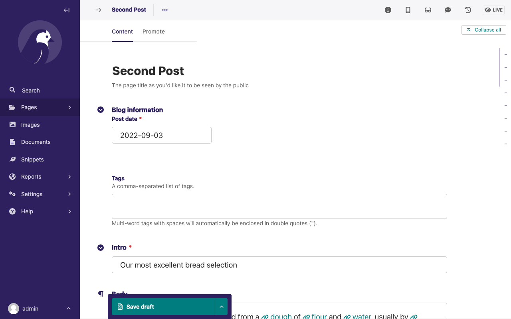
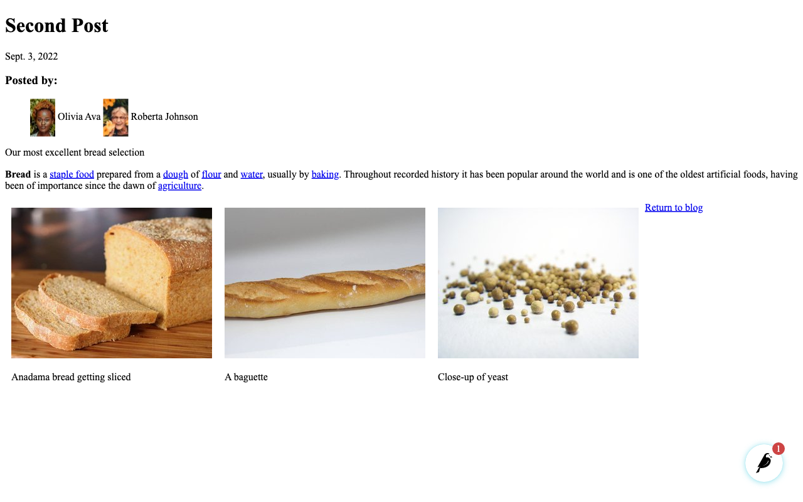
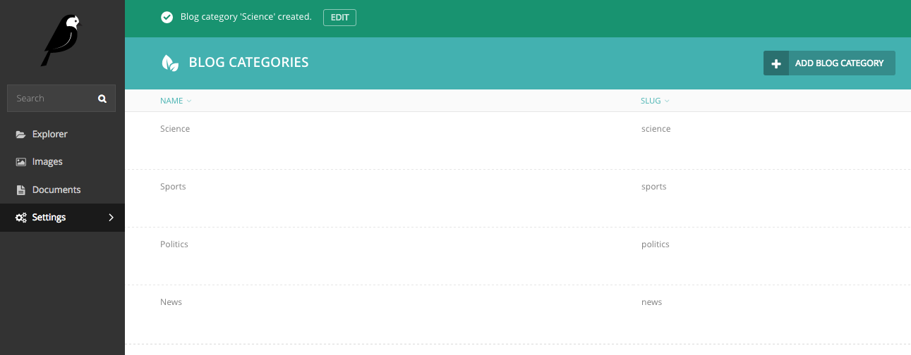

Your first Wagtail site
=======================

.. note::
   This tutorial covers setting up a brand new Wagtail project. If you'd like to add Wagtail to an existing Django project instead, see :doc:`integrating_into_django`.

1. Install Wagtail and its dependencies::

    pip install wagtail

2. Start your site::

    wagtail start mysite
    cd mysite

   Wagtail provides a ``start`` command similar to
   ``django-admin.py startproject``. Running ``wagtail start mysite`` in
   your project will generate a new ``mysite`` folder with a few
   Wagtail-specific extras, including the required project settings, a
   "home" app with a blank ``HomePage`` model and basic templates and a sample
   "search" app.

3. Install project dependencies::

    pip install -r requirements.txt

   This ensures that you have the relevant version of Django for the project you've just created.

4. Create the database::

    python manage.py migrate

   If you haven't updated the project settings, this will be a SQLite
   database file in the project directory.

5. Create an admin user::

    python manage.py createsuperuser

6. ``python manage.py runserver`` If everything worked,
   http://127.0.0.1:8000 will show you a welcome page

   .. figure:: ../_static/images/tutorial/tutorial_1.png
      :alt: Wagtail welcome message

   You can now access the administrative area at http://127.0.0.1:8000/admin

   .. figure:: ../_static/images/tutorial/tutorial_2.png
      :alt: Administrative screen

Extend the HomePage model
-------------------------

Out of the box, the "home" app defines a blank ``HomePage`` model in ``models.py``, along with a migration that creates a homepage and configures Wagtail to use it.

Edit ``home/models.py`` as follows, to add a ``body`` field to the model:

.. code-block:: python

    from __future__ import unicode_literals

    from django.db import models

    from wagtail.wagtailcore.models import Page
    from wagtail.wagtailcore.fields import RichTextField
    from wagtail.wagtailadmin.edit_handlers import FieldPanel

    class HomePage(Page):
        body = RichTextField(blank=True)

        content_panels = Page.content_panels + [
            FieldPanel('body', classname="full")
        ]

``body`` is defined as ``RichTextField``, a special Wagtail field. You
can use any of the `Django core fields <https://docs.djangoproject.com/en/1.8/ref/models/fields/>`__. ``content_panels`` define the
capabilities and the layout of the editing interface. :doc:`More on creating Page models. <../topics/pages>`

Run ``python manage.py makemigrations``, then
``python manage.py migrate`` to update the database with your model
changes. You must run the above commands each time you make changes to
the model definition.

You can now edit the homepage within the Wagtail admin area (go to Explorer, Homepage, then Edit) to see the new body field. Enter some text into the body field, and publish the page.

The page template now needs to be updated to reflect the changes made
to the model. Wagtail uses normal Django templates to render each page
type. It automatically generates a template filename from the model name
by separating capital letters with underscores (e.g. HomePage becomes
home\_page.html). Edit
``home/templates/home/home_page.html`` to contain the following:

.. code-block:: html+django

    

    

    template-homepage

    
        {{ page.body|richtext }}
    

.. figure:: ../_static/images/tutorial/tutorial_3.png
   :alt: Updated homepage

Wagtail template tags
~~~~~~~~~~~~~~~~~~~~~

Wagtail provides a number of :ref:`template tags & filters <template-tags-and-filters>`
which can be loaded by including ```` at the top of
your template file.

In this tutorial, we use the `richtext` filter to escape and print the contents
of a ``RichTextField``:

.. code-block:: html+django

    
    {{ page.body|richtext }}

Produces:

.. code-block:: html

    

        

            <b>Welcome</b> to our new site!
        

    

**Note:** You'll need to include ```` in each
template that uses Wagtail's tags. Django will throw a ``TemplateSyntaxError``
if the tags aren't loaded.

A basic blog
------------

We are now ready to create a blog. To do so, run
``python manage.py startapp blog`` to create a new app in your Wagtail site.

Add the new ``blog`` app to ``INSTALLED_APPS`` in ``mysite/settings/base.py``.

Blog Index and Posts
~~~~~~~~~~~~~~~~~~~~

Lets start with a simple index page for our blog. In ``blog/models.py``:

.. code-block:: python

    class BlogIndexPage(Page):
        intro = RichTextField(blank=True)

        content_panels = Page.content_panels + [
            FieldPanel('intro', classname="full")
        ]

Run ``python manage.py makemigrations`` and ``python manage.py migrate``.

Since the model is called ``BlogIndexPage``, the default template name
(unless we override it) will be ``blog/templates/blog/blog_index_page.html:``

.. code-block:: html+django

    

    

    template-blogindexpage

    
        <h1>{{ page.title }}</h1>

        
{{ page.intro|richtext }}

        
            <h2><a href="">{{ post.title }}</a></h2>
            {{ post.specific.intro }}
            {{ post.specific.body|richtext }}
        

    

Most of this should be familiar, but we'll explain ``get_children`` a bit later.
Note the ``pageurl`` tag, which is similar to Django's ``url`` tag but
takes a Wagtail Page object as an argument.

In the Wagtail admin, create a ``BlogIndexPage`` under the Homepage,
make sure it has the slug "blog" on the Promote tab, and publish it.
You should now be able to access the url ``/blog`` on your site
(note how the slug from the Promote tab defines the page URL).

Now we need a model and template for our blog posts. In ``blog/models.py``:

.. code-block:: python

    from django.db import models

    from wagtail.wagtailcore.models import Page
    from wagtail.wagtailcore.fields import RichTextField
    from wagtail.wagtailadmin.edit_handlers import FieldPanel
    from wagtail.wagtailsearch import index

    class BlogPage(Page):
        date = models.DateField("Post date")
        intro = models.CharField(max_length=250)
        body = RichTextField(blank=True)

        search_fields = Page.search_fields + [
            index.SearchField('intro'),
            index.SearchField('body'),
        ]

        content_panels = Page.content_panels + [
            FieldPanel('date'),
            FieldPanel('intro'),
            FieldPanel('body', classname="full")
        ]

Run ``python manage.py makemigrations`` and ``python manage.py migrate``.

Create a template at ``blog/templates/blog/blog_page.html``:

.. code-block:: html+django

    

    

    template-blogpage

    
        <h1>{{ page.title }}</h1>
        
{{ page.date }}

        
{{ page.intro }}

        {{ page.body|richtext }}

        
<a href="{{ page.get_parent.url }}">Return to blog</a>

    

Note the use of Wagtail's built-in ``get_parent()`` method to obtain the
URL of the blog this post is a part of.

Now create a few blog posts as children of ``BlogIndexPage.``
Be sure to select type "BlogPage" when creating your posts.

.. figure:: ../_static/images/tutorial/tutorial_4a.png
   :alt: Create blog post as child of BlogIndex

.. figure:: ../_static/images/tutorial/tutorial_4b.png
  :alt: Choose type BlogPost

Wagtail gives you full control over what kinds of content can be created under
various parent content types. By default, any page type can be a child of any
other page type.

.. figure:: ../_static/images/tutorial/tutorial_5.png
   :alt: Page edit screen

You should now have the very beginnings of a working blog.
Access the ``/blog`` URL and you should see something like this:

.. figure:: ../_static/images/tutorial/tutorial_7.png
   :alt: Blog basics

Titles should link to post pages, and a link back to the blog's
homepage should appear in the footer of each post page.

Parents and Children
~~~~~~~~~~~~~~~~~~~~

Much of the work you'll be doing in Wagtail revolves around the concept of hierarchical
"tree" structures consisting of nodes and leaves (see :doc:`../reference/pages/theory`).
In this case, the ``BlogIndexPage`` is a "node" and individual ``BlogPage`` instances
are the "leaves".

Take another look at the guts of ``BlogIndexPage:``

.. code-block:: html+django

    
        <h2>{{ post.title }}</h2>
        {{ post.specific.intro }}
        {{ post.specific.body|richtext }}
    

Every "page" in Wagtail can call out to its parent or children
from its own position in the hierarchy. But why do we have to
specify ``post.specific.intro`` rather than ``post.intro?``
This has to do with the way we defined our model:

``class BlogPage(Page):``

The ``get_children()`` method gets us a list of instances of the ``Page`` base class.
When we want to reference properties of the instances that inherit from the base class,
Wagtail provides the ``specific`` method that retrieves the actual ``BlogPage`` record.
While the "title" field is present on the base ``Page`` model, "intro" is only present
on the ``BlogPage`` model, so we need ``.specific`` to access it.

To tighten up template code like this, we could use Django's ``with`` tag:

.. code-block:: html+django

    
        
            <h2>{{ post.title }}</h2>
            
{{ post.intro }}

            {{ post.body|richtext }}
        
    

When you start writing more customized Wagtail code, you'll find a whole set of QuerySet
modifiers to help you navigate the hierarchy.

.. code-block:: python

    # Given a page object 'somepage':
    MyModel.objects.descendant_of(somepage)
    child_of(page) / not_child_of(somepage)
    ancestor_of(somepage) / not_ancestor_of(somepage)
    parent_of(somepage) / not_parent_of(somepage)
    sibling_of(somepage) / not_sibling_of(somepage)
    # ... and ...
    somepage.get_children()
    somepage.get_ancestors()
    somepage.get_descendants()
    somepage.get_siblings()

For more information, see: :doc:`../reference/pages/queryset_reference`

Overriding Context
~~~~~~~~~~~~~~~~~~

There are a couple of problems with our blog index view:

1) Blogs generally display content in *reverse* chronological order
2) We want to make sure we're only displaying *published* content.

To accomplish these things, we need to do more than just grab the index
page's children in the template. Instead, we'll want to modify the
QuerySet in the model definition. Wagtail makes this possible via
the overridable ``get_context()`` method. Modify your ``BlogIndexPage``
model like this:

.. code-block:: python

    class BlogIndexPage(Page):
        intro = RichTextField(blank=True)

        def get_context(self, request):
            # Update context to include only published posts, ordered by reverse-chron
            context = super(BlogIndexPage, self).get_context(request)
            blogpages = self.get_children().live().order_by('-first_published_at')
            context['blogpages'] = blogpages
            return context

All we've done here is to retrieve the original context, create a custom queryset,
add it to the retrieved context, and return the modified context back to the view.
You'll also need to modify your ``blog_index_page.html`` template slightly.
Change:

`` to ``

Now try Unpublishing one of your posts - it should disappear from the blog index
page. The remaining posts should now be sorted with the most recently modified
posts first.

Image support
~~~~~~~~~~~~~

Wagtail provides support for images out of the box. To add them to
your ``BlogPage`` model:

.. code-block:: python

    from django.db import models

    from wagtail.wagtailcore.models import Page
    from wagtail.wagtailcore.fields import RichTextField
    from wagtail.wagtailadmin.edit_handlers import FieldPanel
    from wagtail.wagtailimages.edit_handlers import ImageChooserPanel
    from wagtail.wagtailsearch import index

    class BlogPage(Page):
        main_image = models.ForeignKey(
            'wagtailimages.Image',
            null=True,
            blank=True,
            on_delete=models.SET_NULL,
            related_name='+'
        )
        date = models.DateField("Post date")
        intro = models.CharField(max_length=250)
        body = RichTextField(blank=True)

        search_fields = Page.search_fields + [
            index.SearchField('intro'),
            index.SearchField('body'),
        ]

        content_panels = Page.content_panels + [
            FieldPanel('date'),
            ImageChooserPanel('main_image'),
            FieldPanel('intro'),
            FieldPanel('body'),
        ]

Run ``python manage.py makemigrations`` and ``python manage.py migrate``.

Adjust your blog page template to include the image:

.. code-block:: html+django

    

    

    template-blogpage

    
        <h1>{{ page.title }}</h1>
        
{{ page.date }}

        
            
        

        
{{ page.intro }}

        {{ page.body|richtext }}
    

.. figure:: ../_static/images/tutorial/tutorial_6.png
   :alt: A blog post sample

You can read more about using images in templates in the
:doc:`docs <../topics/images>`.

Tags and Categories
~~~~~~~~~~~~~~~~~~~

What's a blog without a taxonomy? You'll probably want Categories
for "big picture" organization ("News," "Sports," "Politics," etc.) and Tags
for fine-grained sorting ("Bicycle," "Clinton," "Electric Vehicles," etc.)
You'll need mechanisms to let editors manage tags categories and attach them to posts,
ways to display them on your blog pages, and views that display all posts belonging
to a given tag or category.

Let's start with tags, since they're bundled with Wagtail.

First, alter ``models.py`` once more:

.. code-block:: python

    from django.db import models

    from modelcluster.tags import ClusterTaggableManager
    from modelcluster.fields import ParentalKey
    from taggit.models import TaggedItemBase

    from wagtail.wagtailcore.models import Page
    from wagtail.wagtailcore.fields import RichTextField
    from wagtail.wagtailadmin.edit_handlers import FieldPanel, MultiFieldPanel
    from wagtail.wagtailimages.edit_handlers import ImageChooserPanel
    from wagtail.wagtailsearch import index

    class BlogPageTag(TaggedItemBase):
        content_object = ParentalKey('BlogPage', related_name='tagged_items')

    class BlogPage(Page):
        main_image = models.ForeignKey(
            'wagtailimages.Image',
            null=True,
            blank=True,
            on_delete=models.SET_NULL,
            related_name='+'
        )
        date = models.DateField("Post date")
        intro = models.CharField(max_length=250)
        body = RichTextField(blank=True)
        tags = ClusterTaggableManager(through=BlogPageTag, blank=True)

        search_fields = Page.search_fields + [
            index.SearchField('intro'),
            index.SearchField('body'),
        ]

        content_panels = Page.content_panels + [
            FieldPanel('date'),
            ImageChooserPanel('main_image'),
            FieldPanel('intro'),
            FieldPanel('body'),
            MultiFieldPanel([
                FieldPanel('tags'),
            ], heading="Tags"),
        ]

    class BlogIndexPage(Page):
        intro = RichTextField(blank=True)

Note the new ``modelcluster`` and ``taggit`` imports, the addition of a new
``BlogPageTag`` model, the addition of a ``tags`` field on ``BlogPage``,
and the use of ``MultiFieldPanel`` in ``content_panels`` to let users
select tags.

Edit one of your ``BlogPage`` instances, and you should now be able to tag posts:

To render tags on a ``BlogPage,`` add this to ``blog_page.html:``

.. code-block:: html+django

    
        

            <h3>Tags</h3>
            
                <a href="?tag={{ tag }}"><button type="button">{{ tag }}</button></a>
            
        

    

Notice that we're linking to pages here with the builtin ``slugurl``
tag rather than ``pageurl``, which we used earlier. The difference is that ``slugurl`` takes a
Page slug (from the Promote tab) as an argument. ``pageurl`` is more commonly used because it
is unambiguous and avoids extra database lookups. But in the case of this loop, the Page object
isn't readily available, so we fall back on the less-preferred  ``slugurl`` tag.

Visiting a blog post with tags should now show a set of linked
buttons at the bottom - one for each tag. However, clicking a button
will get you a 404, since we haven't yet defined a "tags" view. Add to ``models.py:``

.. code-block:: python

    class BlogTagIndexPage(Page):

        def get_context(self, request):

            # Filter by tag
            tag = request.GET.get('tag')
            blogpages = BlogPage.objects.filter().filter(tags__name=tag)

            # Update template context
            context = super(BlogTagIndexPage, self).get_context(request)
            context['blogpages'] = blogpages
            return context

Note that this Page-based model defines no fields of its own.
Even without fields, subclassing ``Page`` makes it a part of the
Wagtail ecosystem, so that you can give it a title and URL in the
admin, and so that you can manipulate its contents by returning
a queryset from its ``get_context()`` method.

Migrate this in, then create a new ``BlogTagIndexPage`` in the admin.
You'll probably want to create the new page/view under Homepage,
parallel to your Blog index. Give it the slug "tags" on the Promote tab.

Access ``/tags`` and Django will tell you what you probably already knew:
you need to create a template ``blog/blog_tag_index_page.html:``

.. code-block:: html+django

    
    

    

        
            <h4>Showing pages tagged "{{ request.GET.tag }}"</h4>
        

        

              

                  <strong><a href="">{{ blogpage.title }}</a></strong> 
                  <small>Revised: {{ blogpage.latest_revision_created_at }}</small> 
                  
                    
By {{ blogpage.author.profile }}

                  
              

        
            No pages found with that tag.
        

    

We're calling the built-in ``latest_revision_created_at`` field on the ``Page``
model - handy to know this is always available.

We haven't yet added an "author" field to our ``BlogPage`` model, nor do we have
a Profile model for authors  - we'll leave those as an exercise for the reader.

Clicking the tag button at the bottom of a BlogPost should now render a page
something like this:

.. figure:: ../_static/images/tutorial/tutorial_9.png
   :alt: A simple tag view

Categories
~~~~~~~~~~

Now to add a Categories system. Again, alter ``models.py``:

.. code-block:: python

    class BlogCategory(models.Model):
        name = models.CharField(max_length=256)
        slug = models.CharField(max_length=12)

        def __str__(self):
            return self.name

        class Meta:
            verbose_name_plural = "Blog Categories"

This model does *not* subclass the Wagtail ``Page``
model, and is *not* a Wagtail Snippet - it's a standard Django model! While we could have created
categories as Pages, that wouldn't really make a lot of sense - while we'll eventually
want pages for our categories, a category itself is more of a metadata storage structure than a page,
so it makes sense to make it a vanilla Django model. As a result, this exercise will also show
how to integrate non-Wagtail models into the Wagtail workflow.

As an aside, the ``BlogCategory`` model could easily live in a totally different app of your
Django project, and just be imported normally into your Wagtail blog app. This would be important if you were, e.g.,
integrating a Wagtail blog into a pre-existing Django site that already had a system of categories.

We want to create a ManyToMany relationship between BlogCategory and BlogPage. In standard Django, we would do
something like this:

``categories = models.ManyToManyField(BlogCategory, blank=True)``

However, it's a bit trickier than that with Wagtail because of the ``modelcluster`` dependency it
uses to maintain hierarchical relationships. ``modelcluster`` is at the heart of Wagtail, but does not
support M2M relationships. Instead, we'll need to define the related table manually:

.. code-block:: python

    class BlogCategoryBlogPage(Orderable, models.Model):
        category = models.ForeignKey(BlogCategory, related_name="+")
        page = ParentalKey(BlogPage, related_name='blog_categories')

This model's table will store relationships between blog pages and the categories assigned to them,
effectively giving us the equivalent of a ManyToMany relationship. For readability, we named the class
by concatenating the names of the two related models. The class also subclasses ``Orderable``,
which means you'll be able to control the order of Categories on a blog post via the Wagtail admin.

Now we just need to attach a "panel" for the relationship to our BlogPost. In the ``BlogPost`` model,
add an ``InlinePanel`` for the "related_name" ``blog_categories:``

.. code-block:: python

    content_panels = Page.content_panels + [
        FieldPanel('date'),
        ImageChooserPanel('main_image'),
        FieldPanel('intro'),
        FieldPanel('body'),
        InlinePanel('blog_categories', label="Blog Categories"),
        MultiFieldPanel([
            FieldPanel('tags'),
        ], heading="Tags"),
    ]

Run ``python manage.py makemigrations`` and ``python manage.py migrate,`` then view an admin page for a ``BlogPage:``

At first, we have no categories to choose from. Unlike the Django admin, we can't add them on the fly from here.
Since we didn't create ``BlogCategory`` as a Page or Snippet, Wagtail isn't automatically aware of it, so we'll
need to expose it in the admin manually.  Fortunately, Wagtail provides a mechanism for this,
via ``ModelAdmin``. Create a new file in your blog app, called ``wagtail_hooks.py:``

.. code-block:: python

    from wagtail.contrib.modeladmin.options import (ModelAdmin, modeladmin_register)
    from blog.models import BlogCategory

    class BlogCategoryAdmin(ModelAdmin):
        model = BlogCategory
        add_to_settings_menu = True
        list_display = ('name', 'slug')

    modeladmin_register(BlogCategoryAdmin)

``wagtail_hooks`` lets you control aspects of the admin, and to expose non-Wagtail models.
In this example, we've specified:

``add_to_settings_menu = True``

So that our BlogCategories appear in the global Settings menu:

.. figure:: ../_static/images/tutorial/tutorial_11.png
   :alt: Adding Blog Categories to Settings

After using your new Blog Categories interface to create some categories, you can select them from the
InlinePanel in a BlogPage:

Now that we're storing categories on posts, we need a view to display them, and a way to link to them.
Rather than create another model for the new view, let's consider a category to be a "slice" of data exposed
on the ``BlogIndexPage.``  We can pass a category to the view either as URL parameter: ``/blog?cat=science``
or as a keyword on the end of the URL, which is much cleaner: ``/blog/science``. To access that keyword, we'll
take advantage of Wagtail's :doc:`RoutablePageMixin <../reference/contrib/routablepage>`  class. Modify
``BlogIndexPage`` like this:

.. code-block:: python

    from wagtail.contrib.wagtailroutablepage.models import RoutablePageMixin, route
    from django.shortcuts import get_object_or_404, render

    class BlogIndexPage(RoutablePageMixin, Page):
        intro = RichTextField(blank=True)

        def get_context(self, request):
            # Update context to include only published posts, ordered by reverse-chron
            context = super(BlogIndexPage, self).get_context(request)
            blogpages = self.get_children().live().order_by('-first_published_at')

            # Include queryset of non-empty blog categories for menu
            usedcats = BlogCategoryBlogPage.objects.distinct().values_list('category__slug', flat=True)
            blogcats = BlogCategory.objects.filter(slug__in=usedcats)

            context['blogpages'] = blogpages
            context['blogcats'] = blogcats
            return context

        @route(r'^cat/(\w+)/$', name="blog_category")
        def category(self, request, catslug=None):
            """
            Filter BlogPages by category
            """
            category = get_object_or_404(BlogCategory, slug=catslug)
            blogpages = BlogPage.objects.filter(
                blog_categories__category=category).live().order_by('-first_published_at')

            context = self.get_context(request)
            context['blogpages'] = blogpages
            context['category'] = category
            return render(request, 'blog/blog_index_page.html', context)

The ``@route`` decorator is new, but as you can see, it works pretty much the same as standard Django URLs,
with a regex pattern matcher and a route name, which we'll use in a minute. The ``^cat...`` in the regex
matches a URL pattern starting at the parent page, so in this case we're matching e.g.
``/blog/cat/science.``  We query for a ``BlogCategory`` object (or 404), then use it to filter ``BlogPage``
records, traversing through our "ManyToMany" table. Note that when using ``route,``
we need to call Django's ``render()`` manually, specifying the template name.

Since we want to display a nav menu including all non-empty categories, we also insert that queryset
into the context (notice how the ``category()`` suburl calls ``get_context()`` before
appending to context, so the categories list is available on all blog index views.)

Assuming you've created a "Science" category and added some posts to that category, you should now be
able to access a URL like ``/blog/cat/science.`` Now we just need to add category links to our index
and post templates.

We'll also need to be able to reverse blog category links, using a tempate tag that is in
Wagtail's "contrib" module, not in core. In your project settings, add
``'wagtail.contrib.wagtailroutablepage'`` to ``INSTALLED_APPS``, then modify ``blog_index_page.html``:

.. code-block:: html+django

    

    
    

    template-blogindexpage

    

        
            <h3>Blog categories:</h3>
            <ul>
                
                    <li><a href="">
                        {{ cat.name }}</a></li>
                
            </ul>
        

        <h1>{{ page.title }} - {{ category.name }}</h1>

        
{{ page.intro|richtext }}

        
            
                <h2><a href="">{{ post.title }}</a></h2>
                {{ post.latest_revision_created_at }} 

                
                    Filed under:
                    
                        <a href="">
                            {{ cat.category.name }}</a>, 
                     
                

                
                    Tags:
                    
                        <a href="?tag={{ tag }}">
                            <button type="button">{{ tag }}</button></a>
                     
                

                
Intro: {{ post.intro }}

                {{ post.body|richtext }}
            
        

    

Study the "Filed under:" section -
we loop through each of a blog post's categories (if it has any), and for each, we reverse the URL
to the corresponding blog category view, using the URL we named earlier (``blog_category``), and
passing in the slug of the current category. We also display the category name in the header.
You'll probably want to do something similar on ``blog_page.html``.

And with that, we've got both tags and categories working, and our categories system is nice and DRY
because we used a single model (view) to handle both the blog's homepage and its category displays.

Where next
----------

-  Read the Wagtail :doc:`topics <../topics/index>` and :doc:`reference <../reference/index>` documentation
-  Learn how to implement :doc:`StreamField <../topics/streamfield>` for freeform page content
-  Browse through the :doc:`advanced topics <../advanced_topics/index>` section and read :doc:`third-party tutorials <../advanced_topics/third_party_tutorials>`
