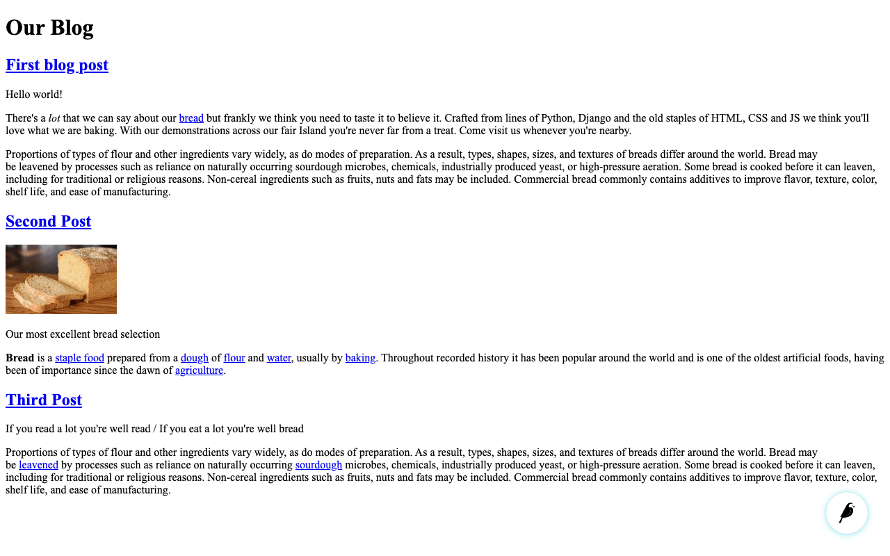

Your first Wagtail site
=======================

.. note::
   This tutorial covers setting up a brand new Wagtail project. If you'd like to add Wagtail to an existing Django project instead, see :doc:`integrating_into_django`.

1. Install Wagtail and its dependencies::

    pip install wagtail

2. Start your site::

    wagtail start mysite
    cd mysite

   Wagtail provides a ``start`` command similar to
   ``django-admin.py startproject``. Running ``wagtail start mysite`` in
   your project will generate a new ``mysite`` folder with a few
   Wagtail-specific extras, including the required project settings, a
   "home" app with a blank ``HomePage`` model and basic templates and a sample
   "search" app.

3. Install project dependencies::

    pip install -r requirements.txt

   This ensures that you have the relevant version of Django for the project you've just created.

4. Create the database::

    python manage.py migrate

   If you haven't updated the project settings, this will be a SQLite
   database file in the project directory.

5. Create an admin user::

    python manage.py createsuperuser

6. ``python manage.py runserver`` If everything worked,
   http://127.0.0.1:8000 will show you a welcome page

   .. figure:: ../_static/images/tutorial/tutorial_1.png
      :alt: Wagtail welcome message

   You can now access the administrative area at ``/admin``

   .. figure:: ../_static/images/tutorial/tutorial_2.png
      :alt: Administrative screen

Extend the HomePage model
-------------------------

Out of the box, the "home" app defines a blank ``HomePage`` model in ``models.py``, along with a migration that creates a homepage and configures Wagtail to use it.

Edit ``home/models.py`` as follows, to add a ``body`` field to the model:

.. code-block:: python

    from __future__ import unicode_literals

    from django.db import models

    from wagtail.wagtailcore.models import Page
    from wagtail.wagtailcore.fields import RichTextField
    from wagtail.wagtailadmin.edit_handlers import FieldPanel

    class HomePage(Page):
        body = RichTextField(blank=True)

        content_panels = Page.content_panels + [
            FieldPanel('body', classname="full")
        ]

``body`` is defined as ``RichTextField``, a special Wagtail field. You
can use any of the `Django core fields <https://docs.djangoproject.com/en/1.8/ref/models/fields/>`__. ``content_panels`` define the
capabilities and the layout of the editing interface. :doc:`More on creating Page models. <../topics/pages>`

Run ``python manage.py makemigrations``, then
``python manage.py migrate`` to update the database with your model
changes. You must run the above commands each time you make changes to
the model definition.

You can now edit the homepage within the Wagtail admin area (go to Explorer, Homepage, then Edit) to see the new body field. Enter some text into the body field, and publish the page.

The page template now needs to be updated to reflect the changes made
to the model. Wagtail uses normal Django templates to render each page
type. It automatically generates a template filename from the model name
by separating capital letters with underscores (e.g. HomePage becomes
home\_page.html). Edit
``home/templates/home/home_page.html`` to contain the following:

.. code-block:: html+django

    

    

    template-homepage

    
        {{ page.body|richtext }}
    

.. figure:: ../_static/images/tutorial/tutorial_3.png
   :alt: Updated homepage

Wagtail template tags
~~~~~~~~~~~~~~~~~~~~~

Wagtail provides a number of
`template tags & filters <../topics/writing_templates#template-tags-filters>`__
which can be loaded by including ```` at the top of
your template file.

In this tutorial, we use the `richtext` filter to escape and print the contents
of a ``RichTextField``:

.. code-block:: html+django

    
    {{ page.body|richtext }}

Produces:

.. code-block:: html

    

        

            <b>Welcome</b> to our new site!
        

    

**Note:** You'll need to include ```` in each
template that uses Wagtail's tags. Django will throw a ``TemplateSyntaxError``
if the tags aren't loaded.

A basic blog
------------

We are now ready to create a blog. To do so, run
``python manage.py startapp blog`` to create a new app in your Wagtail site.

Add the new ``blog`` app to ``INSTALLED_APPS`` in ``mysite/settings/base.py``.

The following example defines a basic blog post model in ``blog/models.py``:

.. code-block:: python

    from django.db import models

    from wagtail.wagtailcore.models import Page
    from wagtail.wagtailcore.fields import RichTextField
    from wagtail.wagtailadmin.edit_handlers import FieldPanel
    from wagtail.wagtailsearch import index

    class BlogPage(Page):
        date = models.DateField("Post date")
        intro = models.CharField(max_length=250)
        body = RichTextField(blank=True)

        search_fields = Page.search_fields + (
            index.SearchField('intro'),
            index.SearchField('body'),
        )

        content_panels = Page.content_panels + [
            FieldPanel('date'),
            FieldPanel('intro'),
            FieldPanel('body', classname="full")
        ]

Create a template at ``blog/templates/blog/blog_page.html``:

.. code-block:: html+django

    

    

    template-blogpage

    
        <h1>{{ page.title }}</h1>
        
{{ page.date }}

        
{{ page.intro }}

        {{ page.body|richtext }}
    

Run ``python manage.py makemigrations`` and ``python manage.py migrate``.

.. figure:: ../_static/images/tutorial/tutorial_4.png
   :alt: Create page screen

.. figure:: ../_static/images/tutorial/tutorial_5.png
   :alt: Page edit screen

Image support
~~~~~~~~~~~~~

Wagtail provides support for images out of the box. To add them to your
model:

.. code-block:: python

    from django.db import models

    from wagtail.wagtailcore.models import Page
    from wagtail.wagtailcore.fields import RichTextField
    from wagtail.wagtailadmin.edit_handlers import FieldPanel
    from wagtail.wagtailimages.edit_handlers import ImageChooserPanel
    from wagtail.wagtailsearch import index

    class BlogPage(Page):
        main_image = models.ForeignKey(
            'wagtailimages.Image',
            null=True,
            blank=True,
            on_delete=models.SET_NULL,
            related_name='+'
        )
        date = models.DateField("Post date")
        intro = models.CharField(max_length=250)
        body = RichTextField(blank=True)

        search_fields = Page.search_fields + (
            index.SearchField('intro'),
            index.SearchField('body'),
        )

        content_panels = Page.content_panels + [
            FieldPanel('date'),
            ImageChooserPanel('main_image'),
            FieldPanel('intro'),
            FieldPanel('body'),
        ]

Run ``python manage.py makemigrations`` and ``python manage.py migrate``.

Adjust your blog page template to include the image:

.. code-block:: html+django

    

    

    template-blogpage

    
        <h1>{{ page.title }}</h1>
        
{{ page.date }}

        
          
        

        
{{ page.intro }}

        {{ page.body|richtext }}
    

.. figure:: ../_static/images/tutorial/tutorial_6.png
   :alt: A blog post sample

You can read more about using images in templates in the
:doc:`docs <../topics/images/index>`.

Blog Index
~~~~~~~~~~

Let us extend the Blog app to provide an index.

.. code-block:: python

    class BlogIndexPage(Page):
        intro = RichTextField(blank=True)

        content_panels = Page.content_panels + [
            FieldPanel('intro', classname="full")
        ]

The above creates an index type to collect all our blog posts.

``blog/templates/blog/blog_index_page.html``

.. code-block:: html+django

    

    

    template-blogindexpage

    
        <h1>{{ page.title }}</h1>

        
{{ page.intro|richtext }}

    

Related items
~~~~~~~~~~~~~

Let's extend the BlogIndexPage to add related links. The related links
can be BlogPages or external links. Change ``blog/models.py`` to

.. code-block:: python

    from django.db import models

    from modelcluster.fields import ParentalKey

    from wagtail.wagtailcore.models import Page, Orderable
    from wagtail.wagtailcore.fields import RichTextField
    from wagtail.wagtailadmin.edit_handlers import (FieldPanel,
                                                    InlinePanel,
                                                    MultiFieldPanel,
                                                    PageChooserPanel)
    from wagtail.wagtailimages.edit_handlers import ImageChooserPanel
    from wagtail.wagtailsearch import index

    # ...

    class LinkFields(models.Model):
        link_external = models.URLField("External link", blank=True)
        link_page = models.ForeignKey(
            'wagtailcore.Page',
            null=True,
            blank=True,
            related_name='+'
        )

        @property
        def link(self):
            if self.link_page:
                return self.link_page.url
            else:
                return self.link_external

        panels = [
            FieldPanel('link_external'),
            PageChooserPanel('link_page'),
        ]

        class Meta:
            abstract = True

    # Related links
    class RelatedLink(LinkFields):
        title = models.CharField(max_length=255, help_text="Link title")

        panels = [
            FieldPanel('title'),
            MultiFieldPanel(LinkFields.panels, "Link"),
        ]

        class Meta:
            abstract = True

    class BlogIndexPage(Page):
        intro = RichTextField(blank=True)

        content_panels = Page.content_panels + [
            FieldPanel('intro', classname="full"),
            InlinePanel('related_links', label="Related links"),
        ]

    class BlogIndexRelatedLink(Orderable, RelatedLink):
        page = ParentalKey('BlogIndexPage', related_name='related_links')

Extend ``blog_index_page.html`` to show related items

.. code-block:: html+django

    

    

    template-blogindexpage

    
        <h1>{{ page.title }}</h1>

        
{{ page.intro|richtext }}

        
            <ul>
                
                    <li><a href="{{ item.link }}">{{ item.title }}</a></li>
                
            </ul>
        
    

You now have a fully working blog with featured blog posts.

.. figure:: ../_static/images/tutorial/tutorial_8.png
   :alt: Barebones blog index

Where next
----------

-  Read the Wagtail :doc:`topics <../topics/index>` and :doc:`reference <../reference/index>` documentation
-  Learn how to implement :doc:`StreamField <../topics/streamfield>` for freeform page content
-  Browse through the :doc:`advanced topics <../advanced_topics/index>` section and read :doc:`third-party tutorials <../advanced_topics/third_party_tutorials>`
