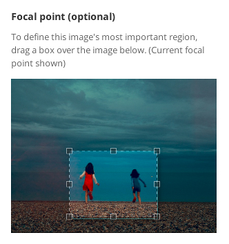
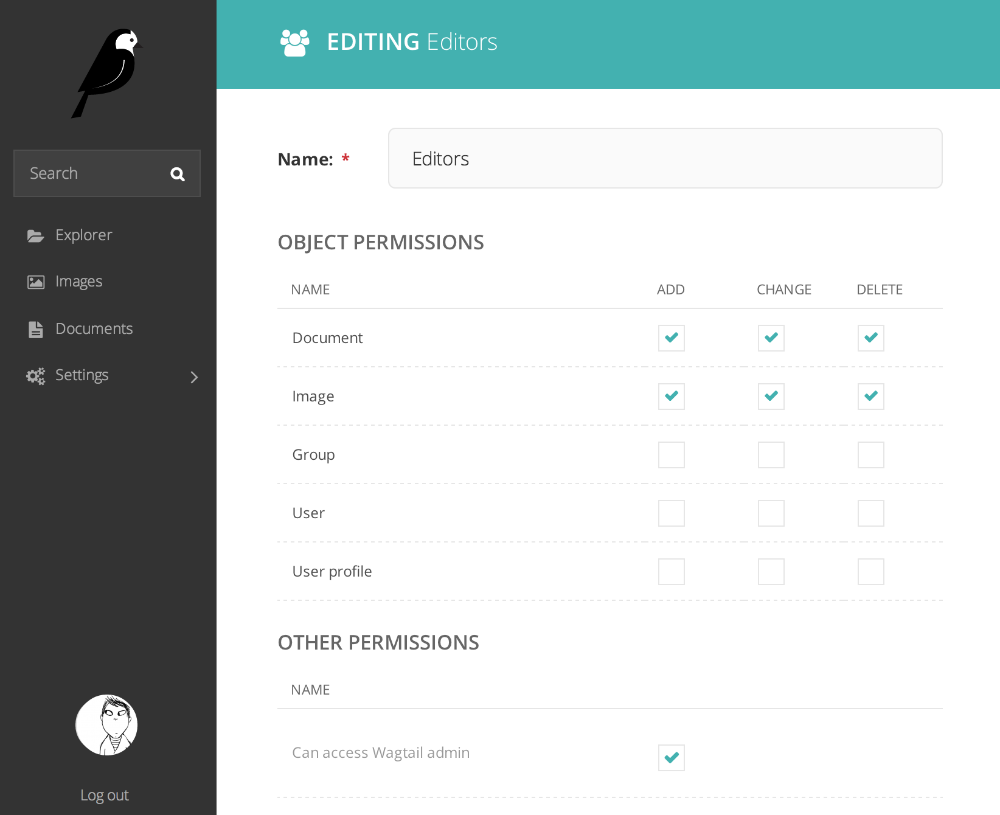
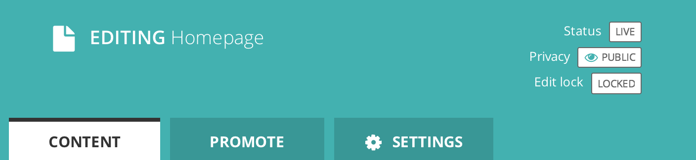

=========================
Wagtail 0.7 release notes
=========================

*October 9, 2014*

.. contents::
    :local:
    :depth: 1

What's new
==========

New interface for choosing image focal point
~~~~~~~~~~~~~~~~~~~~~~~~~~~~~~~~~~~~~~~~~~~~

When editing images, users can now specify a 'focal point' region that cropped versions of the image will be centred on. Previously the focal point could only be set automatically, through image feature detection.

Groups and Sites administration interfaces
~~~~~~~~~~~~~~~~~~~~~~~~~~~~~~~~~~~~~~~~~~

The main navigation menu has been reorganised, placing site configuration options in a 'Settings' submenu. This includes two new items, which were previously only available through the Django admin backend: 'Groups', for setting up user groups with a specific set of permissions, and 'Sites', for managing the list of sites served by this Wagtail instance.

Page locking
~~~~~~~~~~~~

Moderators and administrators now have the ability to lock a page, preventing further edits from being made to that page until it is unlocked again.

Minor features
~~~~~~~~~~~~~~

* The ``content_type`` template filter has been removed from the project template, as the same thing can be accomplished with ``self.get_verbose_name|slugify``.
* Page copy operations now also copy the page revision history.
* Page models now support a ``parent_page_types`` property in addition to ``subpage types``, to restrict the types of page they can be created under.
* ``register_snippet`` can now be invoked as a decorator.
* The project template (used when running ``wagtail start``) has been updated to Django 1.7.
* The 'boost' applied to the title field on searches has been reduced from 100 to 2.
* The ``type`` method of ``PageQuerySet`` (used to filter the QuerySet to a specific page type) now includes subclasses of the given page type.
* The ``update_index`` management command now updates all backends listed in ``WAGTAILSEARCH_BACKENDS``, or a specific one passed on the command line, rather than just the default backend.
* The 'fill' image resize method now supports an additional parameter defining the closeness of the crop. See :ref:`image_tag`
* Added support for invalidating Cloudflare caches. See :ref:`frontend_cache_purging`
* Pages in the explorer can now be ordered by last updated time.

Bug fixes
~~~~~~~~~

* The 'wagtail start' command now works on Windows and other environments where the ``django-admin.py`` executable is not readily accessible.
* The external image URL generator no longer stores generated images in Django's cache; this was an unintentional side-effect of setting cache control headers.
* The Elasticsearch backend can now search QuerySets that have been filtered with an 'in' clause of a non-list type (such as a ``ValuesListQuerySet``).
* Logic around the ``has_unpublished_changes`` flag has been fixed, to prevent issues with the 'View draft' button failing to show in some cases.
* It is now easier to move pages to the beginning and end of their section
* Image rendering no longer creates erroneous duplicate Rendition records when the focal point is blank.

Upgrade considerations
======================

Addition of ``wagtailsites`` app
~~~~~~~~~~~~~~~~~~~~~~~~~~~~~~~~

The Sites administration interface is contained within a new app, ``wagtailsites``. To enable this on an existing Wagtail project, add the line:

.. code-block:: python

    'wagtail.wagtailsites',

to the ``INSTALLED_APPS`` list in your project's settings file.

Title boost on search reduced to 2
~~~~~~~~~~~~~~~~~~~~~~~~~~~~~~~~~~

Wagtail's search interface applies a 'boost' value to give extra weighting to matches on the title field. The original boost value of 100 was found to be excessive, and in Wagtail 0.7 this has been reduced to 2. If you have used comparable boost values on other fields, to give them similar weighting to title, you may now wish to reduce these accordingly. See :ref:`wagtailsearch_indexing`.

Addition of ``locked`` field to Page model
~~~~~~~~~~~~~~~~~~~~~~~~~~~~~~~~~~~~~~~~~~

The page locking mechanism adds a ``locked`` field to wagtailcore.Page, defaulting to False. Any application code working with Page objects should be unaffected, but any code that creates page records using direct SQL, or within existing South migrations using South's frozen ORM, will fail as this code will be unaware of the new database column. To fix a South migration that fails in this way, add the following line to the ``'wagtailcore.page'`` entry at the bottom of the migration file:

.. code-block:: python

  'locked': ('django.db.models.fields.BooleanField', [], {'default': 'False'}),

Update to ``focal_point_key`` field on custom Rendition models
~~~~~~~~~~~~~~~~~~~~~~~~~~~~~~~~~~~~~~~~~~~~~~~~~~~~~~~~~~~~~~

The ``focal_point_key`` field on wagtailimages.Rendition has been changed to ``null=False``, to fix an issue with duplicate renditions being created. If you have defined a custom Rendition model in your project (by extending the ``wagtailimages.AbstractRendition`` class), you will need to apply a migration to make the corresponding change on your custom model. Unfortunately neither South nor Django 1.7's migration system are able to generate this automatically - you will need to customise the migration produced by ``./manage.py schemamigration`` / ``./manage.py makemigrations``, using the wagtailimages migration as a guide:

- https://github.com/wagtail/wagtail/blob/stable/0.7.x/wagtail/wagtailimages/south_migrations/0004_auto__chg_field_rendition_focal_point_key.py (for South / Django 1.6)
- https://github.com/wagtail/wagtail/blob/stable/0.7.x/wagtail/wagtailimages/migrations/0004_make_focal_point_key_not_nullable.py (for Django 1.7)
