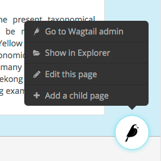

=========================
Wagtail 1.4 release notes
=========================

*March 16, 2016*

.. contents::
    :local:
    :depth: 1

Wagtail 1.4 is designated a Long Term Support (LTS) release. Long Term Support releases will continue to receive maintenance updates as necessary to address security and data-loss related issues, up until the next LTS release (typically a period of 8 months).

What's new
==========

Page revision management
~~~~~~~~~~~~~~~~~~~~~~~~

From the page editing interface, editors can now access a list of previous revisions of the page, and preview or roll back to any earlier revision.

Collections for image / document organisation
~~~~~~~~~~~~~~~~~~~~~~~~~~~~~~~~~~~~~~~~~~~~~

Images and documents can now be organised into collections, set up by administrators through the Settings -> Collections menu item. User permissions can be set either globally (on the 'Root' collection) or on individual collections, allowing different user groups to keep their media items separated. Thank you to the University of South Wales for sponsoring this feature.

Redesigned userbar
~~~~~~~~~~~~~~~~~~

The Wagtail userbar (which gives editors quick access to the admin from the site frontend) has been redesigned, and no longer depends on an iframe. The new design allows more flexibility in label text, more configurable positioning to avoid overlapping with site navigation, and adds a new "Show in Explorer" option. This feature was developed by Thomas Winter and Gareth Price.

Protection against unsaved changes
~~~~~~~~~~~~~~~~~~~~~~~~~~~~~~~~~~

The page editor interface now produces a warning if the user attempts to navigate away while there are unsaved changes.

Multiple document uploader
~~~~~~~~~~~~~~~~~~~~~~~~~~

The "Add a document" interface now supports uploading multiple documents at once, in the same way as uploading images.

Custom document models
~~~~~~~~~~~~~~~~~~~~~~

The ``Document`` model can now be overridden using the new ``WAGTAILDOCS_DOCUMENT_MODEL`` setting. This works in the same way that ``WAGTAILIMAGES_IMAGE_MODEL`` works for ``Image``.

Removed django-compressor dependency
~~~~~~~~~~~~~~~~~~~~~~~~~~~~~~~~~~~~

Wagtail no longer depends on the `django-compressor <http://django-compressor.readthedocs.org/>`_ library. While we highly recommend compressing and bundling the CSS and JavaScript on your sites, using django-compressor places additional installation and configuration demands on the developer, so this has now been made optional.

Minor features
~~~~~~~~~~~~~~

* The page search interface now searches all fields instead of just the title (Kait Crawford)
* Snippets now support a custom ``edit_handler`` property; this can be used to implement a tabbed interface, for example. See :ref:`customising_the_tabbed_interface` (Mikalai Radchuk)
* Date/time pickers now respect the locale's 'first day of week' setting (Peter Quade)
* Refactored the way forms are constructed for the page editor, to allow custom forms to be used
* Notification message on publish now indicates whether the page is being published now or scheduled for publication in future (Chris Rogers)
* Server errors when uploading images / documents through the chooser modal are now reported back to the user (Nigel Fletton)
* Added a hook :ref:`insert_global_admin_css` for inserting custom CSS throughout the admin backend (Tom Dyson)
* Added a hook :ref:`construct_explorer_page_queryset` for customising the set of pages displayed in the page explorer
* Page models now perform field validation, including testing slugs for uniqueness within a parent page, at the model level on saving
* Page slugs are now auto-generated at the model level on page creation if one has not been specified explicitly
* The ``Page`` model now has two new methods ``get_site()`` and ``get_url_parts()`` to aid with customising the page URL generation logic
* Upgraded jQuery to 2.2.1 (Charlie Choiniere)
* Multiple homepage summary items (``construct_homepage_summary_items`` hook) now better vertically spaced (Nicolas Kuttler)
* Email notifications can now be sent in HTML format. See :ref:`email_notifications` (Mike Dingjan)
* ``StreamBlock`` now has provision for throwing non-field-specific validation errors
* Wagtail now works with Willow 0.3, which supports auto-correcting the orientation of images based on EXIF data
* New translations for Hungarian, Swedish (Sweden) and Turkish

Bug fixes
~~~~~~~~~

* Custom page managers no longer raise an error when used on an abstract model
* Wagtail's migrations are now all reversible (Benjamin Bach)
* Deleting a page content type now preserves existing pages as basic Page instances, to prevent tree corruption
* The ``Page.path`` field is now explicitly given the "C" collation on PostgreSQL to prevent tree ordering issues when using a database created with the Slovak locale
* Wagtail's compiled static assets are now put into the correct directory on Windows (Aarni Koskela)
* ``ChooserBlock`` now correctly handles models with primary keys other than ``id`` (alexpilot11)
* Fixed typo in Wistia oEmbed pattern (Josh Hurd)
* Added more accurate help text for the Administrator flag on user accounts (Matt Fozard)
* Tags added on the multiple image uploader are now saved correctly
* Documents created by a user are no longer deleted when the user is deleted
* Fixed a crash in ``RedirectMiddleware`` when a middleware class before ``SiteMiddleware`` returns a response (Josh Schneier)
* Fixed error retrieving the moderator list on pages that are covered by multiple moderator permission records (Matt Fozard)
* Ordering pages in the explorer by reverse 'last updated' time now puts pages with no revisions at the top
* WagtailTestUtils now works correctly on custom user models without a ``username`` field (Adam Bolfik)
* Logging in to the admin as a user with valid credentials but no admin access permission now displays an error message, rather than rejecting the user silently
* StreamBlock HTML rendering now handles non-ASCII characters correctly on Python 2 (Mikalai Radchuk)
* Fixed a bug preventing pages with a ``OneToOneField`` from being copied (Liam Brenner)
* SASS compilation errors during Wagtail development no longer cause exit of Gulp process, instead throws error to console and continues (Thomas Winter)
* Explorer page listing now uses specific page models, so that custom URL schemes defined on Page subclasses are respected
* Made settings menu clickable again in Firefox 46.0a2 (Juha Kujala)
* User management index view no longer assumes the presence of ``username``, ``first_name``, ``last_name`` and ``email`` fields on the user model (Eirik Krogstad)

Upgrade considerations
======================

Removal of django-compressor
~~~~~~~~~~~~~~~~~~~~~~~~~~~~

As Wagtail no longer installs django-compressor automatically as a dependency, you may need to make changes to your site's configuration when upgrading. If your project is actively using django-compressor (that is, your site templates contain ```` tags), you should ensure that your project's requirements explicitly include django-compressor, rather than indirectly relying on Wagtail to install it. If you are not actively using django-compressor on your site, you should update your settings file to remove the line ``'compressor'`` from ``INSTALLED_APPS``, and remove ``'compressor.finders.CompressorFinder'`` from ``STATICFILES_FINDERS``.

Page models now enforce field validation
~~~~~~~~~~~~~~~~~~~~~~~~~~~~~~~~~~~~~~~~

In previous releases, field validation on Page models was only applied at the form level, meaning that creating pages directly at the model level would bypass validation. For example, if ``NewsPage`` is a Page model with a required ``body`` field, then code such as:

.. code-block:: python

    news_page = NewsPage(title="Hello", slug='hello')
    parent_page = NewsIndex.objects.get()
    parent_page.add_child(instance=news_page)

would create a page that does not comply with the validation rules. This is no longer possible, as validation is now enforced at the model level on ``save()`` and ``save_revision()``; as a result, code that creates pages programmatically (such as unit tests, and import scripts) may need to be updated to ensure that it creates valid pages.
