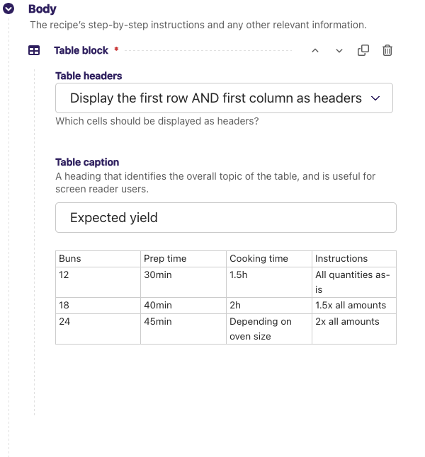

=========================
Wagtail 1.5 release notes
=========================

*May 1, 2016*

.. contents::
    :local:
    :depth: 1

What's new
==========

Reorganised page explorer actions
~~~~~~~~~~~~~~~~~~~~~~~~~~~~~~~~~

.. image:: ../_static/images/releasenotes_1_5_explorermenu.png

The action buttons on the page explorer have been reorganised to reduce clutter, and lesser-used actions have been moved to a "More" dropdown. A new hook :ref:`register_page_listing_buttons` has been added for adding custom action buttons to the page explorer.

ModelAdmin
~~~~~~~~~~

Wagtail now includes an app ``wagtail.contrib.modeladmin`` (previously available separately as the `wagtailmodeladmin <https://github.com/rkhleics/wagtailmodeladmin>`_ package) which allows you to configure arbitrary Django models to be listed, added and edited through the Wagtail admin.

.. image:: ../_static/images/releasenotes_1_5_modeladmin.png

See :doc:`/reference/contrib/modeladmin/index` for full documentation. This feature was developed by Andy Babic.

TableBlock
~~~~~~~~~~

``TableBlock``, a new StreamField block type for editing table-based content, is now available through the ``wagtail.contrib.table_block`` module.

See :doc:`/reference/contrib/table_block` for documentation. This feature was developed by Moritz Pfeiffer, David Seddon and Brad Busenius.

Improved link handling in rich text
~~~~~~~~~~~~~~~~~~~~~~~~~~~~~~~~~~~

The user experience around inserting, editing and removing links inside rich text areas has been greatly improved: link destinations are shown as tooltips, and existing links can be edited as well as unlinked. This feature was developed by Loic Teixeira.

Improvements to the "Image serve view"
~~~~~~~~~~~~~~~~~~~~~~~~~~~~~~~~~~~~~~

:ref:`using_images_outside_wagtail`

This view, which is used for requesting image thumbnails from an external app, has had some improvements made to it in this release.

- A :ref:`"redirect" action <image_serve_view_redirect_action>` has been added which will redirect the user to where the resized image is hosted rather than serving it from the app. This may be beneficial for performance if the images are hosted externally (eg, S3)
- It now takes an optional extra path component which can be used for appending a filename to the end of the URL
- The key is now configurable on the view so you don't have to use your project's ``SECRET_KEY``
- It's been refactored into a class based view and you can now create multiple serve views with different image models and/or keys
- It now supports :ref:`serving image files using django-sendfile <image_serve_view_sendfile>` (Thanks to Yannick Chabbert for implementing this)

Minor features
~~~~~~~~~~~~~~

* Password reset email now reminds the user of their username (Matt Westcott)
* Added :ref:`jinja2 support <settings_tag_jinja2>` for the  ``settings`` template tag (Tim Heap)
* Added 'revisions' action to pages list (Roel Bruggink)
* Added a hook :ref:`insert_global_admin_js` for inserting custom JavaScript throughout the admin backend (Tom Dyson)
* Recognise instagram embed URLs with ``www`` prefix (Matt Westcott)
* The type of the ``search_fields`` attribute on ``Page`` models (and other searchable models) has changed from a tuple to a list (see upgrade consideration below) (Tim Heap)
* Use `PasswordChangeForm` when user changes their password, requiring the user to enter their current password (Matthijs Melissen)
* Highlight current day in date picker (Jonas Lergell)
* Eliminated the deprecated ``register.assignment_tag`` on Django 1.9 (Josh Schneier)
* Increased size of Save button on site settings (Liam Brenner)
* Optimised Site.find_for_request to only perform one database query (Matthew Downey)
* Notification messages on creating / editing sites now include the site name if specified (Chris Rogers)
* Added ``--schema-only`` option to ``update_index`` management command
* Added meaningful default icons to ``StreamField`` blocks (Benjamin Bach)
* Added title text to action buttons in the page explorer (Liam Brenner)
* Changed project template to explicitly import development settings via ``settings.dev`` (Tomas Olander)
* Improved L10N and I18N for revisions list (Roel Bruggink)
* The multiple image uploader now displays details of server errors (Nigel Fletton)
* Added ``WAGTAIL_APPEND_SLASH`` setting to determine whether page URLs end in a trailing slash - see :ref:`append_slash` (Andrew Tork Baker)
* Added auto resizing text field, richtext field, and snippet chooser to styleguide (Liam Brenner)
* Support field widget media inside ``StreamBlock`` blocks (Karl Hobley)
* Spinner was added to Save button on site settings (Liam Brenner)
* Added success message after logout from Admin (Liam Brenner)
* Added ``get_upload_to`` method to ``AbstractRendition`` which, when overridden, allows control over where image renditions are stored (Rob Moggach and Matt Westcott)
* Added a mechanism to customise the add / edit user forms for custom user models - see :doc:`/advanced_topics/customisation/custom_user_models` (Nigel Fletton)
* Added internal provision for swapping in alternative rich text editors (Karl Hobley)

Bug fixes
~~~~~~~~~

* The currently selected day is now highlighted only in the correct month in date pickers (Jonas Lergell)
* Fixed crash when an image without a source file was resized with the "dynamic serve view"
* Registered settings admin menu items now show active correctly (Matthew Downey)
* Direct usage of ``Document`` model replaced with ``get_document_model`` function in ``wagtail.contrib.wagtailmedusa`` and in ``wagtail.contrib.wagtailapi``
* Failures on sending moderation notification emails now produce a warning, rather than crashing the admin page outright (Matt Fozard)
* All admin forms that could potentially include file upload fields now specify ``multipart/form-data`` where appropriate (Tim Heap)
* REM units in Wagtailuserbar caused incorrect spacing (Vincent Audebert)
* Explorer menu no longer scrolls with page content (Vincent Audebert)
* ``decorate_urlpatterns`` now uses ``functools.update_wrapper`` to keep view names and docstrings (Mario César)
* StreamField block controls are no longer hidden by the StreamField menu when prepending a new block (Vincent Audebert)
* Removed invalid use of ``__`` alias that prevented strings getting picked up for translation (Juha Yrjölä)
* :ref:`Routable pages <routable_page_mixin>` without a main view no longer raise a ``TypeError`` (Bojan Mihelac)
* Fixed UnicodeEncodeError in wagtailforms when downloading a CSV for a form containing non-ASCII field labels on Python 2 (Mikalai Radchuk)
* Server errors during search indexing on creating / updating / deleting a model are now logged, rather than causing the overall operation to fail (Karl Hobley)
* Objects are now correctly removed from search indexes on deletion (Karl Hobley)

Upgrade considerations
======================

Buttons in admin now require ``class="button"``
~~~~~~~~~~~~~~~~~~~~~~~~~~~~~~~~~~~~~~~~~~~~~~~

The Wagtail admin CSS has been refactored for maintainability, and buttons now require an explicit ``button`` class. (Previously, the styles were applied on all inputs of type ``"submit"``, ``"reset"`` or ``"button"``.) If you have created any apps that extend the Wagtail admin with new views / templates, you will need to add this class to all buttons.

The ``search_fields`` attribute on models should now be set to a list
~~~~~~~~~~~~~~~~~~~~~~~~~~~~~~~~~~~~~~~~~~~~~~~~~~~~~~~~~~~~~~~~~~~~~

On searchable models (eg, ``Page`` or custom ``Image`` models) the ``search_fields`` attribute should now be a list instead of a tuple.

For example, the following ``Page`` model:

.. code-block:: python

    class MyPage(Page):
        ...

        search_fields = Page.search_fields + (
            indexed.SearchField('body'),
        )

Should be changed to:

.. code-block:: python

    class MyPage(Page):
        ...

        search_fields = Page.search_fields + [
            indexed.SearchField('body'),
        ]

To ease the burden on third-party modules, adding tuples to ``Page.search_fields`` will still work. But this backwards-compatibility fix will be removed in Wagtail 1.7.

Elasticsearch backend now defaults to verifying SSL certs
~~~~~~~~~~~~~~~~~~~~~~~~~~~~~~~~~~~~~~~~~~~~~~~~~~~~~~~~~

Previously, if you used the Elasticsearch backend, configured with the URLS property like:

.. code-block:: python

    WAGTAILSEARCH_BACKENDS = {
        'default': {
            'BACKEND': 'wagtail.wagtailsearch.backends.elasticsearch',
            'URLS': ['https://example.com/'],
        }
    }

Elasticsearch would not be configured to verify SSL certificates for HTTPS URLs. This has been changed so that SSL certificates are verified for HTTPS connections by default.

If you need the old behaviour back, where SSL certificates are not verified for your HTTPS connection, you can configure the Elasticsearch backend with the ``HOSTS`` option, like so:

.. code-block:: python

    WAGTAILSEARCH_BACKENDS = {
        'default': {
            'BACKEND': 'wagtail.wagtailsearch.backends.elasticsearch',
            'HOSTS': [{
                'host': 'example.com'
                'use_ssl': True,
                'verify_certs': False,
            }],
        }
    }

See the `Elasticsearch-py documentation <http://elasticsearch-py.readthedocs.org/en/stable/#ssl-and-authentication>`_ for more configuration options.

Project template now imports ``settings.dev`` explicitly
~~~~~~~~~~~~~~~~~~~~~~~~~~~~~~~~~~~~~~~~~~~~~~~~~~~~~~~~

In previous releases, the project template's ``settings/__init__.py`` file was set up to import the development settings (``settings/dev.py``), so that these would be picked up as the default (i.e. whenever a settings module was not specified explicitly). However, in some setups this meant that the development settings were being inadvertently imported in production mode.

For this reason, the import in ``settings/__init__.py`` has now been removed, and commands must now specify ``myproject.settings.dev`` or ``myproject.settings.production`` as appropriate; the supporting scripts (such as ``manage.py``) have been updated accordingly. As this is a change to the project template, existing projects are not affected; however, if you have any common scripts or configuration files that rely on importing ``myproject.settings`` as the settings module, these will need to be updated in order to work on projects created under Wagtail 1.5.
