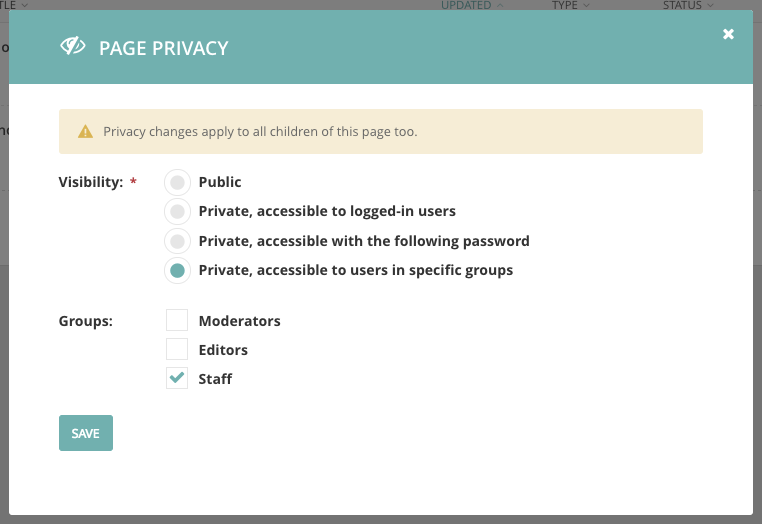

=========================
Wagtail 1.8 release notes
=========================

*December 15, 2016*

.. contents::
    :local:
    :depth: 1

Wagtail 1.8 is designated a Long Term Support (LTS) release. Long Term Support releases will continue to receive maintenance updates as necessary to address security and data-loss related issues, up until the next LTS release (typically a period of 8 months).

What's new
==========

New page privacy options
~~~~~~~~~~~~~~~~~~~~~~~~

Access to pages can now be restricted based on user accounts and group membership, rather than just through a shared password. This makes it possible to set up intranet-style sites via the admin, with no additional coding. This feature was developed by Shawn Makinson, Tom Miller, Luca Perico and Matt Westcott.

See: :ref:`private_pages`

Restrictions on bulk-deletion of pages
~~~~~~~~~~~~~~~~~~~~~~~~~~~~~~~~~~~~~~

Previously, any user with edit permission over a page and its descendants was able to delete them all as a single action, which led to the risk of accidental deletions. To guard against this, the permission rules have been revised so that a user with basic permissions can only delete pages that have no children; in order to delete a whole subtree, they must individually delete each child page first. A new "bulk delete" permission type has been added which allows a user to delete pages with children, as before; superusers receive this permission implicitly, and so there is no change of behaviour for them.

See: :ref:`permissions`

This feature was developed by Matt Westcott.

Elasticsearch 5 support
~~~~~~~~~~~~~~~~~~~~~~~

Wagtail now supports Elasticsearch 5. See :ref:`wagtailsearch_backends_elasticsearch` for configuration details. This feature was developed by Karl Hobley.

Permission-limited admin breadcrumb
~~~~~~~~~~~~~~~~~~~~~~~~~~~~~~~~~~~

Breadcrumb links within the admin are now limited to the portion of the page tree that covers all pages the user has permission over. As with the changes to the explorer sidebar menu in Wagtail 1.6, this is a step towards supporting full multi-tenancy (where multiple sites on the same Wagtail installation can be fully isolated from each other through permission configuration). This feature was developed by Jeffrey Chau, Robert Rollins and Matt Westcott.

Updated tutorial
~~~~~~~~~~~~~~~~

The ":doc:`Your first Wagtail site </getting_started/tutorial>`" tutorial has been extensively updated to cover concepts such as dynamic page listings, template context variables, and tagging. This update was contributed by Scot Hacker, with additions from Matt Westcott.

Other features
~~~~~~~~~~~~~~

* Added support of a custom ``edit_handler`` for site settings. See :ref:`docs for the site settings module <edit_handlers_settings>`. (Axel Haustant)
* Added ``get_landing_page_template`` getter method to ``AbstractForm`` (Gagaro)
* Added ``Page.get_admin_display_title`` method to override how the title is displayed in the admin (Henk-Jan van Hasselaar)
* Added support for specifying custom HTML attributes for table rows on ModelAdmin index pages. See :ref:`modeladmin_get_extra_attrs_for_row` (Andy Babic)
* Added ``first_common_ancestor`` method to ``PageQuerySet`` (Tim Heap)
* Page chooser now opens at the deepest ancestor page that covers all the pages of the required page type (Tim Heap)
* ``PageChooserBlock`` now accepts a ``target_model`` option to specify the required page type (Tim Heap)
* Modeladmin forms now respect ``fields`` / ``exclude`` options passed on custom model forms (Thejaswi Puthraya)
* Added new StreamField block type ``StaticBlock`` for blocks that occupy a position in a stream but otherwise have no configuration; see :ref:`StaticBlock <streamfield_staticblock>` (Benoît Vogel)
* Added new StreamField block type ``BlockQuoteBlock`` (Scot Hacker)
* Updated Cloudflare cache module to use the v4 API (Albert O'Connor)
* Added ``exclude_from_explorer`` attribute to the ``ModelAdmin`` class to allow hiding instances of a page type from Wagtail's explorer views (Andy Babic)
* Added ``above_login``, ``below_login``, ``fields`` and ``login_form`` customisation blocks to the login page template - see :doc:`/advanced_topics/customisation/admin_templates` (Tim Heap)
* ``ChoiceBlock`` now accepts a callable as the choices list (Mikalai Radchuk)
* Redundant action buttons are now omitted from the root page in the explorer (Nick Smith)
* Locked pages are now disabled from editing at the browser level (Edd Baldry)
* Added :meth:`wagtail.core.query.PageQuerySet.in_site` method for filtering page QuerySets to pages within the specified site (Chris Rogers)
* Added the ability to override the default index settings for Elasticsearch. See :ref:`wagtailsearch_backends_elasticsearch` (PyMan Claudio Marinozzi)
* Extra options for the Elasticsearch constructor should be now defined with the new key ``OPTIONS`` of the ``WAGTAILSEARCH_BACKENDS`` setting (PyMan Claudio Marinozzi)

Bug fixes
~~~~~~~~~

* ``AbstractForm`` now respects custom ``get_template`` methods on the page model (Gagaro)
* Use specific page model for the parent page in the explore index (Gagaro)
* Remove responsive styles in embed when there is no ratio available (Gagaro)
* Parent page link in page search modal no longer disappears on hover (Dan Braghis)
* ModelAdmin views now consistently call ``get_context_data`` (Andy Babic)
* Header for search results on the redirects index page now shows the correct count when the listing is paginated (Nick Smith)
* ``set_url_paths`` management command is now compatible with Django 1.10 (Benjamin Bach)
* Form builder email notifications now output multiple values correctly (Sævar Öfjörð Magnússon)
* Closing 'more' dropdown on explorer no longer jumps to the top of the page (Ducky)
* Users with only publish permission are no longer given implicit permission to delete pages (Matt Westcott)
* ``search_garbage_collect`` management command now works when wagtailsearchpromotions is not installed (Morgan Aubert)
* ``wagtail.contrib.settings`` context processor no longer fails when ``request.site`` is unavailable (Diederik van der Boor)
* ``TableBlock`` content is now indexed for search (Morgan Aubert)
* ``Page.copy()`` is now marked as ``alters_data``, to prevent template code from triggering it (Diederik van der Boor)

Upgrade considerations
======================

``unique_together`` constraint on custom image rendition models needs updating
~~~~~~~~~~~~~~~~~~~~~~~~~~~~~~~~~~~~~~~~~~~~~~~~~~~~~~~~~~~~~~~~~~~~~~~~~~~~~~

If your project is using a custom image model (see :ref:`custom_image_model`), you will need to
update the ``unique_together`` option on the corresponding Rendition model when upgrading to Wagtail 1.8. Change the line:

.. code-block:: python

    unique_together = (
        ('image', 'filter', 'focal_point_key'),
    )

to:

.. code-block:: python

    unique_together = (
        ('image', 'filter_spec', 'focal_point_key'),
    )

You will then be able to run ``manage.py makemigrations`` and ``manage.py migrate`` as normal.

Additionally, third-party code that accesses the Filter and Rendition models directly should note the following and make updates where applicable:

* ``Filter`` will no longer be a Django model as of Wagtail 1.9, and as such, ORM operations on it (such as ``save()`` and ``Filter.objects``) are deprecated. It should be instantiated and used as an in-memory object instead - for example, ``flt, created = Filter.objects.get_or_create(spec='fill-100x100')`` should become ``flt = Filter(spec='fill-100x100')``.
* The ``filter`` field of Rendition models is no longer in use; lookups should instead be performed on the ``filter_spec`` field, which contains a filter spec string such as ``'fill-100x100'``.

``wagtail.wagtailimages.models.get_image_model`` has moved
~~~~~~~~~~~~~~~~~~~~~~~~~~~~~~~~~~~~~~~~~~~~~~~~~~~~~~~~~~

The ``get_image_model`` function should now be imported from ``wagtail.wagtailimages`` rather than ``wagtail.wagtailimages.models``. See :ref:`custom_image_model_referring_to_image_model`.

Non-administrators now need 'bulk delete' permission to delete pages with children
~~~~~~~~~~~~~~~~~~~~~~~~~~~~~~~~~~~~~~~~~~~~~~~~~~~~~~~~~~~~~~~~~~~~~~~~~~~~~~~~~~

As a precaution against accidental data loss, this release introduces a new "bulk delete" permission on pages, which can be set through the Settings -> Groups area. Non-administrator users must have this permission in order to delete pages that have children; a user without this permission would have to delete each child individually before deleting the parent. By default, no groups are assigned this new permission. If you wish to restore the previous behaviour, and don't want to configure permissions manually through the admin interface, you can do so with a data migration. Create an empty migration using ``./manage.py makemigrations myapp --empty --name assign_bulk_delete_permission`` (replacing ``myapp`` with the name of one of your project's apps) and edit the migration file to contain the following:

.. code-block:: python

    from __future__ import unicode_literals

    from django.db import migrations

    def add_bulk_delete_permission(apps, schema_editor):
        """Find all groups with add/edit page permissions, and assign them bulk_delete permission"""
        GroupPagePermission = apps.get_model('wagtailcore', 'GroupPagePermission')
        for group_id, page_id in GroupPagePermission.objects.filter(
            permission_type__in=['add', 'edit']
        ).values_list('group', 'page').distinct():
            GroupPagePermission.objects.create(
                group_id=group_id, page_id=page_id, permission_type='bulk_delete'
            )

    def remove_bulk_delete_permission(apps, schema_editor):
        GroupPagePermission = apps.get_model('wagtailcore', 'GroupPagePermission')
        GroupPagePermission.objects.filter(permission_type='bulk_delete').delete()

    class Migration(migrations.Migration):

        dependencies = [
            # keep the original dependencies line
        ]

        operations = [
            migrations.RunPython(add_bulk_delete_permission, remove_bulk_delete_permission),
        ]

Cloudflare cache module now requires a ``ZONEID`` setting
~~~~~~~~~~~~~~~~~~~~~~~~~~~~~~~~~~~~~~~~~~~~~~~~~~~~~~~~~

The ``wagtail.contrib.wagtailfrontendcache.backends.CloudflareBackend`` module has been updated to use Cloudflare's v4 API, replacing the previous v1 implementation (which is `unsupported as of November 9th, 2016 <https://www.cloudflare.com/docs/client-api/>`_). The new API requires users to supply a *zone identifier*, which should be passed as the ``ZONEID`` field of the ``WAGTAILFRONTENDCACHE`` setting:

.. code-block:: python

    WAGTAILFRONTENDCACHE = {
        'cloudflare': {
            'BACKEND': 'wagtail.contrib.wagtailfrontendcache.backends.CloudflareBackend',
            'EMAIL': 'your-cloudflare-email-address@example.com',
            'TOKEN': 'your cloudflare api token',
            'ZONEID': 'your cloudflare domain zone id',
        },
    }

For details of how to obtain the zone identifier, see `the Cloudflare API documentation <https://api.cloudflare.com/#getting-started-resource-ids>`_.

Extra options for the Elasticsearch constructor should be now defined with the new key ``OPTIONS`` of the ``WAGTAILSEARCH_BACKENDS`` setting
~~~~~~~~~~~~~~~~~~~~~~~~~~~~~~~~~~~~~~~~~~~~~~~~~~~~~~~~~~~~~~~~~~~~~~~~~~~~~~~~~~~~~~~~~~~~~~~~~~~~~~~~~~~~~~~~~~~~~~~~~~~~~~~~~~~~~~~~~~~~

For the Elasticsearch backend, all extra keys defined in ``WAGTAILSEARCH_BACKENDS`` are passed directly to the Elasticsearch constructor. All these keys now should be moved inside the new ``OPTIONS`` dictionary. The old behaviour is still supported, but deprecated.

For example, the following configuration changes the connection class that the Elasticsearch connector_ uses:

.. code-block:: python

    from elasticsearch import RequestsHttpConnection

    WAGTAILSEARCH_BACKENDS = {
        'default': {
            'BACKEND': 'wagtail.wagtailsearch.backends.elasticsearch',
            'connection_class': RequestsHttpConnection,
        }
    }

As ``connection_class`` needs to be passed through to the Elasticsearch connector_,  it should be moved to the new ``OPTIONS`` dictionary:

.. code-block:: python

    from elasticsearch import RequestsHttpConnection

    WAGTAILSEARCH_BACKENDS = {
        'default': {
            'BACKEND': 'wagtail.wagtailsearch.backends.elasticsearch',
            'OPTIONS': {
                'connection_class': RequestsHttpConnection,
            }
        }
    }

.. _connector: https://elasticsearch-py.readthedocs.io/en/5.0.0/api.html#elasticsearch
