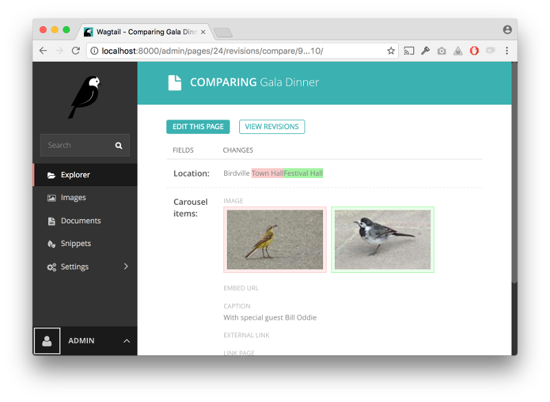

=========================
Wagtail 1.9 release notes
=========================

*February 16, 2017*

.. contents::
    :local:
    :depth: 1

What's new
==========

Revision comparisons
~~~~~~~~~~~~~~~~~~~~

Wagtail now provides the ability to view differences between revisions of a page, from the revisions listing page and when reviewing a page in moderation. This feature was developed by Karl Hobley, Janneke Janssen and Matt Westcott. Thank you to Blackstone Chambers for sponsoring this feature.

Many-to-many relations on page models
~~~~~~~~~~~~~~~~~~~~~~~~~~~~~~~~~~~~~

.. image:: ../_static/images/releasenotes_1_9_m2m.png

Wagtail now supports a new field type ``ParentalManyToManyField`` that can be used to set up many-to-many relations on pages. For details, see the :ref:`tutorial_categories` section of the tutorial. This feature was developed by Thejaswi Puthraya and Matt Westcott.

Bulk-deletion of form submissions
~~~~~~~~~~~~~~~~~~~~~~~~~~~~~~~~~

Form builder form submissions can now be deleted in bulk from the form submissions index page. This feature was sponsored by St John's College, Oxford and developed by Karl Hobley.

Accessing parent context from StreamField block ``get_context`` methods
~~~~~~~~~~~~~~~~~~~~~~~~~~~~~~~~~~~~~~~~~~~~~~~~~~~~~~~~~~~~~~~~~~~~~~~

The ``get_context`` method on StreamField blocks now receives a ``parent_context`` keyword argument, consisting of the dict of variables passed in from the calling template. For example, this makes it possible to perform pagination logic within ``get_context``, retrieving the current page number from ``parent_context['request'].GET``. See :ref:`get_context on StreamField blocks <streamfield_get_context>`. This feature was developed by Mikael Svensson and Peter Baumgartner.

Welcome message customisation for multi-tenanted installations
~~~~~~~~~~~~~~~~~~~~~~~~~~~~~~~~~~~~~~~~~~~~~~~~~~~~~~~~~~~~~~

The welcome message on the admin dashboard has been updated to be more suitable for multi-tenanted installations. Users whose page permissions lie within a single site will now see that site name in the welcome message, rather than the installation-wide ``WAGTAIL_SITE_NAME``. As before, this message can be customised, and additional template variables have been provided for this purpose - see :ref:`custom_branding`. This feature was developed by Jeffrey Chau.

Other features
~~~~~~~~~~~~~~

* Changed text of "Draft" and "Live" buttons to "View draft" and "View live" (Dan Braghis)
* Added ``get_api_representation`` method to streamfield blocks allowing the JSON representation in the API to be customised (Marco Fucci)
* Added :ref:`before_copy_page` and :ref:`after_copy_page` hooks (Matheus Bratfisch)
* View live / draft links in the admin now consistently open in a new window (Marco Fucci)
* ``ChoiceBlock`` now omits the blank option if the block is required and has a default value (Andreas Nüßlein)
* The ``add_subpage`` view now maintains a ``next`` URL parameter to specify where to redirect to after completing page creation (Robert Rollins)
* The ``wagtailforms`` module now allows to define custom form submission model, add custom data to CSV export and some other customisations. See :doc:`/reference/contrib/forms/customisation` (Mikalai Radchuk)
* The Webpack configuration is now in a subfolder to declutter the project root, and uses environment-specific configurations for smaller bundles in production and easier debugging in development (Janneke Janssen, Thibaud Colas)
* Added page titles to title text on action buttons in the explorer, for improved accessibility (Matt Westcott)

Bug fixes
~~~~~~~~~

* Help text for StreamField is now visible and does not cover block controls (Stein Strindhaug)
* "X minutes ago" timestamps are now marked for translation (Janneke Janssen, Matt Westcott)
* Avoid indexing unsaved field content on `save(update_fields=[...])` operations (Matt Westcott)
* Corrected ordering of arguments passed to ModelAdmin ``get_extra_class_names_for_field_col`` / ``get_extra_attrs_for_field_col`` methods (Andy Babic)
* ``pageurl`` / ``slugurl`` tags now function when request.site is not available (Tobias McNulty, Matt Westcott)

Upgrade considerations
======================

``django-modelcluster`` and ``django-taggit`` dependencies updated
~~~~~~~~~~~~~~~~~~~~~~~~~~~~~~~~~~~~~~~~~~~~~~~~~~~~~~~~~~~~~~~~~~

Wagtail now requires version 3.0 or later of ``django-modelcluster`` and version 0.20 or later of ``django-taggit``; earlier versions are unsupported. In normal circumstances these packages will be upgraded automatically when upgrading Wagtail; however, if your Wagtail project has a requirements file that explicitly specifies an older version, this will need to be updated.

``get_context`` methods on StreamField blocks need updating
~~~~~~~~~~~~~~~~~~~~~~~~~~~~~~~~~~~~~~~~~~~~~~~~~~~~~~~~~~~

Previously, ``get_context`` methods on StreamField blocks returned a dict of variables which would be merged into the calling template's context before rendering the block template. ``get_context`` methods now receive a ``parent_context`` dict, and are responsible for returning the final context dictionary with any new variables merged into it. The old calling convention is now deprecated, and will be phased out in Wagtail 1.11.

In most cases, the method will be calling ``get_context`` on the superclass, and can be updated by passing the new ``parent_context`` keyword argument to it:

.. code-block:: python

    class MyBlock(Block):

        def get_context(self, value):
            context = super(MyBlock, self).get_context(value)
            ...
            return context

becomes:

.. code-block:: python

    class MyBlock(Block):

        def get_context(self, value, parent_context=None):
            context = super(MyBlock, self).get_context(value, parent_context=parent_context)
            ...
            return context

Note that ``get_context`` methods on page models are unaffected by this change.
