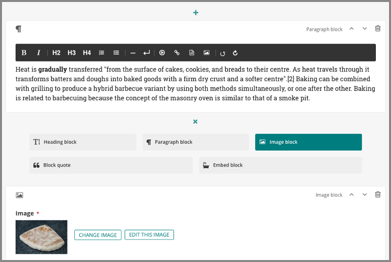

=========================
Wagtail 2.7 release notes
=========================

*November 6, 2019*

.. contents::
    :local:
    :depth: 1

Wagtail 2.7 is designated a Long Term Support (LTS) release. Long Term Support releases will continue to receive maintenance updates as necessary to address security and data-loss related issues, up until the next LTS release (typically a period of 12 months).

What's new
==========

Improved StreamField design
~~~~~~~~~~~~~~~~~~~~~~~~~~~

The design of the StreamField user interface has been updated to improve clarity and usability, including better handling of nested blocks. This work was completed by Bertrand Bordage as part of the `Wagtail's First Hatch <https://www.kickstarter.com/projects/noripyt/wagtails-first-hatch>`_ crowdfunding campaign. We would like to thank all `supporters of the campaign <https://wagtail.org/blog/wagtails-first-hatch-backers/>`_.

WebP image support
~~~~~~~~~~~~~~~~~~

Images can now be uploaded and rendered in `WebP <https://developers.google.com/speed/webp>`_ format; see :ref:`image_file_formats` for details. This feature was developed by frmdstryr, Karl Hobley and Matt Westcott.

Other features
~~~~~~~~~~~~~~

* Added Elasticsearch 7 support (pySilver)
* Added Python 3.8 support (John Carter, Matt Westcott)
* Added ``construct_page_listing_buttons`` hook (Michael van Tellingen)
* Added more detailed documentation and troubleshooting for installing OpenCV for feature detection (Daniele Procida)
* Move and refactor upgrade notification JS (Jonny Scholes)
* Remove need for Elasticsearch ``update_all_types`` workaround, upgrade minimum release to 6.4.0 or above (Jonathan Liuti)
* Add ability to insert internal anchor links/links with fragment identifiers in Draftail (rich text) fields (Iman Syed)
* Added Table Block caption for accessibility (Rahmi Pruitt)
* Add ability for users to change their own name via the account settings page (Kevin Howbrook)
* Add ability to insert telephone numbers as links in Draftail (rich text) fields (Mikael Engström and Liam Brenner)
* Increase delay before search in the snippet chooser, to prevent redundant search request round trips (Robert Rollins)
* Add ``WAGTAIL_EMAIL_MANAGEMENT_ENABLED`` setting to determine whether users can change their email address (Janne Alatalo)
* Recognise Soundcloud artist URLs as embeddable (Kiril Staikov)
* Add ``WAGTAILDOCS_SERVE_METHOD`` setting to determine how document downloads will be linked to and served (Tobias McNulty, Matt Westcott)
* Add ``WAGTAIL_MODERATION_ENABLED`` setting to enable / disable the 'Submit for Moderation' option (Jacob Topp-Mugglestone) - thanks to `The Motley Fool <https://www.fool.com/>`_ for sponsoring this feature
* Added settings to customise pagination page size for the Images admin area (Brian Whitton)
* Added ARIA role to TableBlock output (Matt Westcott)
* Added cache-busting query parameters to static files within the Wagtail admin (Matt Westcott)
* Allow ``register_page_action_menu_item`` and ``construct_page_action_menu`` hooks to override the default menu action (Rahmi Pruitt, Matt Westcott) - thanks to `The Motley Fool <https://www.fool.com/>`_ for sponsoring review of this feature
* ``WAGTAILIMAGES_MAX_IMAGE_PIXELS`` limit now takes the number of animation frames into account (Karl Hobley)

Bug fixes
~~~~~~~~~

* Added line breaks to long filenames on multiple image / document uploader (Kevin Howbrook)
* Added https support for Scribd oEmbed provider (Rodrigo)
* Changed StreamField group label colour so labels are visible (Catherine Farman)
* Prevented images with a very wide aspect ratio from being displayed distorted in the rich text editor (Iman Syed)
* Prevent exception when deleting a model with a protected One-to-one relationship (Neal Todd)
* Added labels to snippet bulk edit checkboxes for screen reader users (Martey Dodoo)
* Middleware responses during page preview are now properly returned to the user (Matt Westcott)
* Default text of page links in rich text uses the public page title rather than the admin display title (Andy Chosak)
* Specific page permission checks are now enforced when viewing a page revision (Andy Chosak)
* ``pageurl`` and ``slugurl`` tags no longer fail when ``request.site`` is ``None`` (Samir Shah)
* Output form media on add/edit image forms with custom models (Matt Westcott)
* Output form media on add/edit document forms with custom models (Sergey Fedoseev)
* Fixes layout for the clear checkbox in default FileField widget (Mikalai Radchuk)
* Remove ASCII conversion from Postgres search backend, to support stemming in non-Latin alphabets (Pavel Denisov)
* Prevent tab labels on page edit view from being cut off on very narrow screens (Kevin Howbrook)
* Very long words in page listings are now broken where necessary (Kevin Howbrook)
* Language chosen in user preferences no longer persists on subsequent requests (Bojan Mihelac)
* Prevent new block IDs from being assigned on repeated calls to ``StreamBlock.get_prep_value`` (Colin Klein)
* Prevent broken images in notification emails when static files are hosted on a remote domain (Eduard Luca)
* Replace styleguide example avatar with default image to avoid issues when custom user model is used (Matt Westcott)
* ``DraftailRichTextArea`` is no longer treated as a hidden field by Django's form logic (Sergey Fedoseev)
* Replace format() placeholders in translatable strings with % formatting (Matt Westcott)
* Altering Django REST Framework's ``DEFAULT_AUTHENTICATION_CLASSES`` setting no longer breaks the page explorer menu and admin API (Matt Westcott)
* Regression - missing label for external link URL field in link chooser (Stefani Castellanos)

Upgrade considerations
======================

Query strings added to static file URLs within the admin
~~~~~~~~~~~~~~~~~~~~~~~~~~~~~~~~~~~~~~~~~~~~~~~~~~~~~~~~

To avoid problems caused by outdated cached JavaScript / CSS files following a Wagtail upgrade, URLs to static files within the Wagtail admin now include a version-specific query parameter of the form ``?v=1a2b3c4d``. Under certain front-end cache configurations (such as `Cloudflare's 'No Query String' caching level <https://support.cloudflare.com/hc/en-us/articles/200168256-What-are-Cloudflare-s-caching-levels->`_), the presence of this parameter may prevent the file from being cached at all. If you are using such a setup, and have some other method in place to expire outdated files (e.g. clearing the cache on deployment), you can disable the query parameter by setting ``WAGTAILADMIN_STATIC_FILE_VERSION_STRINGS`` to False in your project settings. (Note that this is automatically disabled when ``ManifestStaticFilesStorage`` is in use.)

``Page.dummy_request`` is deprecated
~~~~~~~~~~~~~~~~~~~~~~~~~~~~~~~~~~~~

The internal ``Page.dummy_request`` method (which generates an HTTP request object simulating a real page request, for use in previews) has been deprecated, as it did not correctly handle errors generated during middleware processing. Any code that calls this method to render page previews should be updated to use the new method ``Page.make_preview_request(original_request=None, preview_mode=None)``, which builds the request and calls ``Page.serve_preview`` as a single operation.

Changes to document serving on remote storage backends (Amazon S3 etc)
~~~~~~~~~~~~~~~~~~~~~~~~~~~~~~~~~~~~~~~~~~~~~~~~~~~~~~~~~~~~~~~~~~~~~~

This release introduces a new setting :ref:`WAGTAILDOCS_SERVE_METHOD <wagtaildocs_serve_method>` to control how document downloads are served. On previous versions of Wagtail, document files would always be served through a Django view, to allow permission checks to be applied. When using a remote storage backend such as Amazon S3, this meant that the document would be downloaded to the Django server on every download request.

In Wagtail 2.7, the default behaviour on remote storage backends is to redirect to the storage's underlying URL after performing the permission check. If this is unsuitable for your project (for example, your storage provider is configured to block public access, or revealing its URL would be a security risk) you can revert to the previous behaviour by setting ``WAGTAILDOCS_SERVE_METHOD`` to ``'serve_view'``.

Template change for page action menu hooks
~~~~~~~~~~~~~~~~~~~~~~~~~~~~~~~~~~~~~~~~~~

When customising the action menu on the page edit view through the :ref:`register_page_action_menu_item <register_page_action_menu_item>` or :ref:`construct_page_action_menu <construct_page_action_menu>` hook, the ``ActionMenuItem`` object's ``template`` attribute or ``render_html`` method can be overridden to customise the menu item's HTML. As of Wagtail 2.7, the HTML returned from these should *not* include the enclosing ``<li>`` element.

Any add-on library that uses this feature and needs to preserve backward compatibility with previous Wagtail versions can conditionally reinsert the ``<li>`` wrapper through its ``render_html`` method - for example:

  .. code-block:: python

    from django.utils.html import format_html
    from wagtail import VERSION as WAGTAIL_VERSION
    from wagtail.admin.action_menu import ActionMenuItem

    class CustomMenuItem(ActionMenuItem):
        template = 'myapp/my_menu_item.html'

        def render_html(self, request, parent_context):
            html = super().render_html(request, parent_context)
            if WAGTAIL_VERSION < (2, 7):
                html = format_html('<li>{}</li>', html)
            return html

``wagtail.admin.utils`` and ``wagtail.admin.decorators`` modules deprecated
~~~~~~~~~~~~~~~~~~~~~~~~~~~~~~~~~~~~~~~~~~~~~~~~~~~~~~~~~~~~~~~~~~~~~~~~~~~

The modules ``wagtail.admin.utils`` and ``wagtail.admin.decorators`` have been deprecated. The helper functions defined here exist primarily for Wagtail's internal use; however, some of them (particularly ``send_mail`` and ``permission_required``) may be found in user code, and import lines will need to be updated. The new locations for these definitions are as follows:

+---------------------------------+--------------------------+----------------------------+
| Definition                      | Old location             | New location               |
+=================================+==========================+============================+
| any_permission_required         | wagtail.admin.utils      | wagtail.admin.auth         |
+---------------------------------+--------------------------+----------------------------+
| permission_denied               | wagtail.admin.utils      | wagtail.admin.auth         |
+---------------------------------+--------------------------+----------------------------+
| permission_required             | wagtail.admin.utils      | wagtail.admin.auth         |
+---------------------------------+--------------------------+----------------------------+
| PermissionPolicyChecker         | wagtail.admin.utils      | wagtail.admin.auth         |
+---------------------------------+--------------------------+----------------------------+
| user_has_any_page_permission    | wagtail.admin.utils      | wagtail.admin.auth         |
+---------------------------------+--------------------------+----------------------------+
| user_passes_test                | wagtail.admin.utils      | wagtail.admin.auth         |
+---------------------------------+--------------------------+----------------------------+
| users_with_page_permission      | wagtail.admin.utils      | wagtail.admin.auth         |
+---------------------------------+--------------------------+----------------------------+
| reject_request                  | wagtail.admin.decorators | wagtail.admin.auth         |
+---------------------------------+--------------------------+----------------------------+
| require_admin_access            | wagtail.admin.decorators | wagtail.admin.auth         |
+---------------------------------+--------------------------+----------------------------+
| get_available_admin_languages   | wagtail.admin.utils      | wagtail.admin.localization |
+---------------------------------+--------------------------+----------------------------+
| get_available_admin_time_zones  | wagtail.admin.utils      | wagtail.admin.localization |
+---------------------------------+--------------------------+----------------------------+
| get_js_translation_strings      | wagtail.admin.utils      | wagtail.admin.localization |
+---------------------------------+--------------------------+----------------------------+
| WAGTAILADMIN_PROVIDED_LANGUAGES | wagtail.admin.utils      | wagtail.admin.localization |
+---------------------------------+--------------------------+----------------------------+
| send_mail                       | wagtail.admin.utils      | wagtail.admin.mail         |
+---------------------------------+--------------------------+----------------------------+
| send_notification               | wagtail.admin.utils      | wagtail.admin.mail         |
+---------------------------------+--------------------------+----------------------------+
| get_object_usage                | wagtail.admin.utils      | wagtail.admin.models       |
+---------------------------------+--------------------------+----------------------------+
| popular_tags_for_model          | wagtail.admin.utils      | wagtail.admin.models       |
+---------------------------------+--------------------------+----------------------------+
| get_site_for_user               | wagtail.admin.utils      | wagtail.admin.navigation   |
+---------------------------------+--------------------------+----------------------------+
