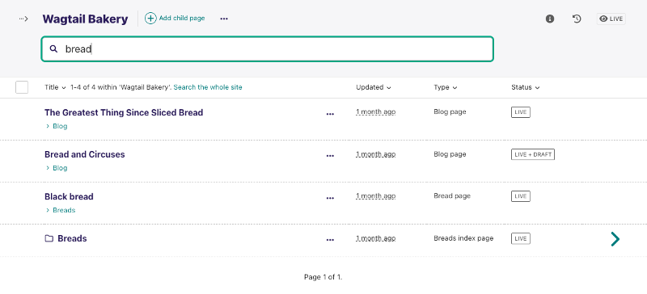

# Wagtail 5.2 (LTS) release notes

_November 1, 2023_

```{contents}
---
local:
depth: 1
---
```

Wagtail 5.2 is designated a Long Term Support (LTS) release. Long Term Support releases will continue to receive maintenance updates as necessary to address security and data-loss related issues, up until the next LTS release (typically a period of 12 months).

## What's new

### Redesigned page listing view



The page explorer listing view has been redesigned to allow improved navigation and searching. This feature was developed by Ben Enright, Matt Westcott, Thibaud Colas and Sage Abdullah.

### OpenSearch support

[OpenSearch](https://opensearch.org/) is now formally supported as an alternative to Elasticsearch. For configuration details, see [OpenSearch configuration](opensearch). This feature was developed by Matt Westcott.

### Responsive & multi-format images with the picture tag

Wagtail has new template tags to reduce the loading time and environmental footprint of images:

 * The `picture` tag generates images in multiple formats and-or sizes in one batch, creating an HTML `<picture>` tag.
 * The `srcset_image` tag generates images in multiple sizes, creating an `` tag with a `srcset` attribute.

As an example, the `picture` tag allows generating six variants of an image in one go:

```html+django

```

This outputs:

```html
<picture>
    <source sizes="80vw" srcset="/media/images/pied-wagtail.width-400.avif 400w, /media/images/pied-wagtail.width-800.avif 800w" type="image/avif">
    <source sizes="80vw" srcset="/media/images/pied-wagtail.width-400.webp 400w, /media/images/pied-wagtail.width-800.webp 800w" type="image/webp">
    
</picture>
```

We expect those changes to greatly reduce the weight of images for all Wagtail sites. We encourage all site implementers to consider using them to improve the performance of the sites and reduce their carbon footprint. For further details, For more details, see [](multiple_formats) and [](responsive_images). Those new template tags are also supported in Jinja templates, see [](jinja2) for the Jinja API.

This feature was developed by Paarth Agarwal and Thibaud Colas as part of the Google Summer of Code program and a [partnership with the Green Web Foundation](https://www.thegreenwebfoundation.org/news/working-with-the-wagtail-community-on-the-summer-of-code/) and Green Coding Berlin, with support from Dan Braghiș, Thibaud Colas, Sage Abdullah, Arne Tarara (Green Coding Berlin), and Chris Adams (Green Web Foundation). We also thank Aman Pandey for introducing [AVIF support](image_file_formats) in Wagtail 5.1, Andy Babic for creating [`AbstractImage.get_renditions()`](image_renditions_multiple) in the same release; and Storm Heg, Mitchel Cabuloy, Coen van der Kamp, Tom Dyson, and Chris Lawton for their feedback on [RFC 71](https://github.com/wagtail/rfcs/pull/71).

### Support extending Wagtail client-side with Stimulus

Wagtail now officially supports client-side admin customizations with [Stimulus](https://stimulus.hotwired.dev/). The developer documentation has a dedicated page about [](extending_client_side). This covers fundamental topics of client-side extensibility, such as:

 * Adding custom JavaScript
 * Extending with DOM events and Wagtail's custom DOM events
 * Extending with Stimulus
 * Extending with React

Thank you to core contributor LB (Ben) Johnston for writing this documentation.

### `ModelViewSet` improvements

Several features from {class}`~wagtail.snippets.views.snippets.SnippetViewSet` have been implemented in {class}`~wagtail.admin.viewsets.model.ModelViewSet`, allowing you to use them without registering your models as snippets. For more details on using `ModelViewSet`, refer to [](generic_views).

 * Move `SnippetViewSet` menu registration mechanism to base `ViewSet` class (Sage Abdullah)
 * Move `SnippetViewSet` template override mechanism to `ModelViewSet` (Sage Abdullah)
 * Move `SnippetViewSet.list_display` to `ModelViewSet` (Sage Abdullah)
 * Move `list_filter`, `filterset_class`, `search_fields`, `search_backend_name`, `list_export`, `export_filename`, `list_per_page`, and `ordering` from `SnippetViewSet` to `ModelViewSet` (Sage Abdullah, Cynthia Kiser)
 * Add default header titles to generic `IndexView` and `CreateView` (Sage Abdullah)
 * Add the ability to use filters and to export listings in generic `IndexView` (Sage Abdullah)
 * Add generic `UsageView` to `ModelViewSet` (Sage Abdullah)
 * Add generic `InspectView` to `ModelViewSet` (Sage Abdullah)
 * Extract generic `HistoryView` from snippets and add it to `ModelViewSet` (Sage Abdullah)
 * Extract generic breadcrumbs functionality from page breadcrumbs (Sage Abdullah)
 * Add breadcrumbs support to custom `ModelViewSet` views (Sage Abdullah)
 * Allow `ModelViewSet` to be used with models that have non-integer primary keys (Sage Abdullah)
 * Enable reference index tracking for models registered with `ModelViewSet` (Sage Abdullah)

In addition, the following new features have been added to the generic admin views as part of `ModelViewSet`, which can also be used with `SnippetViewSet`.

 * Allow overriding `IndexView.export_headings` via `ModelViewSet` (Christer Jensen, Sage Abdullah)
 * Add the ability to define listing buttons on generic `IndexView` (Sage Abdullah)

### User interface refinements

Several tweaks have been made to the admin user interface which we hope will make it easier to use.

 * Show the full first published at date within a tooltip on the Page status sidebar on the relative date (Rohit Sharma)
 * Do not render minimap if there are no panel anchors (Sage Abdullah)
 * Use dropdown buttons on listings in dashboard panels (Sage Abdullah)
 * Implement breadcrumbs design refinements (Thibaud Colas)
 * Add support for Shift + Click behavior in form submissions and simple translations submissions (LB (Ben) Johnston)
 * Improve filtering of audit logging based on the user's permissions (Stefan Hammer)

### External links in promoted search results

Promoted search result entries can now use an external URL along with custom link text, instead of linking to a page within Wagtail. This makes it easier to manage promoted content across multiple websites. Thank you to TopDevPros, and Brad Busenius from University of Chicago Library.

### Other features

 * Add support for Python 3.12 (Matt Westcott)
 * Add [`wagtailcache`](wagtailcache) and [`wagtailpagecache`](wagtailpagecache) template tags to ensure previewing Pages or Snippets will not be cached (Jake Howard)
 * Always set help text element ID for form fields with help text in `field.html` template (Sage Abdullah)
 * When copying a page or creating an alias, copy its view restrictions to the destination (Sandeep Choudhary, Suyash Singh)
 * Support pickling of StreamField values (pySilver)
 * Remove `wagtail.publish` log action on aliases when they are created from live source pages or the source page is published (Dan Braghis)
 * Remove `wagtail.unpublish` log action on aliases when source page is unpublished (Dan Braghis)
 * Add compare buttons to workflow dashboard panel (Matt Westcott)
 * Support specifying a `get_object_list` method on `ChooserViewSet` (Matt Westcott)
 * Add [`linked_fields` mechanism on chooser widgets](chooser_viewsets_limiting_choices) to allow choices to be limited by fields on the calling page (Matt Westcott)
 * Add support for merging cells within `TableBlock` with the [`mergedCells` option](table_block_options) (Gareth Palmer)
 * When adding a panel within `InlinePanel`, focus will now shift to that content similar to `StreamField` (Faishal Manzar)
 * Add support for `placement` in `human_readable_date` the tooltip template tag (Rohit Sharma)
 * Support passing extra context variables via the `` tag (Matt Westcott)
 * Allow subclasses of `PagesAPIViewSet` override default [Page model via the `model`](api_v2_configure_endpoints) attribute (Neeraj Yetheendran, Herbert Poul)
 * Add support for subject and body in the Email link chooser form (TopDevPros, Alexandre Joly)
 * Add a visual progress bar to the output of the `wagtail_update_image_renditions` management command (Faishal Manzar)
 * Increase the read buffer size to improve efficiency and performance when generating file hashes for document or image uploads, use `hashlib.file_digest` if available (Python 3.11+) (Jake Howard)
 * API ordering now [supports multiple fields](api_v2_usage_ordering) (Rohit Sharma, Jake Howard)
 * Pass block value to `Block.get_template` to allow varying template based on value (Florian Delizy)
 * Add [`InlinePanel` DOM events](inline_panel_events) for when ready and when items added or removed (Faishal Manzar)
 * Support `Filter` instances as input for [`AbstractImage.get_renditions()`](image_renditions_multiple) (Thibaud Colas)
 * Improve error messages for image template tags (Thibaud Colas)
 * The [`purge_revisions` management command](purge_revisions) now respects revisions that have an `on_delete=PROTECT` foreign key relation and won't delete them (Neeraj P Yetheendran, Meghana Reddy, Sage Abdullah, Storm Heg)

### Bug fixes

 * Ensure that StreamField's `FieldBlock`s correctly set the `required` and `aria-describedby` attributes (Storm Heg)
 * Avoid an error when the moderation panel (admin dashboard) contains both snippets and private pages (Matt Westcott)
 * When deleting collections, ensure the collection name is correctly shown in the success message (LB (Ben) Johnston)
 * Filter out comments on Page editing counts that do not correspond to a valid field / block path on the page such as when a field has been removed (Matt Westcott)
 * Allow `PublishMenuItem` to more easily support overriding its label via `construct_page_action_menu` (Sébastien Corbin)
 * Allow locale selection when creating a page at the root level (Sage Abdullah)
 * Ensure the admin login template correctly displays all `non_fields_errors` for any custom form validation (Sébastien Corbin)
 * Ensure 'mark as active' label in workflow bulk action set active form can be translated (Rohit Sharma)
 * Ensure the panel title for a user's settings correctly reflects the `WAGTAIL_EMAIL_MANAGEMENT_ENABLED` setting by not showing 'email' if disabled (Omkar Jadhav)
 * Update Spotify oEmbed provider URL parsing to resolve correctly (Dhrűv)
 * Update link colors within help blocks to meet accessible contrast requirements (Rohit Sharma)
 * Ensure the search promotions popular search terms picker correctly refers to the correct model (LB (Ben) Johnston)
 * Correctly quote non-numeric primary keys on snippet inspect view (Sage Abdullah)
 * Prevent crash on snippet inspect view when displaying a null foreign key to an image (Sage Abdullah)
 * Ensure that pages in moderation show as "Live + In Moderation" in the page explorer rather than "Live + Draft" (Sage Abdullah)
 * Prevent error when updating reference index for objects with a lazy ParentalKey-related object (Chris Shaw)
 * Ignore conflicts when inserting reference index entries to prevent race conditions causing uniqueness errors (Chris Shaw)
 * Populate the correct return value when creating a new snippet within the snippet chooser (claudobahn)
 * Reinstate missing filter by page type on page search (Matt Westcott)
 * Ensure very long words can wrap when viewing saved comments (Chiemezuo Akujobi)
 * Avoid forgotten password link text conflicting with the supplied aria-label (Thibaud Colas)
 * Fix log message to record the correct restriction type when removing a page view restriction (Rohit Sharma, Hazh. M. Adam)
 * Avoid potential race condition with new Page subscriptions on the edit view (Alex Tomkins)
 * Use the correct action log when creating a redirect (Thibaud Colas)
 * Ensure that all password fields consistently allow leading & trailing whitespace (Neeraj P Yetheendran)

### Documentation

 * Expand documentation on using `ViewSet` and `ModelViewSet` (Sage Abdullah)
 * Document `WAGTAILADMIN_BASE_URL` on ["Integrating Wagtail into a Django project"](/getting_started/integrating_into_django) page (Shreshth Srivastava)
 * Replace incorrect screenshot for authors listing on tutorial (Shreshth Srivastava)
 * Add documentation for building [non-model-based choosers using the _queryish_ library](chooser_viewsets_non_model_data) (Matt Westcott)
 * Fix incorrect tag library import on focal points example (Hatim Makki Hoho)
 * Add reminder about including your custom Draftail feature in any overridden `WAGTAILADMIN_RICH_TEXT_EDITORS` setting (Charlie Sue)
 * Mention the need to install `python3-venv` on Ubuntu (Brian Mugo)
 * Document the use of the Google developer documentation style guide in documentation (Damilola Oladele)
 * Fix Inconsistent URL Format in Getting Started tutorial (Olumide Micheal)
 * Add more extensive documentation for the [`permission` kwarg support in Panels](panels_permissions) (LB (Ben) Johnston)
 * Update all `FieldPanel('title')` examples to use the recommended `TitleFieldPanel('title')` panel (Chinedu Ihedioha)

### Maintenance

#### Stimulus adoption

As part of our [adoption of Stimulus](https://github.com/wagtail/rfcs/blob/main/text/078-adopt-stimulus-js.md), in addition to the new documentation, we have migrated several existing components to the framework. Thank you to our core contributor LB who oversees this project, and to all contributors who refactored specific components.

 * Migrate form submission listing checkbox toggling to the shared `w-bulk` Stimulus implementation (LB (Ben) Johnston)
 * Migrate the editor unsaved messages popup to be driven by Stimulus using the shared `w-message` controller (LB (Ben) Johnston, Hussain Saherwala)
 * Migrate all other `data-tippy` HTML attribute usage to the Stimulus data-*-value attributes for w-tooltip & w-dropdown (Subhajit Ghosh, LB (Ben) Johnston)
 * Migrate select all on focus/click behavior to Stimulus, used on the image URL generator (Chiemezuo Akujobi)
 * Add support for a `reset` method to support Stimulus driven dynamic field resets via the `w-action` controller (Chiemezuo Akujobi)
 * Add support for a `notify` target on the Stimulus dialog for dispatching events internally (Chiemezuo Akujobi)
 * Migrate publishing schedule dialog field resets to Stimulus (Chiemezuo Akujobi)

#### Other maintenance

 * Fix snippet search test to work on non-fallback database backends (Matt Westcott)
 * Update ESLint, Prettier & Jest npm packages (LB (Ben) Johnston)
 * Add npm scripts for TypeScript checks and formatting SCSS files (LB (Ben) Johnston)
 * Run tests in parallel in some of the CI setup (Sage Abdullah)
 * Remove unused WorkflowStatus view, urlpattern, and workflow-status.js (Storm Heg)
 * Add support for options/attrs in Telepath widgets so that attrs render on the created DOM (Storm Heg)
 * Update pre-commit hooks to be in sync with latest changes to ESLint & Prettier for client-side changes (Storm Heg)
 * Add `WagtailTestUtils.get_soup()` method for testing HTML content (Storm Heg, Sage Abdullah)
 * Allow `ViewSet` subclasses to customize `url_prefix` and `url_namespace` logic (Matt Westcott)
 * Simplify `SnippetViewSet` registration code (Sage Abdullah)
 * Rename groups `IndexView.results_template_name` to `results.html` (Sage Abdullah)
 * Allow viewsets to define a common set of view kwargs (Matt Westcott)
 * Do not use jest inside `stubs.js` to prevent Storybook from crashing (LB (Ben) Johnston)
 * Refactor snippets templates to reuse the shared `slim_header.html` template (Sage Abdullah)
 * Refactor `slim_header.html` template to reduce code duplication (Sage Abdullah)
 * Upgrade Willow to v1.6.2 to support MIME type data without reliance on `imghdr` (Jake Howard)
 * Replace `imghdr` with Willow's built-in MIME type detection (Jake Howard)
 * Replace `@total_ordering` usage with comparison functions implementation (Virag Jain)
 * Replace `<script type="text/django-form-template"><-/script>` template approach with HTML `template` elements in InlinePanel and expanding formset (Mansi Gundre, Subhajit Ghosh, LB (Ben) Johnston)
 * Refactor side panels code for better reuse in pages and snippets (Sage Abdullah)
 * Deprecate legacy URL redirects in `ModelViewSet` and `SnippetViewSet` (Sage Abdullah)
 * Simplify code for registering page listing action buttons (Matt Westcott)
 * Removed the unused, legacy, Wagtail userbar views set up for an old iframe approach (Sage Abdullah)
 * Optimize `lru_cache` usage (Jake Howard)
 * Implement `date_since` in `get_most_popular` inside `search_promotions.models.Query` (TopDevPros)
 * Refactor generic view subclasses to better reuse the generic templates and breadcrumbs (Sage Abdullah)
 * Adopt consistent `classname` (not `classnames`) attributes for all `MenuItem` usage, including deprecation warnings (LB (Ben) Johnston)
 * Adopt consistent `classname` (not `classnames`) attribute within the `wagtail.images.formats.Format` instance, including deprecation warnings (LB (Ben) Johnston)
 * Deprecate `context` argument of `construct_snippet_listing_buttons` hook (Sage Abdullah)
 * Deprecate legacy moderation system (Sage Abdullah)
 * Update CI database versions (Jake Howard)
 * Add changelog and issue tracker links to the PyPI project page (Panagiotis H.M. Issaris)
 * Add better deprecation warnings to the `search.Query` & `search.QueryDailyHits` model, move final set of templates from the admin search module to the search promotions contrib module (LB (Ben) Johnston)


## Upgrade considerations - changes affecting all projects

### Changes to UUID fields on MariaDB when upgrading to Django 5.0

Django 5.0 introduces support for MariaDB's native UUID type on MariaDB 10.7 and above. This breaks backwards compatibility with `CHAR`-based UUIDs created on earlier versions of Django and MariaDB, and so upgrading a site to Django 5.0+ and MariaDB 10.7+ is liable to result in errors such as `Data too long for column 'translation_key' at row 1` or `Data too long for column 'uuid' at row 1` when creating or editing pages. To fix this, it is necessary to run the [`convert_mariadb_uuids`](convert_mariadb_uuids) management command (available as of Wagtail 5.2.5) after upgrading:

```sh
./manage.py convert_mariadb_uuids
```

This will convert all existing UUID fields used by Wagtail to the new format. New sites created under Django 5.0+ and MariaDB 10.7+ are unaffected.

## Upgrade considerations - deprecation of old functionality

### Legacy moderation system is deprecated

The legacy moderation system, which was replaced by the new workflow system in Wagtail 2.10, is now deprecated. Since Wagtail 2.10, submitting a page for moderation will use the new workflow system. However, the legacy moderation system is still in place for approving and rejecting pages that were submitted for moderation before Wagtail 2.10.

To view all pages that are still in the legacy moderation system backlog, you can sign in as a superuser and see if there is a "Pages awaiting moderation" section in the admin dashboard. You can approve or reject the pages from there. You can also do this programmatically by querying for `Revision.objects.filter(submitted_for_moderation=True)` and calling `revision.approve_moderation()` or `revision.reject_moderation()` on each revision.

The legacy moderation system will be removed in a future release. If you still have pages in the moderation queue that were submitted for moderation before Wagtail 2.10, you should approve or reject them before upgrading. See [](./2.10) for more details.

As a result, the following features are now deprecated:

- `wagtail.models.Revision.submitted_for_moderation`
- `wagtail.models.Revision.submitted_revisions`
- `wagtail.models.Revision.approve_moderation`
- `wagtail.models.Revision.reject_moderation`
- The `submitted_for_moderation` argument in {meth}`wagtail.models.RevisionMixin.save_revision`
- `WAGTAIL_MODERATION_ENABLED`
- `wagtail.admin.userbar.ModeratePageItem`
- `wagtail.admin.userbar.ApproveModerationEditPageItem`
- `wagtail.admin.userbar.RejectModerationEditPageItem`
- `wagtail.admin.views.home.PagesForModerationPanel`
- `wagtail.admin.views.pages.moderation`
- `wagtail.permission_policies.pages.PagePermissionPolicy.revisions_for_moderation`

If you use any of the above features, remove them or replace them with the equivalent features from the new workflow system. The above features will be removed in a future release.

## Upgrade considerations - changes affecting Wagtail customizations

### Adoption of `classname` convention for `MenuItem` related classes and hooks

Wagtail `MenuItem` and menu hooks have been updated to use the more consistent naming of `classname` (singular) instead of `classnames` (plural), a convention that started in Wagtail 4.2.

The current `classnames` keyword argument naming will be supported, but will trigger a deprecation warning. Support for this variant will be removed in a future release.

The following classes will adopt this new convention.

-   `admin.menu.MenuItem`
-   `admin.ui.sidebar.ActionMenuItem`
-   `admin.ui.sidebar.LinkMenuItem`
-   `admin.ui.sidebar.PageExplorerMenuItem`
-   `contrib.settings.registry.SettingMenuItem`

The following hooks usage may be impacted if `classnames` were used when generating menu items.

-   `register_admin_menu_item`
-   `register_settings_menu_item`

#### Example

```python
from django.urls import reverse

from wagtail import hooks
from wagtail.admin.menu import MenuItem

@hooks.register('register_admin_menu_item')
def register_frank_menu_item():
  return MenuItem(
    'Frank',
    reverse('frank'),
    icon_name='folder-inverse',
    order=10000,
    classname="highlight-menu" # not classnames=...
  )
```

### Edit and delete URLs in `ModelViewSet` changed to allow non-integer primary keys

To accommodate models with non-integer primary keys, the URL patterns for the edit and delete views in {class}`~wagtail.admin.viewsets.model.ModelViewSet` have been changed.

Relative to the viewset's {attr}`~wagtail.admin.viewsets.base.ViewSet.url_prefix`, the following changes have been made:
- The edit URL pattern has been changed from `<int:pk>/` to `edit/<str:pk>/`
- The delete URL pattern has been changed from `<int:pk>/delete/` to `delete/<str:pk>/`

If you use {func}`~django.urls.reverse` with {meth}`~wagtail.admin.viewsets.base.ViewSet.get_url_name` to generate the URLs for these views, no changes are needed. However, if you have hard-coded these URLs in your code, you will need to update them to match the new patterns.

Redirects for the legacy URLs are in place for backwards compatibility, but will be removed in a future release.

The URLs for snippets underwent similar changes in Wagtail 2.14. The redirects for the legacy URLs in {class}`~wagtail.snippets.views.snippets.SnippetViewSet` have now been marked for removal in a future release.

### `ModelViewSet` automatically registers the model to the reference index

Models that are registered with a `ModelViewSet` now have reference index tracking enabled by default. This means that you no longer need to call `ReferenceIndex.register_model()` in your app's `ready()` method for such models. If this is undesired, you can disable it by setting {attr}`~wagtail.admin.viewsets.model.ModelViewSet.add_to_reference_index` to `False` on the `ModelViewSet` subclass. For more details, see [](managing_the_reference_index).

### Groups `IndexView.results_template_name` renamed from `results.html` to `index_results.html`

The `IndexView`'s `results_template_name` attribute in the `GroupViewSet` has been renamed from `wagtailusers/groups/results.html` to `wagtailusers/groups/index_results.html` for consistency with the other viewsets. If you have customized or extended the template, e.g. for [](customizing_group_views), you will need to rename it to match the new name.

### `construct_snippet_listing_buttons` hook no longer accepts a `context` argument

The [`construct_snippet_listing_buttons`](construct_snippet_listing_buttons) hook no longer accepts a `context` argument. If you have implemented this hook, you will need to remove the `context` argument from your implementation. If you need to access values computed by the view, you'll need to override the {attr}`~wagtail.snippets.views.snippets.SnippetViewSet.index_view_class` with a custom `IndexView` subclass. The `get_list_buttons` and `get_list_more_buttons` methods in particular may be overridden to customize the buttons on the listing.

Defining a function for this hook that accepts the `context` argument will raise a warning, and the function will receive an empty dictionary (`{}`) as the `context`. Support for defining the `context` argument will be completely removed in a future Wagtail release.

### Hooks for page listing and page header buttons no longer accept a `page_perms` argument

The arguments passed to the hooks [`register_page_header_buttons`](register_page_header_buttons), [`register_page_listing_buttons`](register_page_listing_buttons), [`construct_page_listing_buttons`](construct_page_listing_buttons) and [`register_page_listing_more_buttons`](register_page_listing_more_buttons) have changed. For all of these hooks, the `page_perms` argument has been replaced by `user`; in addition, `register_page_header_buttons` is now passed a `view_name` argument, which is either `'edit'` or `'index'`, depending on whether the button is being generated for the page listing or edit view. In summary, the changes are:

* `register_page_header_buttons`: Previously `func(page, page_perms, next_url)`, now `func(page, user, next_url, view_name)`.
* `register_page_listing_buttons`: Previously `func(page, page_perms, next_url)`, now `func(page, user, next_url)`.
* `construct_page_listing_buttons`: Previously `func(buttons, page, page_perms, context)`, now `fn(buttons, page, user, context)`.
* `register_page_listing_more_buttons`: Previously `func(page, page_perms, next_url)`, now `func(page, user, next_url)`.

Additionally, the `ButtonWithDropdownFromHook` constructor, and the resulting hook it creates, should now be passed a `user` argument instead of `page_perms`.

Existing code that performs permission checks using `page_perms` can retrieve the same permission tester object using `page.permissions_for_user(user)`.

Hook functions using the old `page_perms` signature will continue to work, but this is deprecated and will raise a warning. Support for the old signature will be removed in a future Wagtail release.

## Upgrade considerations - changes to undocumented internals

### Breadcrumbs class name has changed

If using custom styling for the breadcrumbs, this class has changed from singular to plural for a more intuitive class.

| Old              | New               |
| ---------------- | ----------------- |
| `'w-breadcrumb'` | `'w-breadcrumbs'` |

### Snippets templates refactored to reuse the shared `slim_header.html` template

The templates for the snippets views have been refactored to reuse the shared `slim_header.html` template. If you have customized or extended the templates, e.g. for [](wagtailsnippets_custom_admin_views), you will need to update them to match the new structure. As a result, the following templates have been removed:

- `wagtailsnippets/snippets/headers/_base_header.html`
- `wagtailsnippets/snippets/headers/create_header.html`
- `wagtailsnippets/snippets/headers/edit_header.html`
- `wagtailsnippets/snippets/headers/history_header.html`
- `wagtailsnippets/snippets/headers/list_header.html`
- `wagtailsnippets/snippets/headers/usage_header.html`

In most cases, the usage of those templates can be replaced with the `wagtailadmin/shared/headers/slim_header.html` template. Refer to the snippets views and templates code for more details.

### `BaseSidePanels`, `PageSidePanels` and `SnippetSidePanels` classes are removed

The `BaseSidePanels`, `PageSidePanels` and `SnippetSidePanels` classes that were used to combine the side panels (i.e. status, preview and comments side panels) have been removed. Each side panel is now instantiated directly in the view. The `wagtail.admin.ui.components.MediaContainer` class can be used to combine the [`Media`](inv:django#topics/forms/media) objects for the side panels.

The `BasePreviewSidePanel`, `PagePreviewSidePanel` and `SnippetPreviewSidePanel` classes have been replaced with the consolidated `PreviewSidePanel` class.

The `BaseStatusSidePanel` class has been renamed to `StatusSidePanel`.

If you use these classes in your code, you will need to update your code to instantiate the side panels directly in the view.

For example, if you have the following code:

```python
from wagtail.admin.ui.side_panels import PageSidePanels


def my_view(request):
    ...

    side_panels = PageSidePanels(
        request,
        page.get_latest_revision_as_object(),
        show_schedule_publishing_toggle=False,
        live_page=page,
        scheduled_page=page.get_scheduled_revision_as_object(),
        in_explorer=False,
        preview_enabled=True,
        comments_enabled=False,
    )

    return render(
        request,
        template_name,
        {"page": page, "side_panels": side_panels, "media": side_panels.media},
    )
```

Update it to the following:

```python
from wagtail.admin.ui.components import MediaContainer
from wagtail.admin.ui.side_panels import PageStatusSidePanel, PreviewSidePanel


def my_view(request):
    ...

    side_panels = [
        PageStatusSidePanel(
            page,
            request,
            show_schedule_publishing_toggle=False,
            live_object=page,
            scheduled_object=page.get_scheduled_revision_as_object(),
            locale=page.locale,
            translations=translations,
        ),
        PreviewSidePanel(
            page,
            request,
            preview_url=reverse("wagtailadmin_pages:preview_on_edit", args=[page.id]),
        ),
    ]
    side_panels = MediaContainer(side_panels)

    return render(
        request,
        template_name,
        {"page": page, "side_panels": side_panels, "media": side_panels.media},
    )
```

### Breadcrumbs now use different data attributes and events

The undocumented JavaScript implementation for the header breadcrumbs component has been migrated to a Stimulus controller and now uses different data attributes.

This may impact custom header implementations that relied on the previous approach, custom breadcrumbs that did not use `breadcrumbs` and require the expand/collapse behavior may be impacted.

#### Events

| Old                              | New                      |
| -------------------------------- | ------------------------ |
| `'wagtail:breadcrumbs-expand'`   | `'w-breadcrumbs:opened'` |
| `'wagtail:breadcrumbs-collapse'` | `'w-breadcrumbs:closed'` |

#### Data attributes

| Old                       | New                                                                                                    |
| ------------------------- | ------------------------------------------------------------------------------------------------------ |
| `data-breadcrumb-next`    | `data-controller="w-breadcrumbs"`                                                                      |
| `data-toggle-breadcrumbs` | `data-w-breadcrumbs-target="toggle" data-action="w-breadcrumbs#toggle mouseenter->w-breadcrumbs#peek"` |
| `data-breadcrumb-item`    | `data-w-breadcrumbs-target="content"`                                                                  |

Note that the root DOM element also includes a set of additional data attributes to function as the breadcrumbs:

```
data-controller="w-breadcrumbs"
data-action="keyup.esc@document->w-breadcrumbs#close w-breadcrumbs:open@document->w-breadcrumbs#open w-breadcrumbs:close@document->w-breadcrumbs#close"
data-w-breadcrumbs-close-icon-class="icon-cross"
data-w-breadcrumbs-closed-value="true"
data-w-breadcrumbs-open-icon-class="icon-breadcrumb-expand"
data-w-breadcrumbs-opened-content-class="w-max-w-4xl"
data-w-breadcrumbs-peek-target-value="header"
```

### `window.updateFooterSaveWarning` global util removed

The undocumented global util `window.updateFooterSaveWarning` has been removed, this is part of the footer 'unsaved' messages toggling behavior on page forms.
This behavior has now moved to a Stimulus controller and leverages DOM events instead. Calling this function will do nothing and in a future release will throw an error.

You can implement roughly the equivalent functionality with this JavaScript function, however, this will not be guaranteed to work in future releases.

```javascript
window.updateFooterSaveWarning = (formDirty, commentsDirty) => {
  if (!formDirty && !commentsDirty) {
    document.dispatchEvent(new CustomEvent('w-unsaved:clear'));
  } else {
    const [type] = [
      formDirty && commentsDirty && 'all',
      commentsDirty && 'comments',
      formDirty && 'edits',
    ].filter(Boolean);
    document.dispatchEvent(new CustomEvent('w-unsaved:add', { detail: { type } }));
  }
};
```

### `dropdown` template tag argument `toggle_tippy_offset` renamed to `toggle_tooltip_offset`

The naming conventions for `tippy` related attributes have been updated to align with the generic `tooltip` naming.

If you are using the undocumented dropdown template tag with the offset arg, this will need to be updated.

| Old                                                                | New                                                                  |
| ------------------------------------------------------------------ | -------------------------------------------------------------------- |
| `...` | `...` |

### `escapescript` template tag and `escape_script` functions are deprecated

As of this release, the undocumented `coreutils.escape_script` util and `escapescript` template tag will no longer be supported.

This was used to provide a way for HTML template content in IE11, which is no longer supported, and was non-compliant with CSP support.

The current approach will trigger a deprecation warning and will be removed in a future release.

#### Old

```text

<script type="text/django-form-template" id="id_{{ formset.prefix }}-EMPTY_FORM_TEMPLATE">
    
        <div>Widget template content</div>
        <script src="/js/my-widget.js"></script>
    
</script>
```

#### New

Use the HTML [`template`](https://developer.mozilla.org/en-US/docs/Web/HTML/Element/template) element to avoid content from being parsed by the browser on load.

```html+django
<template id="id_{{ formset.prefix }}-EMPTY_FORM_TEMPLATE">
    <div>Widget template content</div>
    <script src="/js/my-widget.js"></script>
</template>
```

### Adoption of `classname` convention within the Image `Format` instance

When using `wagtail.images.formats.Format`, the created instance set the argument for classes to the attribute `classnames` (plural), this has now changed to `classname` (singular).

For any custom code that accessed or modified this undocumented attribute, updates will need to be made as follows.

Accessing `self.classnames` will still work until a future release, simply returning `self.classname`, but this will raise a deprecation warning.

```python
# image_formats.py
from django.utils.html import format_html
from wagtail.images.formats import Format, register_image_format


class CustomImageFormat(Format):

    def image_to_html(self, image, alt_text, extra_attributes=None):
        # contrived example - pull out the class and render on outside element
        classname = self.classname # not self.classnames
        self.classname = "" # not self.classnames
        inner_html = super().image_to_html(image, alt_text, extra_attributes)
        return format_html("<custom-image class='{}'>{}</custom-image>", classname, inner_html)


custom_format = CustomImageFormat('custom_example', 'Custom example', 'example-image object-fit', 'width-750')

register_image_format(custom_format)
```

### Changes to search promotions contrib module

#### Deprecated `search_garbage_collect` management command has been removed

In 5.0 the documentation advised that the `search_garbage_collect` command used to remove old stored search queries and daily hits has been moved to [`searchpromotions_garbage_collect`](searchpromotions_garbage_collect).

The old command has now been fully removed and if called will throw an error.

#### Changes to URL names and templates

Some search promotions URLs and templates have now moved from the main admin search module into the search promotions module.

| **Item** | **Old**                                                               | **New**                                                                                            |
| -------- | --------------------------------------------------------------------- | -------------------------------------------------------------------------------------------------- |
| URL name | `wagtailsearch_admin:queries_chooser`                                 | `wagtailsearchpromotions:chooser`                                                                  |
| URL name | `wagtailsearch_admin:queries_chooserresults`                          | `wagtailsearchpromotions:queries_chooserresults`                                                   |
| Template | `wagtail/search/templates/wagtailsearch/queries/chooser/chooser.html` | `wagtail/contrib/search_promotions/templates/wagtailsearchpromotions/queries/chooser/chooser.html` |
| Template | `wagtail/search/templates/wagtailsearch/queries/chooser/results.html` | `wagtail/contrib/search_promotions/templates/wagtailsearchpromotions/queries/chooser/results.html` |
| Template | `wagtail/search/templates/wagtailsearch/queries/chooser_field.html`   | `wagtail/contrib/search_promotions/templates/wagtailsearchpromotions/queries/chooser_field.html`   |

### `Block.get_template` now accepts a `value` argument

The `get_template` method on StreamField blocks now accepts a `value` argument in addition to `context`. Code using the old signature should be updated:

```python
# Old
def get_template(self, context=None):
    ...

# New
def get_template(self, value=None, context=None):
    ...
```
