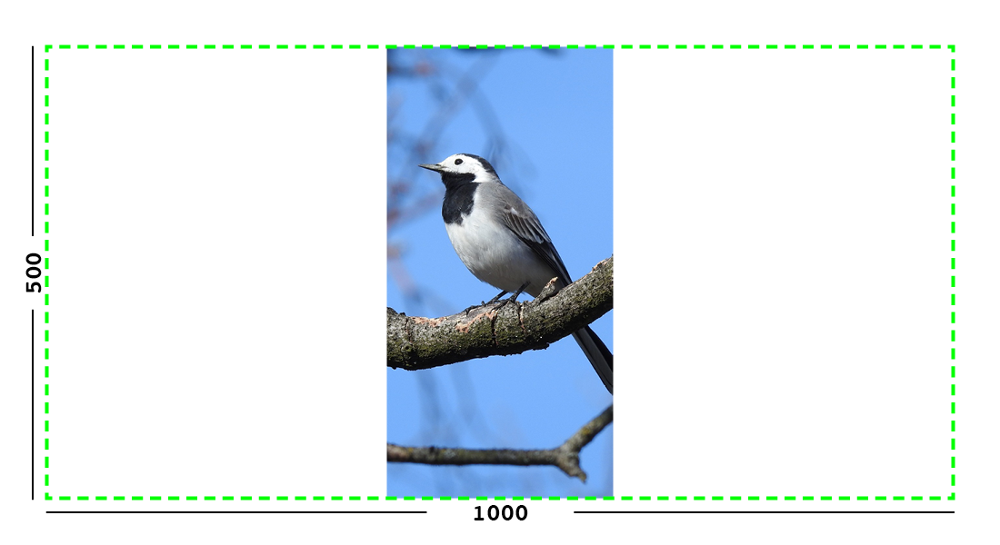
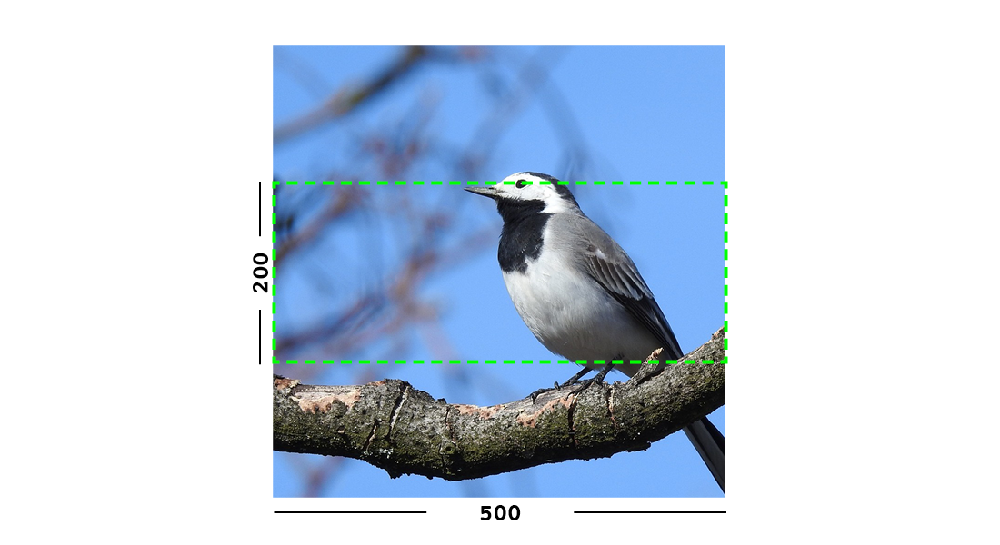
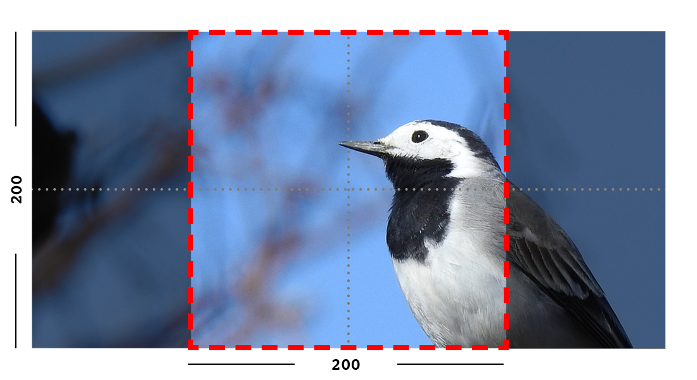
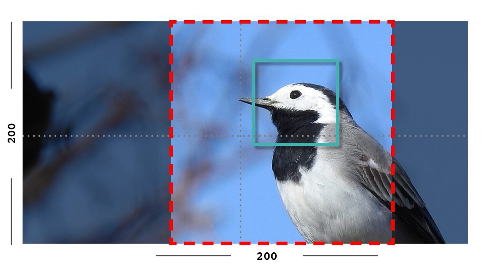
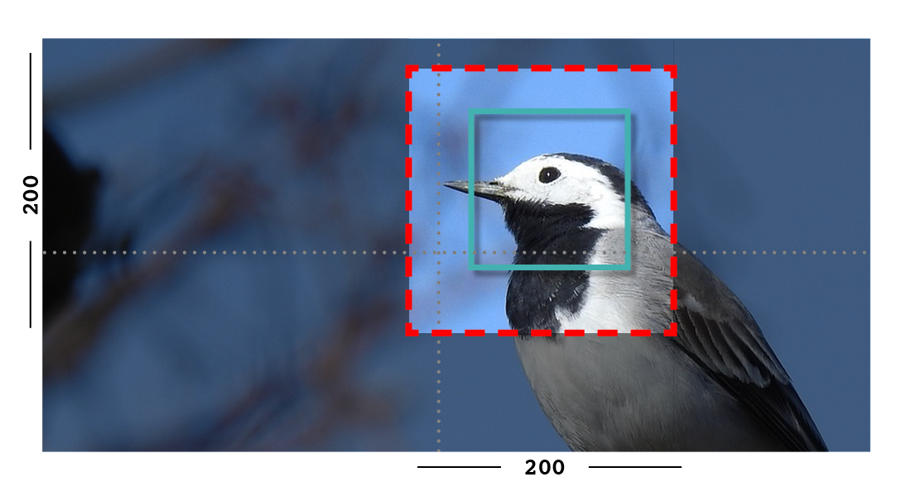

(image_tag)=

# How to use images in templates

The `image` tag inserts an XHTML-compatible `img` element into the page, setting its `src`, `width`, `height` and `alt`. See also [](image_tag_alt).

The syntax for the tag is thus:

```html+django

```

**Both the image and resize rule must be passed to the template tag.**

For example:

```html+django

...

<!-- Display the image scaled to a width of 400 pixels: -->


<!-- Display it again, but this time as a square thumbnail: -->

```

In the above syntax example `[image]` is the Django object referring to the image. If your page model defined a field called "photo" then `[image]` would probably be `page.photo`. The `[resize-rule]` defines how the image is to be resized when inserted into the page. Various resizing methods are supported, to cater to different use cases (for example lead images that span the whole width of the page, or thumbnails to be cropped to a fixed size).

Note that a space separates `[image]` and `[resize-rule]`, but the resize rule must not contain spaces. The width is always specified before the height. Resized images will maintain their original aspect ratio unless the `fill` rule is used, which may result in some pixels being cropped.

(responsive_images)=

## Responsive images

In addition to `image`, Wagtail also provides a `srcset_image` template tag which generates an `` tag with a `srcset` attribute. This allows browsers to select the most appropriate image file to load based on [responsive image rules](https://developer.mozilla.org/en-US/docs/Learn/HTML/Multimedia_and_embedding/Responsive_images).

The syntax for `srcset_image` is the same as `image, with two exceptions:

```html+django

```

- The resize rule should be provided with multiple sizes in a brace-expansion pattern, like `width-{200,400}`. This will generate the `srcset` attribute, with as many URLs as there are sizes defined in the resize rule.
- The `sizes` attribute is mandatory. This tells the browser how large the image will be displayed on the page, so that it can select the most appropriate image to load.

(available_resizing_methods)=

## Available resizing methods

The available resizing methods are as follows:

### `max`

(takes two dimensions)

```html+django

```

Fit **within** the given dimensions.

The longest edge will be reduced to the matching dimension specified. For example, a portrait image of width 1000 and height 2000, treated with the `max-1000x500` rule (a landscape layout) would result in the image being shrunk so the _height_ was 500 pixels and the width was 250.



Example: The image will keep its proportions but fit within the max (green line) dimensions provided.

### `min`

(takes two dimensions)

```html+django

```

**Cover** the given dimensions.

This may result in an image slightly **larger** than the dimensions you specify. A square image of width 2000 and height 2000, treated with the `min-500x200` rule would have its height and width changed to 500, that is matching the _width_ of the resize-rule, but greater than the height.



Example: The image will keep its proportions while filling at least the min (green line) dimensions provided.

### `width`

(takes one dimension)

```html+django

```

Reduces the width of the image to the dimension specified.

### `height`

(takes one dimension)

```html+django

```

Reduces the height of the image to the dimension specified.

### `scale`

(takes a percentage)

```html+django

```

Resize the image to the percentage specified.

### `fill`

(takes two dimensions and an optional `-c` parameter)

```html+django

```

Resize and **crop** to fill the **exact** dimensions specified.

This can be particularly useful for websites requiring square thumbnails of arbitrary images. For example, a landscape image of width 2000 and height 1000 treated with the `fill-200x200` rule would have its height reduced to 200, then its width (ordinarily 400) cropped to 200.

This resize-rule will crop to the image's focal point if it has been set. If not, it will crop to the centre of the image.



Example: The image is scaled and also cropped (red line) to fit as much of the image as possible within the provided dimensions.

**On images that won't upscale**

It's possible to request an image with `fill` dimensions that the image can't support without upscaling. For example an image of width 400 and height 200 requested with `fill-400x400`. In this situation the _ratio of the requested fill_ will be matched, but the dimension will not. So that example 400x200 image (a 2:1 ratio) could become 200x200 (a 1:1 ratio, matching the resize-rule).

**Cropping closer to the focal point**

By default, Wagtail will only crop enough to change the aspect ratio of the image to match the ratio in the resize-rule.

In some cases (for example thumbnails), it may be preferable to crop closer to the focal point, so that the subject of the image is more prominent.

You can do this by appending `-c<percentage>` at the end of the resize-rule. For example, if you would like the image to be cropped as closely as possible to its focal point, add `-c100`:

```html+django

```

This will crop the image as much as it can, without cropping into the focal point.

If you find that `-c100` is too close, you can try `-c75` or `-c50`. Any whole number from 0 to 100 is accepted.



Example: The focal point is set off centre so the image is scaled and also cropped like fill, however the center point of the crop is positioned closer the focal point.



Example: With `-c75` set, the final crop will be closer to the focal point.

### `original`

(takes no dimensions)

```html+django

```

Renders the image at its original size.

```{note}
Wagtail does not allow deforming or stretching images. Image dimension ratios will always be kept. Wagtail also *does not support upscaling*. Small images forced to appear at larger sizes will "max out" at their native dimensions.
```

(image_tag_alt)=

## More control over the `img` tag

Wagtail provides two shortcuts to give greater control over the `img` element:

### 1. Adding attributes to the  tag

Extra attributes can be specified with the syntax `attribute="value"`:

```html+django

```

You can set a more relevant `alt` attribute this way, overriding the one automatically generated from the title of the image. The `src`, `width`, and `height` attributes can also be overridden, if necessary.

You can also add default attributes to all images (a default class or data attribute for example) - see [](adding_default_attributes_to_images).

### 2. Generating the image "as foo" to access individual properties

Wagtail can assign the image data to another variable using Django's `as` syntax, to access the underlying image Rendition (`tmp_photo`):

```html+django



```

This is also possible with the `srcset_image` tag, to retrieve multiple size renditions:

```html+django



```

And with the picture tag, to retrieve multiple formats:

```html+django


{{ tmp_photo.avif.0.url }}
{{ tmp_photo.jpeg.0.url }}
```

```{note}
The image property used for the `src` attribute is `image.url`, not `image.src`.
```

Renditions contain the information specific to the way you've requested to format the image using the resize-rule, dimensions, and source URL. The following properties are available:

### `url`

URL to the resized version of the image. This may be a local URL (such as `/static/images/example.jpg`) or a full URL (such as `https://assets.example.com/images/example.jpg`), depending on how static files are configured.

### `width`

Image width after resizing.

### `height`

Image height after resizing.

### `alt`

Alternative text for the image, typically taken from the image title.

### `attrs`

A shorthand for outputting the attributes `src`, `width`, `height`, and `alt` in one go:

```html+django

```

### `full_url`

Same as `url`, but always returns a full absolute URL. This requires `WAGTAILADMIN_BASE_URL` to be set in the project settings.

This is useful for images that will be re-used outside of the current site, such as social share images:

```html+django
<meta name="twitter:image" content="{{ tmp_photo.full_url }}">
```

If your site defines a custom image model using `AbstractImage`, any additional fields you add to an image (such as a copyright holder) are **not** included in the rendition.

Therefore, if you'd added the field `author` to your AbstractImage in the above example, you'd access it using `{{ page.photo.author }}` rather than `{{ tmp_photo.author }}`.

(Due to the links in the database between renditions and their parent image, you _could_ access it as `{{ tmp_photo.image.author }}`, but that has reduced readability.)

(adding_default_attributes_to_images)=

## Adding default attributes to all images

We can configure the `wagtail.images` application to specify additional attributes to add to images. This is done by setting up a custom `AppConfig` class within your project folder (i.e. the package containing the top-level settings and urls modules).

To do this, create or update your existing `apps.py` file with the following:

```python
from wagtail.images.apps import WagtailImagesAppConfig


class CustomImagesAppConfig(WagtailImagesAppConfig):
    default_attrs = {"decoding": "async", "loading": "lazy"}
```

Then, replace `wagtail.images` in `settings.INSTALLED_APPS` with the path to `CustomUsersAppConfig`:

```python
INSTALLED_APPS = [
    ...,
    "myapplication.apps.CustomImagesAppConfig",
    # "wagtail.images",
    ...,
]
```

Now, images created with `` will additionally have `decoding="async" loading="lazy"` attributes. This also goes for images added to Rich Text and `ImageBlock` blocks.

## Alternative HTML tags

The `as` keyword allows alternative HTML image tags (such as `<picture>` or `<amp-img>`) to be used.
For example, to use the `<picture>` tag:

```html+django
<picture>
    
    <source srcset="{{ wide_photo.url }}" media="(min-width: 800px)">
    
</picture>
```

And to use the `<amp-img>` tag (based on the [Mountains example](https://amp.dev/documentation/components/amp-img/#example:-specifying-a-fallback-image) from the AMP docs):

```html+django



<amp-img alt="{{ image.alt }}"
    width="{{ webp_image.width }}"
    height="{{ webp_image.height }}"
    src="{{ webp_image.url }}">
    <amp-img alt="{{ image.alt }}"
        fallback
        width="{{ jpeg_image.width }}"
        height="{{ jpeg_image.height }}"
        src="{{ jpeg_image.url }}"></amp-img>
</amp-img>
```

## Images embedded in rich text

The information above relates to images defined via image-specific fields in your model. However, images can also be embedded arbitrarily in Rich Text fields by the page editor (see [](rich_text)).

Images embedded in Rich Text fields can't be controlled by the template developer as easily. There are no image objects to work with, so the `` template tag can't be used. Instead, editors can choose from one of a number of image "Formats" at the point of inserting images into their text.

Wagtail comes with three pre-defined image formats, but more can be defined in Python by the developer. These formats are:

### `Full width`

Creates an image rendition using `width-800`, giving the  tag the CSS class `full-width`.

### `Left-aligned`

Creates an image rendition using `width-500`, giving the  tag the CSS class `left`.

### `Right-aligned`

Creates an image rendition using `width-500`, giving the  tag the CSS class `right`.

```{note}
The CSS classes added to images do **not** come with any accompanying stylesheets or inline styles. For example, the `left` class will do nothing, by default. The developer is expected to add these classes to their front-end CSS files, to define exactly what they want `left`, `right` or `full-width` to mean.
```

For more information about image formats, including creating your own, see [](rich_text_image_formats).

(output_image_format)=

## Output image format

Wagtail may automatically change the format of some images when they are resized:

-   PNG and JPEG images don't change the format
-   GIF images without animation are converted to PNGs
-   AVIF images are converted to PNGs
-   BMP images are converted to PNGs
-   WebP images are converted to PNGs

It is also possible to override the output format on a per-tag basis by using the
`format` filter after the resize rule.

For example, to make the tag always convert the image to a JPEG, use `format-jpeg`:

```html+django

```

You may also use `format-png` or `format-gif`.

### Lossless AVIF and WebP

You can encode the image into lossless AVIF or WebP format by using `format-avif-lossless` or `format-webp-lossless` filter respectively:

```html+django


```

(image_background_colour)=

## Background colour

The PNG and GIF image formats both support transparency, but if you want to
convert images to JPEG format, the transparency will need to be replaced with a solid background colour.

By default, Wagtail will set the background to white. But if a white background doesn't fit your design, you can specify a colour using the `bgcolor` filter.

This filter takes a single argument, which is a CSS 3 or 6-digit hex code
representing the colour you would like to use:

```html+django
{# Sets the image background to black #}

```

(image_quality)=

## Image quality

Wagtail's JPEG image quality settings default to 85 (which is quite high). AVIF and WebP default to 80.
This can be changed either globally or on a per-tag basis.

### Changing globally

Use the `WAGTAILIMAGES_AVIF_QUALITY`, `WAGTAILIMAGES_JPEG_QUALITY` and `WAGTAILIMAGES_WEBP_QUALITY` settings to change
the global defaults of AVIF, JPEG and WebP quality:

```python
# settings.py

# Make low-quality but small images
WAGTAILIMAGES_AVIF_QUALITY = 50
WAGTAILIMAGES_JPEG_QUALITY = 40
WAGTAILIMAGES_WEBP_QUALITY = 45
```

Note that this won't affect any previously generated images so you may want to delete all renditions so they can regenerate with the new setting. This can be done from the Django shell:

```python
# Replace this with your custom rendition model if you use one
>>> from wagtail.images.models import Rendition
>>> Rendition.objects.all().delete()
```

You can also directly use the image management command from the console for regenerating the renditions:

```sh
./manage.py wagtail_update_image_renditions --purge
```

You can read more about this command from [](wagtail_update_image_renditions)

### Changing per-tag

It's also possible to have different AVIF, JPEG and WebP qualities on individual tags by using `avifquality`, `jpegquality` and `webpquality` filters. This will always override the default setting:

```html+django



```

Note that this will have no effect on PNG or GIF files. If you want all images to be low quality, you can use this filter with `format-avif`, `format-jpeg` or `format-webp` (which forces all images to output in AVIF, JPEG or WebP format):

```html+Django



```

## Generating image renditions in Python

All of the image transformations mentioned above can also be used directly in Python code.
See [](image_renditions).

(svg_images)=

## SVG images

Wagtail supports the use of Scalable Vector Graphics alongside raster images. To allow Wagtail users to upload and use SVG images, add "svg" to the list of allowed image extensions by configuring `WAGTAILIMAGES_EXTENSIONS`:

```python
WAGTAILIMAGES_EXTENSIONS = ["gif", "jpg", "jpeg", "png", "webp", "svg"]
```

SVG images can be included in templates via the `image` template tag, as with raster images. However, operations that require SVG images to be rasterised are not currently supported. This includes direct format conversion, e.g. `format-webp`, and `bgcolor` directives. Crop and resize operations do not require rasterisation, so may be used freely (see [](available_resizing_methods)).

The `image` tag's `preserve-svg` positional argument may be used to restrict the operations applied to an SVG image to only those that do not require rasterisation. This may be useful in situations where a single `image` tag declaration is applied to multiple source images, for example:

```html+django

    

```

In this example, any of the image objects that are SVGs will only have the `fill-400x400` operation applied to them, while raster images will have both the `fill-400x400` and `format-webp` operations applied. If the `preserve-svg` argument is not used in this example, an error will be raised when attempting to convert SVG images to webp, as this is not possible without a rasterisation library.

### Security considerations

Wagtail's underlying image library, Willow, is configured to mitigate known XML parser exploits (e.g. billion laughs, quadratic blowup) by rejecting suspicious files.

When including SVG images in templates via the `image` tag, they will be rendered as html `img` elements. In this case, `script` elements in SVGs will not be executed, mitigating XSS attacks.

If a user navigates directly to the URL of the SVG file embedded scripts may be executed, depending on server/storage configuration. This can be mitigated by setting appropriate Content-Security-Policy or Content-Disposition headers for SVG responses:

-   setting `Content-Security-Policy: default-src 'none'` will prevent scripts from being loaded or executed (as well as other resources - a more relaxed policy of `script-src 'none'` may also be suitable); and
-   setting `Content-Disposition: attachment` will cause the file to be downloaded rather than being immediately rendered in the browser, meaning scripts will not be executed (note: this will not prevent scripts from running if a user downloads and subsequently opens the SVG file in their browser).

The steps required to set headers for specific responses will vary, depending on how your Wagtail application is deployed.
