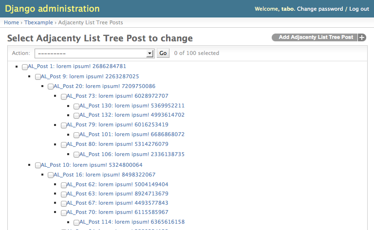

Admin
=====

API
---

.. module:: treebeard.admin

.. autoclass:: TreeAdmin
   :show-inheritance:

   Example:

   .. code-block:: python

        from django.contrib import admin
        from treebeard.admin import TreeAdmin
        from treebeard.forms import movenodeform_factory
        from myproject.models import MyNode

        class MyAdmin(TreeAdmin):
            form = movenodeform_factory(MyNode)

        admin.site.register(MyNode, MyAdmin)

.. autofunction:: admin_factory

Interface
---------

The features of the admin interface will depend on the tree type.

Advanced Interface
~~~~~~~~~~~~~~~~~~

:doc:`Materialized Path <mp_tree>` and :doc:`Nested Sets <ns_tree>` trees have
an AJAX interface based on `FeinCMS`_, that includes features like
drag&drop and an attractive interface.

.. image:: _static/treebeard-admin-advanced.png

Basic Interface
~~~~~~~~~~~~~~~

:doc:`Adjacency List <al_tree>` trees have a basic admin interface.

.. _FeinCMS: http://www.feincms.org
